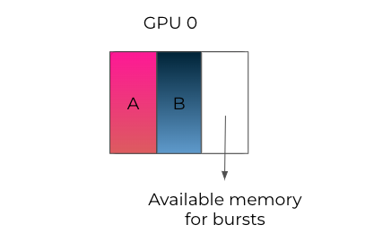

# Run.AI调研报告

## 概览
RunAi: 为容器化工作负载提供AI基础设施编排和虚拟化平台。


### 背景
根据 Run:ai 发布的《2023 年人工智能基础设施状况调查》
- 按需访问 GPU 计算的比例仍然很低，89% 的公司经常面临资源分配问题，只有 28% 的受访者可以按需访问 GPU。
- 88%公司有一半以上的模型没有发布到生产, 平均37%的模型发布生产
- 91%公司计划提升GPU能力或AI基础设施


这些结果和其他结果凸显了为人工智能从业人员提供自助式 GPU 访问的必要性。

### 价值
- 助力客户构建AI基础设施, 快速轻松地发布AI应用
- 按需提供GPU算力, 显著降低 GPU 成本, 成本降低75%


相同基础设施, 10倍工作负载提升

### 客户、用例
用例1：  
一台机器上有两个 GPU，其中一个 GPU 已被一个作业使用。当有新任务进来时，一个需要全部资源（两个 GPU）的任务通常会进入待处理状态，这是很低效的，因为有一个 GPU 是闲置的，理论上可以使用。利用 Run:AI 的弹性功能，我们可以缩小工作负载在单个 GPU 上运行。虽然运行速度会慢一些。当第二块 GPU 可用时，工作将动态扩展回使用两块 GPU。


对于在离线推理工作负载，只需要少量的算力和显存

案例1：  
伦敦一所研究型大学通过RunAI将资源分配从静态分配转变为动态分配，实验时间从 49 天缩短到不到两天，速度提高了 3000%。实际 GPU 利用率增加了 2 倍。  
https://www.youtube.com/watch?v=b8YmDxl6ZXw

案例2：  
一家计算机视觉公司通过RunAI将GPU利用率从28%提高到70%, 训练模型速度提高2倍。

案例3：  
自动驾驶公司Vayve通过RunAI将GPU利用率从低于45%提高到80%以上。

案例4：  
一家全球性银行通过RunAI虚拟化GPU让10倍的数据科学家用户同时使用相同数量的GPU。几十个项目根据业务优先级使用资源。

客户：  
纽约梅隆银行、农业信贷银行等金融服务机构、索尼、Mobileye、Helsing.ai 和 Living Optics 等初创公司，以及 UPenn 和 EFPL 等人工智能学校。

## UI
### 工作区


选择框架  


交互式连接  


### CLI
提交分布式训练作业


提交25个8卡worker

查看作业


### 模型部署


### 多云管理


### 指标观测


历史观测


## 功能点
### GPU切分
- RunAI提供多GPU、多GPU节点、单GPU切分, 团队能够根据每项AI工作负载的需求匹配适量的算力, 从而最大限度地提高基础设施的效率，避免出现 GPU 闲置或低利用率的情况。
- GPU切分显存、算力,  切分的 GPU 可由不同容器（工作负载）访问。


显存切分示例

## 智能调度
- 公平调度, 无论提交时间如何，作业都将得到公平的调度, 每个项目都可以获得配额资源内的保障。
- 批调度, 将许多处理任务分组或 "批处理 "，无需用户干预即可并行运行完成。批处理通常用于高性能计算。
- Gang调度, 容器需要一起启动、一起开始、一起从故障中恢复并一起结束, 业务流程协调程序可以在计算机之间自动执行网络和通信。
- 装箱（bin-packing）调度, 避免碎片化。
- 分散（spreading）调度, 避免装箱调度的资源竞争。
- 合并调度, 避免碎片化。调度器尝试将工作负载从一个节点移动到另一个节点。
- 拓扑感知, 参考网卡的拓扑结构和 GPU 服务器之间的连接, Run:AI调度器确保在运行AI工作负载时考虑到基础设施的物理属性，从而实现理想而一致的性能。
- 智能排队, 允许系统管理员根据业务优先级为每个队列定义不同的规则、策略和要求。结合超配额系统和可配置的公平策略，可以自动化和优化资源分配，以最大限度地利用集群资源。


调度队列：项目在调度器中被转化为队列


bin-packing调度避免碎片


合并调度避免碎片

合并调度主要适用于批处理作业，而不是交互式工作负载
- 这意味着它们可以在必要时中断和重新分配
- 相比之下，交互式工作负载通常需要连续且不间断地访问资源，因此它们不可抢占。

### 显存动态分配
- 传统采用静态内存分配的策略假设最坏的情况，分配最大可能的显存需求。这会造成显存的浪费。
- 动态分配允许多个模型共享一个 GPU，同时实时适应其不同的显存需求。具有 GPU 配额保障的项目可以使用超过其配额的更多 GPU，从而最大限度地减少资源闲置时间。



显存动态分配

如果作业已提交，却没有足够的可用资源来启动它，调度器就会在考虑优先级和公平性参数的同时，暂停队列中超出配额的作业。

### 算力时间分片（time-slicing）
RunAI 提供了两种新的时间切片模式：
- 严格模式, 每个负载获得精确的算力分时
- 公平模式, 每个工作负载除了算力保障之外，可以使用其他空闲工作负载未使用的其他 GPU 运行时计算切片。这些多余的时间片在该 GPU 上运行的所有工作负载之间平均分配。


严格模式


公平模式

设置集群时间分片
```yml
global: 
    core: 
        timeSlicing: 
            mode: fair/strict
```

### 伸缩
- 允许企业根据预定义的阈值，使用内置和GPU特定的指标自动放大或缩小模型。
- 在可能的情况下，自动将资源缩至零，从而降低成本，并将资源重新用于其他工作负载。

### 其他
资源池（节点池）
- 节点池是一组节点，使用预定义的（例如GPU类型）或管理员定义的标签（键和值）分组到资源桶中
- 节点池有助于有效地管理异构资源


节点池

消除云供应商锁定
- 提供统一控制平面, 支持用户使用各个云托管Kubernetes
- 支持混合云, 将敏感数据保存在本地 
- 支持用户将AI工作负载从一个云迁移到另一个

## 原理
### 架构


平台架构

RunAI由两个组件组成
- RunAI集群提供调度服务和工作负载管理。
- RunAI控制平面提供资源管理, 工作负载提交和集群监控。


RunAI用户
- 用户通过RunAI控制台、RunAI命令行或直接向K8s发送yaml文件提交ML工作负载
- 管理员通过RunAI用户界面监控和设置优先级

RunAI集群
- RunAI调度器扩展了K8s调度器
- 工作负载管理, 包括代码及代码所需的资源, 如存储及网络等。
- RunAI集群作为k8s operator安装

RunAI控制面
- 控制面由多个租户管理资源, 提交工作负载和监控多个集群
- 从单一UI管理多个位置的GPU集群。

### GPU切分
RunAI提供了两种GPU切分方案：Fraction、MIG。

利用Fraction技术，所有使用 GPU 的运行工作负载都能并行共享计算，获得对应的计算份额。例如，假设有两个容器，一个容器的 GPU 工作量为 0.25，另一个容器的 GPU 工作量为 0.75，那么这两个容器将获得对应比率份额的计算能力。如果其中一个工作负载不使用 GPU，另一个工作负载将获得整个 GPU 的计算能力。

为了与其他 Kubernetes 调度器互操作，Run:ai 创建了特殊的预留 pod。一旦某个工作负载被分配了一部分 GPU，Run:ai 就会在专用的 runai-reservation 命名空间中创建一个 pod，并将全部 GPU 作为资源。这将使其他调度程序了解 GPU 已被保留。

NVIDIA MIG 允许将基于 NVIDIA Ampere 架构的 GPU（例如 NVIDIA A100）划分为单独的 GPU 实例。

### 动态显存分配
动态显存分配是RunAi 核心功能的一部分，它使工作负载能够优化 GPU 资源的使用。其工作原理是利用 Kubernetes Request和Limit表示法动态指定和使用显存和算力。

配置集群动态切分
```yml
spec: 
  global: 
    core: 
      dynamicFraction: 
        enabled: true # Boolean field default is true.
```

设置每个工作负载的显存限制，将 RUNAI_GPU_MEMORY_LIMIT 环境变量添加到容器中

要使用动态切分，每个 Pod 的 GPU 设备必须等于 1。如果每个 Pod 使用 1 个以上的 GPU 设备，或者选择了 MIG 配置文件，则动态切分不能用于该计算资源。

**解决内存冲突**  
如果多个推理服务器同时尝试使用可突发资源，从而导致潜在的内存冲突，RunAI会在运行时检测并解决这一问题, 确保内存冲突不会引发 OOM 事件，从而导致停机和 SLA 降低。
- 等待和重试解析器可确保只有一个推理服务器能够访问 GPU 内存资源，而其他服务器则要等待资源被释放。
- 优先级解析器通过终止其他 pod 中闲置时间可配置或优先级较低的进程，确保优先级较高的 pod 在需要时能获得突发资源。
- 交换解析器允许多个服务器通过在 CPU 和 GPU 之间交换内存来分时共享显存，并确保一致性和公平性。

用户可根据自己的具体要求和偏好灵活选择合适的解析器。


## 示例
### 提交作业
```bash
runai submit frac05 -i gcr.io/run-ai-demo/quickstart -g 0.5 --interactive
runai submit frac03 -i gcr.io/run-ai-demo/quickstart -g 0.3
```

作业列表


GPU利用率


8GB，是 Tesla V100 GPU 16GB 的一半

### 队列公平
teamA提交4个作业
```bash
runai submit a1 -i gcr.io/run-ai-demo/quickstart -g 1 -p team-a
runai submit a2 -i gcr.io/run-ai-demo/quickstart -g 1 -p team-a
runai submit a3 -i gcr.io/run-ai-demo/quickstart -g 1 -p team-a
runai submit a4 -i gcr.io/run-ai-demo/quickstart -g 1 -p team-a
```

此时作业状态


所有作业running

teamB提交4个作业
```bash
runai submit b1 -i gcr.io/run-ai-demo/quickstart -g 1 -p team-b
runai submit b2 -i gcr.io/run-ai-demo/quickstart -g 1 -p team-b
runai submit b3 -i gcr.io/run-ai-demo/quickstart -g 1 -p team-b
runai submit b4 -i gcr.io/run-ai-demo/quickstart -g 1 -p team-b
```

此时作业状态


两个 teamB 作业立即取代了 teamA

团队 a 和团队 b 各有 1 个 GPU 的配额，因此剩余的超额配额（2 个 GPU）在项目之间平均分配。

### 分布式工作负载
提交作业（2pod, 每pod分配1个gpu）
```bash
runai config project team-a
runai submit-dist mpi --workers=2 -g 1 \
        -i gcr.io/run-ai-demo/quickstart-distributed:v0.3.0 -e RUNAI_SLEEP_SECS=60
```

作业状态


作业描述


两个工作器 Pod、它们的状态以及它们在哪个节点上运行

### 合并调度
当前状态（a1、b1分别运行在不同节点）


提交作业
```bash
runai submit a2 -i gcr.io/run-ai-demo/quickstart -g 2 -p team-a
```

当前状态


作业 a1 已被抢占，然后在第二个节点上重新启动，为新的 a2 作业腾出空间


### 保存检查点
将检查点保存在 NFS 检查点文件夹 /mnt/nfs_share/john 中
```bash
runai submit train-with-checkpoints -i tensorflow/tensorflow:1.14.0-gpu-py3 \
  -v /mnt/nfs_share/john:/mydir -g 1  --working-dir /mydir --command -- ./startup.sh
```

相关链接
- https://www.run.ai
- https://wandb.ai/site The AI developer platform
- https://home.mlops.community/ 机器学习从业者聚集在一起定义和实现 MLOps 的地方
- https://docs.ray.io/en/latest/ray-overview/getting-started.html ML负载伸缩
