# AntMan：DL GPU 集群动态伸缩

## 摘要
本文介绍了一种深度学习基础架构 AntMan。AntMan 通过协同设计集群调度器以及深度学习框架，实现在不影响调度公平性前提下的资源利用率提升。

基于深度学习作业资源需求的动态变化，在空闲的 GPU 上执行多个作业。

已部署在阿里巴巴的生产环境中，用于管理数千个 GPU 上的数万个日常深度学习作业。在多租户集群中将整体 GPU 显存利用率提升 42%，计算利用率提高了 34%

## 1 介绍
阿里巴巴现状，多租户 DL 集群中 GPU 硬件利用率很低，同时很多作业在排队等待资源。  

现状原因分析
- 训练作业无法在整个执行过程中充分使用 GPU 资源
- 一些需要混合计算的 DL 模型作业很难使用 GPU 并行化
- 分布式训练时，90% 的时间开销在网络上
- 资源预留策略导致 GPU 闲置，比如 gang 调度时，部分可用资源保留，以等待所有资源同时可用
- 在 GPU 上打包多个作业，会造成资源争抢，难以保证资源配额。

AntMan 实现方式
- 定制 DL 框架 PyTorch 和 TensorFlow
- 定制 Kubernetes 调度器用以评估验证
- 在 Fuxi 调度器中完全实现调度策略

AntMan 在 64 张 V100 的 kubernetes 集群上使用评估
- 在无抢占场景下，资源保障作业性能符合预期
- 与当前生产集群相比，所有作业平均完成时间提高了 2.05 倍
- 与 Gandiva（流行的 DL 集群调度器）相比提高了 1.84 倍

AntMan 在 5000 多个 GPU 的生产集群部署报告
- GPU 吞吐量提升 17.1%
- 降低平均排队延迟 2.05x
- GPU 显存和计算利用率分别提升 42% 和 34%

论文关键贡献
- 综合  DL 集群特征，从硬件、集群调度、作业行为三方面降低使用
- 引入包括显存和计算单元的动态缩放机制。在作业执行期间有效动态调整资源使用
- 协同设计集群调度器和 DL 框架，维持 SLA 的同时提高集群利用率

## 2 研究动因
### 2.1 深度学习训练
深度学习训练通常包含数百万次迭代，每次迭代处理几个样本，称为 mini-batch。

为了训练具有海量数据的模型，深度学习通常采用多 GPU 数据并行，每个 GPU 负责并行处理数据子集

在大公司中，多租户集群通常用于提高硬件利用率，用户有时会超额订阅 GPU 资源配额，尤其是当 GPU 需求爆发时

### 2.2 DL 集群特征
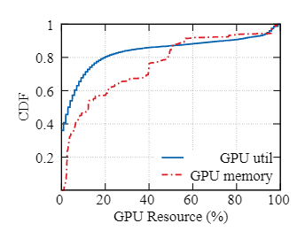  
图 1：GPU 资源统计（生产集群）

使用中的 GPU 利用率低
- 只有 20% 的 GPU 显存利用率超过 50%
- 在计算层面，只有 10% 的 GPU 达到了 80% 以上的利用率

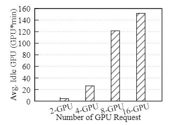  
图 2：gang 调度时，GPU 平均空闲等待损耗

gang 调度时，空闲等待
- 除非所有必需的 GPU 同时可用，否则作业不会开始训练 
- 在空闲等待资源上启动其他作业, 可能会导致大型作业变得饥饿并破坏调度公平性 

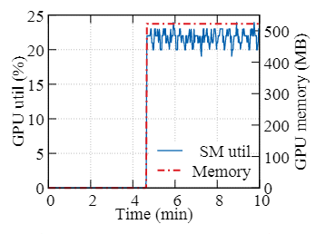  
图 3：DeepFM 作业资源需求（Criteo 数据集）

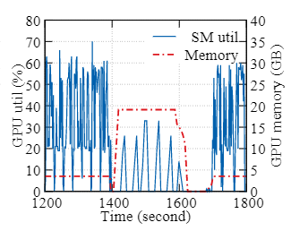  
图 4：ESPnet 作业资源需求（text-speech 数据集）

动态资源需求
- DL 作业通常不能充分利用GPU资源
- DeepFM（Criteo 数据集）示例：一开始，数据集的预处理只需要 CPU。
- 动态资源需求实际上与固定资源分配，根据峰值使用需求足够资源使昂贵硬件未得到充分使用

### 2.3 DL 独特性机会

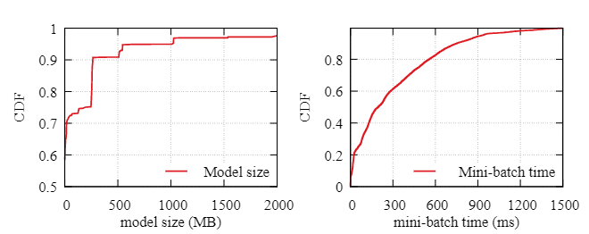  
图 5：一周 DL 作业统计之模型大小及 mini-batch 分布

尽管深度学习训练可能会使用多达 32 到 40 GB 的 GPU 显存（例如 V100 和 A100），但只有一小部分用于存储持久性深度学习模型。 90% 的 DL 模型仅占用 500 MB GPU 显存。大多数 GPU 显存在同一个 mini-batch 中分配和释放。此外，DL 训练周期也相当小。多达 80% 的任务在 600 毫秒内消费一个mini-batch。

## 3 设计
### 3.1 DL 框架动态伸缩
#### 3.1.1 显存管理
现代操作系统在内存管理中支持以内存页为粒度的分页，当它们用完物理内存时，使用磁盘作为内存。
AntMan 采用类似方法，将特定程序的粒度张量在运行时透明迁移到通用内存地址中，从而使 DL 框架支持动态GPU显存上限。

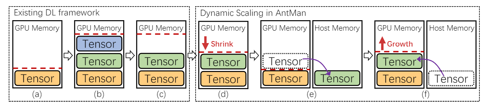  
图 6：AntMan 通用显存动态伸缩

图 6 说明了现有 DL 框架中的显存管理以及与 AntMan 的差异。
- 缓存 GPU 显存大小（即红色虚线）的数量随着 DL 框架中创建的张量而增加（6a~b）
- 一些张量仅用于 DL 训练的某些阶段（例如，数据预处理、评估），继而不再需要。然而，这部分缓存的 GPU 显存并没有被释放（图 6c）。
- AntMan 转向缩放 GPU 显存上限的方法。在处理 mini-batch 时监控应用程序性能和显存需求，以缩小缓存显存。（图 6d）
- AntMan 尽最大努力在 GPU 设备上分配张量，如果 GPU 显存仍然不足，可以使用主机内存在 GPU 外部分配张量（图 6e）。此时，工作负载性能降低。
- 当 GPU 显存上限增加时，张量可以自动分配回 GPU（图 6f）

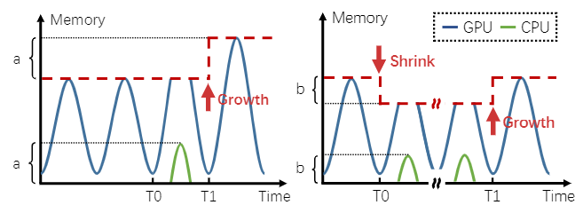  
（a）显存突发伸缩                                                      （b）缩放保护显存  
图 7：通过 mini-batch 行为有效伸缩显存

图 7a 说明了显存缩放如何解决突发需求
- 在 T0 时刻，运行 DL 训练作业的内存需求增加，由于 GPU 显存的上限有限，一些张量不能放在 GPU 显存中，而是使用主机内存创建。
- AntMan 检测主机内存的使用情况，并在 T1 时，根据主机内存的使用情况提高该作业的GPU 显存上限
- AntMan 在运行时提供细粒度的 GPU 显存调度。训练作业可能会缩小以确保其他作业的显存资源，并在其他作业完成后重新增长，如图 7b 所示。

注意：由于张量被放置在主机内存中，此 mini-batch 中正在运行的作业的性能可能会变慢。然而，考虑到典型的 DL 训练通常需要数百万个 mini-batch，这样的性能开销可以忽略不计。

#### 3.1.2 计算管理
现代操作系统支持 cgroups，它限制和隔离进程所需的 CPU 资源。 AntMan 引入了一种类似的方法，在运行时动态隔离 DL 特定进程的 GPU 计算资源访问

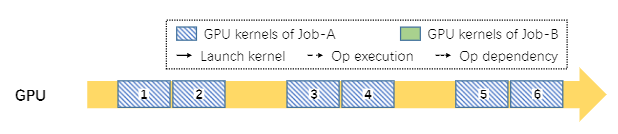  
（a）作业 A 在 GPU 中独占执行，有一些空闲周期。

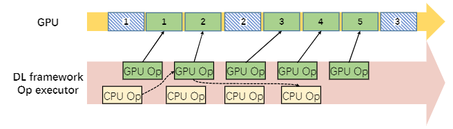  
（b）作业 A 受到作业 B 干扰

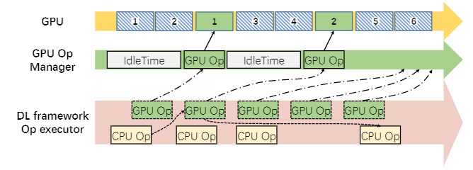  
（c）作业 B 的 GpuOpManager 控制干扰

图 8：在共享 GPU 中运行两个互不干扰作业的计算管理

干扰主要来自于缺乏控制GPU内核执行频率的能力。为了解决这个问题，我们在 DL 框架中引入了 GPU 运算管理器

图 8 说明了在同一 GPU 上执行的两个作业的 GPU 计算单元干扰示例。
- 图 8a 说明了 作业 A 如何以细粒度的方式在 aGPU 上执行。简而言之，GPU 内核将按顺序排列并由 GPU 一个一个地处理。
- 作业 B 被安排在这个 GPU 上（图 8b）。作业 B 的 GPU 操作启动在 GPU 中执行的内核（绿色块），可以将其填满，从而延迟其他 GPU 内核（蓝色块）的执行)，导致 作业 A 的性能不佳
- 在 AntMan 中，GPU 运算符的执行专门由一个新引入的模块，称为 GpuOpManager。当 GPU 运算符准备好执行时，它会被添加到 GpuOpManager 而不是直接启动。 

### 3.2 协同调度
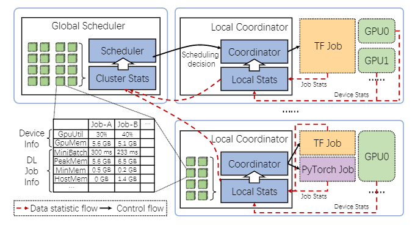  
图 9：AntMan 协同调度流程

每个工作服务器都包含一个本地协调器，该协调器负责通过从 DL 框架报告的统计信息使用动态资源缩放原语来管理作业执行。

在 AntMan 中，作业被全局调度器分为资源保障作业和机会作业，应用了不同的调度策略。资源保障型作业会消耗相应租户的一定 GPU 资源配额，而机会型作业则不会。因此，AntMan 确保资源保证作业的性能应与独占执行中的性能一致

在 AntMan 中，类似于传统的集群调度器，调度决策从全局调度器分派到本地协调器。此外，本地协调器使用动态缩放机制将 GPU 资源调度到 DL 训练作业。

数据统计流信息由本地协调器的统计模块收集，并以自下而上的方式聚合到集群统计模块上，以帮助做出调度决策

统计信息包括硬件信息（例如 GPU 利用率、GPU 显存使用情况），mini-batch 持续时间、峰值显存使用、最小显存使用和主机内存消耗等。

### 3.3 调度策略
**目标**
- 在 AntMan 中，多租户公平调度是我们的首要目标
- 其次是提高集群效率从而实现更高的吞吐量
- 通常，备用资源被分配给超量配置的租户。这样的 GPU 资源，不抢占是很难拿回来的。这种行为会歧视大作业（即分配更多的 GPU），导致偏爱小作业的不公平性。
- 在 AntMan 中引入了 GPU 机会性作业，以窃取 GPU 中的空闲周期，从而最大限度地提高集群利用率

**全局调度器**。作为多租户集群调度器，全局调度器维护多个租户队列
- 全局调度程序将评估未授予 GPU 配额的作业的排队时间。那些遭受长时间排队延迟的作业将作为机会作业自动执行
- 只有在过去 10 秒内利用率低于 M（目前设置为 80%）的 GPU 才能被选为候选者。
- AntMan 默认会自动选择机会性作业，但它也允许用户在提交时手动识别作业类型；例如，作为明确确保 SLA 的资源保证作业。作业也可以指定为永远不会占用租户资源配额的机会作业

**本地协调器**。本地协调器的主要职责是协作执行共享 GPU 上的作业
- 一个 GPU 只分配给一个资源保证作业，因为它消耗 GPU 配额。在 AntMan 中，有可能在这个 GPU 上执行一些机会作业。
- 本地协调器必须防止资源保障型作业在运行时受到其他位于同一位置的作业干扰。
- 当资源保障型作业到达运行机会作业的 GPU 上时，本地协调器首先限制机会作业使用 GPU，包括 GPU 显存和 GPU SM。
- 一旦资源保证作业稳定执行，本地协调器会将剩余的 GPU 显存分配给机会作业
- 此外，它通过监控作业性能（即 mini-batch 时间）逐渐增加机会作业的 GPU 计算单元使用，而不干扰资源保障作业。
- 当资源保障作业增加 GPU 显存需求时，由于通用内存（第 3.1.1 节），张量会使用主机内存临时存储。
- 本地协调器减少其他机会作业的 GPU 显存使用，并提高资源保障作业的 GPU 显存限制以恢复其性能。
- 如果它观察到资源保障作业的性能不稳定，它会采取悲观策略来限制其他机会作业对 GPU 资源的使用

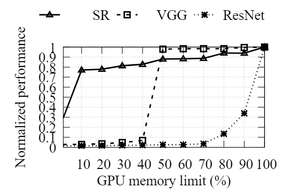  
图 10：在显存不足的情况下，工作负载表现出性能敏感性的多样性

如图 10 所示，即使设备显存减少了 90%，超分辨率 (SR) 模型的性能也仅下降了 25% 左右。 

Cifar10 数据集 (VGG) 上的 VGG16  模型即使在将其设备显存减少一半后也能保持其大部分原始性能。

ImageNet 数据集 (ResNet) 上的 ResNet50 对显存收缩很敏感；减少 10% 的显存会导致 60% 以上的减速。

## 4 实现
在阿里巴巴，DL 训练作业是在 Docker 容器中使用我们定制版本的 DL 框架执行的。 DL 框架的 API 与社区版本兼容，但增强了 AntMan 的功能。

AntMan 在我们的内部集群调度器 Fuxi 中完全实现，以在多个集群上提供日常生产训练工作，每个集群都有数千个 GPU

### 4.1 深度学习框架
动态缩放机制在两个流行的深度学习框架 TensorFlow 和 PyTorch 中实现，版本分别为 v1.12 和 v1.3.1。 TensorFlow 中的实现需要 4000 行代码（大部分使用 C++）。PyTorch 中的实现大约需要 2000 行代码（Python 中 500 行，C++ 中 1500 行）。

DL框架的修改主要集中在三个组件：内存分配器、执行器和接口。

### 4.2 集群调度
在 Kubernetes 上实现了一个自定义调度程序作为评估 AntMan 的原型。实现需要大约 2000 行 Python 代码。总的来说，Kubernetes 负责集群管理和在 Docker 容器中执行作业。我们的全局调度器使用 Python API 来监控 Kubernetes 的 API 服务器中的事件以进行调度。本地协调器作为 DaemonSet 部署在 Kubernetes 中。每个协调器监视文件系统的某些路径以收集每个作业的报告信息。聚合的作业和设备信息存储在 ETCD 中。因此，全局调度器在做出调度决策时直接读取 ETCD 中的状态

AntMan 已在阿里巴巴内部集群调度器 Fuxi 中得到全面实现。全局调度器的实现大约需要 10000 行代码

## 5 评估
我们首先展示微基准测试结果来证明 AntMan 机制的有效性和效率。然后，我们在具有 64 个 V100 GPU 的小型集群中评估 AntMan 的优势，以将策略与实际工作负载进行比较。最后，我们展示了在具有超过 5000 个异构 GPU（V100 和 P100）的生产集群上的评估结果。

除非明确说明，否则所有实验均在具有 8 个服务器的云 GPU 集群上进行。每台服务器都配备了 96 核 Intel Xeon Platinum8163 (Skylake) @2.50GHz 和 736GB RAM，运行 Cen-tOS 7.7。每台服务器有 8 个 NVIDIA V100 GPU（32 GBGPU 显存，带 NVLink），由 NVIDIA driver418.87、CUDA 10.0 和 CUDNN 7 驱动。云 GPU 集群由 Kubernetes 管理；作业通过 KubeFlow 提交，并在 Docker 容器中执行。

### 5.1 基准
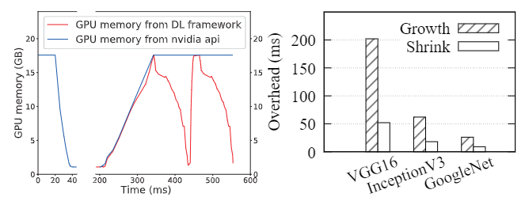  
（a）ResNet-50 上的收缩增长分析                       （b）典型模型的 GPU 显存缩放开销

图 11：AntMan 中 GPU 显存扩展的效率

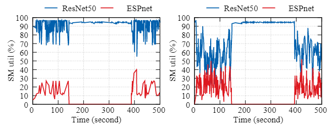  
（a）打包模式                                                    （b）自适应计算调整模式

图 12：Gandiva 中打包模式的 SM 利用率和 AntMan 中针对 ESP-net 和 ResNet-50 500s 执行段的自适应计算调整模式

### 5.2 微量实验
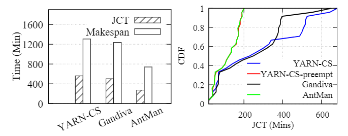  
（a）YARN-CS、Gandiva、AntMan的比较                   （b）资源保证作业的作业完成时间  
图 13：64 卡 V100  跟踪实验

### 5.3 集群实验
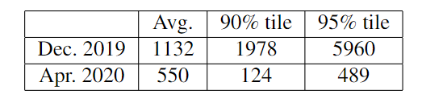  
表格 4：一周排队延迟统计（单位：秒）

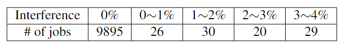  
表格 5：10K 作业的 mini-batch 时间干扰分析

## 6 相关研究
- GPU 显存管理。vDNN、Capuchin、CDMA、Gist等
- 干扰和性能隔离。Quincy、Entropy 等

## 7 结语
我们介绍了 AntMan，这是一种部署在阿里巴巴 GPU 生产集群中的深度学习基础设施。 AntMan 在深度学习框架中引入了动态缩放原语，允许在运行时对单个深度学习作业的 GPU 资源进行灵活的细粒度控制。通过利用上述有效原语，AntMan 共同设计了集群调度程序和深度学习框架以进行协作作业管理，允许 GPU 以最大努力执行机会性作业，同时避免对其他作业的干扰。 AntMan 在不影响公平性的情况下，将阿里巴巴 GPU 集群的整体 GPU 显存利用率和计算利用率分别提高了 42% 和 34%

## 附录
### 术语
**资源保障型作业**：resource-guarantee jobs，提供资源保障，以保证作业运行性能，会消耗相应租户的一定GPU资源配额

**机会型作业**：opportunistic jobs，无资源保障，为提升 GPU 资源利用率的低优先级作业，不消耗租户配额

**资源碎片**：resource fragmentation。例如，在同一服务器中请求四个 GPU，但跨服务器有四个可用

**mini-batch**：mini-batch 是指在深度学习和机器学习中，用于训练模型的一组较小的数据子集。它是批量梯度下降（Batch Gradient Descent）和随机梯度下降（Stochastic Gradient Descent）之间的折衷方法。在 mini-batch 梯度下降中，每次更新权重时，使用的是 mini-batch 数据（一小组样本）而不是整个数据集或单个样本。

**张量**：tensor，在机器学习中，张量是一种多维数组或多重线性映射，用于表示和处理数据。机器学习算法通常需要大量的数据进行训练，这些数据可以被表示为张量的形式，然后输入到模型中进行处理和分析。

## 相关链接
[1] [AntMan: Dynamic Scaling on GPU Clustersfor Deep Learning](https://dl.acm.org/doi/epdf/10.5555/3488766.3488796)   
[2] https://zhuanlan.zhihu.com/p/451238714  