# Gandiva：DL GPU 集群的内省式调度

## 摘要
Gandiva 是一种新的集群调度框架，利用 DLT 领域的知识来改善 GPU 集群中训练 DL 模型的延迟和效率。

深度学习特征：  
1、反馈驱动（feedback-driven），用户运行一组作业时，需要通过早期准确性反馈动态确定子集作业的优先级；  
2、深度学习作业在资源使用方面的异质性，很难实现先验最佳拟合；  
3、作业内（intra-job）可预测性，深度学习大量重复执行 mini-batch 迭代，具有相似运行时间和资源需求；  

Gandiva 利用作业内可预测性在多个作业中有效地对 GPU 进行时间切片，从而降低延迟；将作业动态迁移到更适合的 GPU 提高作业性能，从而提高集群效率。  

评估报告：
在 180 个 GPU 集群中运行的真实工作负载中，Gandiva 将总体集群利用率提高了 26%  

## 1 介绍
传统调度器面临的困境：  
1、长时间运行的作业在完成之前拥有对 GPU 的独占权，而依赖于早期反馈的作业在队列中排队。长时间排队迫使用户要么使用保留的 GPU，要么要求集群超量预配，导致集群效率降低。  
2、DLT 作业是异质的。作业在显存使用、GPU 核心利用率、对带宽的敏感性以及来自其他作业的干扰方面存在很大差异。例如，某些 GPU DLT 作业可能会在亲和 GPU 上执行得更好，而其他作业可能对亲和性不那么敏感。  

Gandiva 优势：  
1、通常在作业的一个 mini-batch 中，显存使用差异超过 10 倍，Gandiva 利用这种循环可预测性来实现高效的程序感知时间分片；Gandiva 将调度原子由作业变为微任务（micro-tasks），使集群能够超量执行 DLT 作业并提供早期反馈。  
2、Gandiva 还使用可预测性来执行配置文件驱动（profile-driven）【术语】的自省。它根据 mini-batch 进度不断地自省其决策，以提高集群效率。例如，当显存和 GPU 利用率较低时，它会将多个作业打包到同一个 GPU 上；它动态地将通信密集型作业迁移到更亲和的 GPU；它还会增加机会作业【术语】的并行度以利用闲置资源，并适时减少作业。  
3、Gandiva 框架还提供了以下 API 供 DLT 调度策略使用：(a) 高效时间片，(b) 低延迟迁移，(c) 精细粒度分析，（d）作业内部弹性【术语】，（e）动态优先级。  
4、Gandiva 为深度学习的特定工作负载定制了调度器，从而为调度器提供了更多作业的可见性和控制。  

实现：  
我们通过修改两个流行的框架 PyTorch 和 Tensorflow 来实现 Gandiva，为调度器提供必要的原语，并且还在 Kubernetes 和 Docker 容器之上实现了一个初始调度策略管理器。  

评估：  
我们在由 180 个异构 GPU 组成的集群上评估 Gandiva，并通过微基准测试【术语】和实际工作负载表明：  
(i) Gandiva 将集群调度效率提高了 26%  
(ii) Gandiva 具有足够的反应性以时间切片方式在同一个 GPU 上动态执行多个作业，从而将早期反馈时间缩短了 77%。  
(iii) Gandiva 在使用相同资源的情况下将超参数搜索的总体完成时间改善了一个数量级。  

## 2 背景
略

## 3 DLT 作业特性
### 3.1 局部敏感性
不同的 DLT 作业对 GPU 间亲和力表现出不同程度的敏感度。如：两个 GPU 可能位于不同的 CPU 插槽（Socket）；或在同一 CPU 插槽中，但位于不同的 PCIe 交换机。  

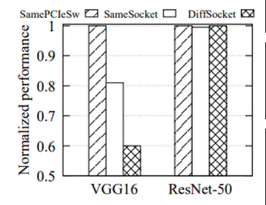  
图 1：服务器内部位置敏感对比

图 1 显示了两个模型 VGG16 和 ResNet-50 对服务器内局部性的不同敏感性。VGG16 在局部性差的情况下会受到很大影响。对于最差的局部性，当两个 GPU 位于不同的 CPU 插槽中时，VGG16 仅达到最佳局部性配置的 60%，其中两个 GPU 位于同一 PCIe 交换机下。另一方面，在此设置中，ResNet-50 不受 GPU 局部性的影响。这是因为 VGG16 是一个比 ResNet-50 更大的神经模型，每个 mini-batch 中的模型同步会给底层 PCIe 总线带来更高的通信负载。  

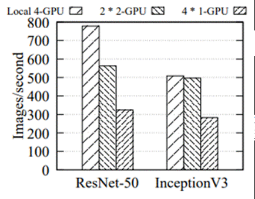  
图 2：服务器内部位置敏感对比

图 2 显示了 4 卡需求作业在不同节点间运行的性能。即使与 40G InfiniBand 网络互连，当作业分配给 4 台节点时，性能差异也很明显。  

### 3.2 抗干扰性
DLT 作业在共享集群中运行时，可能会因资源争用而相互干扰。  

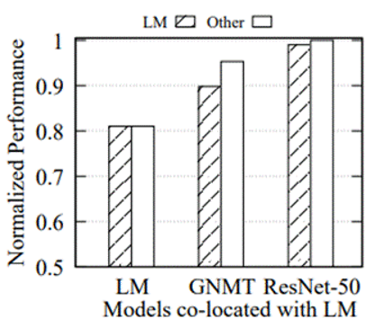  
图 3：单卡干扰对比

当在同一个 PCIe 交换机下放置一个语言模型作业（标记为 LM）和另一个作业时，图 3 显示了由于服务器内部干扰导致的性能下降。当两个 LM 一起运行时，两个作业都会减速 19%。然而，ResNet-50 不受协同的影响。神经机器翻译 (GNMT) 对 LM 表现出适度的干扰。  

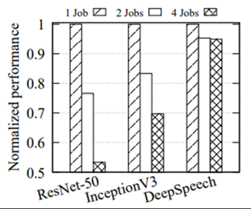  
图 4：NIC 干扰对比

图 4 显示了与 40G InfiniBand 网络连接的两台 4 GPU 的服务器间干扰。当运行多个作业时，ResNet-50 显示高达 47% 的减速，InceptionV3 显示 30% 的减速，而 DeepSpeech 仅显示 5% 的减速。  

### 3.3 作业内可预测性

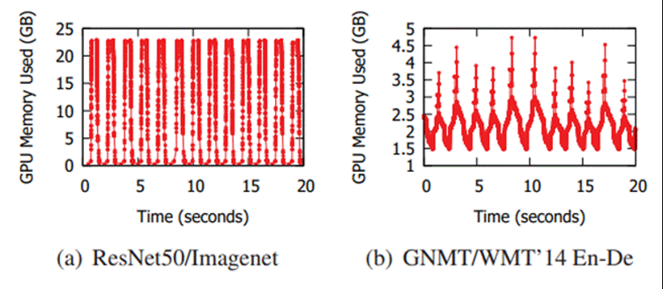  
图 5：GPU 显存用量

DLT 作业由许多 mini-batch 迭代组成。在四张 K80 GPU 上使用 ResNet-50 模型时，在 ImageNet 数据训练的 20 秒快照期间使用的总显存如图 5(a) 所示。使用的显存显然遵循循环模式。每个循环都对应单个 mini-batch 的处理（大约 1.5 秒），显存在正向传递期间增加，在反向传递期间减少。使用的最大和最小显存分别为 23 GB 和 0.3 GB，即 77 倍。该比率与 mini-batch 大小（通常在 16 到 256 之间；在本例中为 128）成比例。  

在一张 K80 GPU 上使用 GNMT 模型时，在 WMT'14 英语-德语数据集训练的 20 秒快照期间使用的总显存如图 5(b) 所示。虽然 mini-batch 迭代与 ImageNet 示例中的不同，但该图具有类似的循环特征。最大和最小值之间的差异较小 (3x) ，主要是由于较大的模型 (0.4GB) 和较小的 mini-batch（本例中为 16）。  

 Gandiva 以多种方式利用了这种特征行为。  
首先，一个 DLT 作业可以自动分成 mini-batch 迭代，这些迭代的集合（超过 60 秒）作为一个微任务，形成一个调度间隔。  
其次，通过在最小内存周期执行挂起操作，可以显著减少从 GPU 复制到 CPU 中的内存量，从而使挂起/恢复和迁移的效率更高效。  
第三，可以分析 mini-batch 进度，评估机制（如打包或迁移）的有效性  

## 4 设计
### 4.1 机制

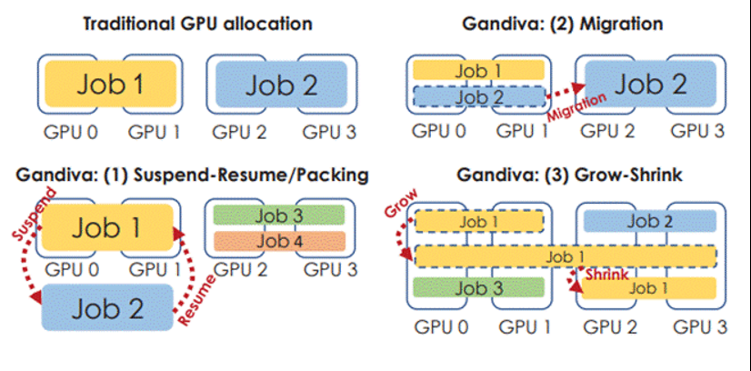  
图 6：Gandiva 中的 GPU 使用选项

在 Gandiva 中，我们通过三种方式消除 GPU 对 DLT 作业的排他性、局部性，从而解决这些低效问题（图 6）。  
首先，在过载期间，Gandiva 不是等待当前作业完成，而是允许传入作业与现有作业分时使用 GPU。这是使用为 DLT 作业量身定制的挂起-恢复机制以及选择性打包来实现的。  
其次，Gandiva 支持将 DLT 作业从一组 GPU 高效迁移到另一组。迁移允许时间片作业迁移到其他（最近空出的）GPU 或对集群进行碎片整理，以便为传入的作业分配具有良好局部性的 GPU。  
第三，Gandiva 支持 GPU 增长-收缩机制，因此空闲的 GPU 可以被机会性使用。为了有效地支持这些机制并实现有效的资源管理，Gandiva 通过持续分析 DLT 作业的资源使用情况并评估其性能来自省 DLT 作业。  

挂起-恢复是 Gandiva 用来消除一组 GPU 对 DLT 作业的独占性的一种机制。现代操作系统支持 CPU 进程时间片的高效挂起-恢复。 Gandiva 利用这种机制并添加了对 GPU 时间切片的支持。  
如图 5(a) 所示，DLT 作业对 GPU 内存的使用具有循环特征，最小和最大内存使用量之间的差异高达 77 倍。 Gandiva 的关键思想是利用这种循环行为，并在 GPU 内存使用率最低时挂起-恢复 DLT 作业。因此，当发出挂起调用时，DLT 工具包等待显存使用周期的最小值，将存储在 GPU 中的对象复制到 CPU，释放其所有显存分配（包括缓存），然后调用 CPU 挂起机制。稍后，当 恢复作业时，DLT 框架首先分配适当的显存，将存储的对象复制回 GPU，然后恢复作业。  
挂起-恢复可以在 100 毫秒内完成，而对于大型语言翻译作业，挂起-恢复最多可能需要 1 秒。给定 1 分钟的时间片间隔，这相当于 2% 或更少的开销。  
Gandiva 中的挂起最多可能会延迟 DLT 作业的一个 mini-batch 间隔（通常为几秒或更短），但我们认为这是一个值得的权衡，因为它可以显著减少开销，因为降低了 GPU-CPU 复制成本，并减少了 CPU 中使用的内存。此外，在此延迟期间完成了有用的工作。调度器会跟踪此延迟并相应地调整时间片间隔以确保公平。  

挂起-恢复的替代方法是在 GPU 上同时运行多个 DLT 作业，并让 GPU 分时作业。我们称之为打包。只有当打包的作业不超过 GPU 资源（核心、显存）并且不会相互产生干扰时，GPU 中的打包才是有效的。如果作业互相干扰，打包可能比挂起-恢复要差得多。当 DLT 作业具有独占访问权限时，我们通过监视来分析它们的资源和进度。如果两个作业被确定为打包的候选者，我们将它们打包在一起并继续监视它们。如果给定的打包对作业的性能造成不利影响，我们将解包这些作业并恢复为挂起-恢复。  

迁移是 Gandiva 用来给 DLT 作业重新分配 GPU 的机制。迁移在多种情况下很有用，例如：   
i) 将时间片作业移动到集群中任何位置的空闲 GPU；   
ii) 将相互干扰的作业迁移开；   
iii) 对集群进行碎片整理，以便传入的作业获得具有良好局部性的 GPU。  

Gandiva 用来消除 GPU 对 DLT 作业的排他性的另一种机制是增长-收缩。该机制主要针对集群可能未被充分利用的情况，例如，夜间。基本思想是在空闲时间增加可用于作业的 GPU 数量，并相应地在负载增加时减少可用 GPU 数量。  

### 4.2 调度策略
我们将节点的高度定义为 M/N ，其中 M 是分配 GPU 数量，N 是总 GPU 数量。因此，挂起-恢复机制只会在服务器高度超过 1 时使用。集群的高度是其所有节点的最大高度。当集群的高度大于 1 时发生过载，即所有作业分配的 GPU 总和大于 GPU 总数。我们将节点的亲和性定义为分配给该节点的作业。例如，最初节点的亲和性为 0，如果将需要两张 GPU 的作业分配给节点，则该节点的亲和性变为 2。调度器将具有相似 GPU 请求的作业分配给同一节点。  

Gandiva 调度程序的主要设计目标是为作业提供早期反馈。在流行的调度器中，集群过载期间作业在队列中等待。相比之下，Gandiva 通过立即将 GPU 分配给新作业并使用挂起-恢复机制提供早期结果来支持超额订阅。第二个设计目标是集群效率。这是通过分析和贪婪启发式的持续优化实现的，该过程利用了打包、迁移和增长-收缩等机制。  
为了实现这些目标，Gandiva 调度程序以两种模式运行：反应式和自省式。反应模式指的是调度器对作业提交、完成、机器故障等事件做出反应。自省模式是指调度器为提高集群利用率和作业完成时间的连续过程。调度器可以同时在两种模式下运行。  

#### 4.2.1 反应模式
传统的调度器以这种模式运行。

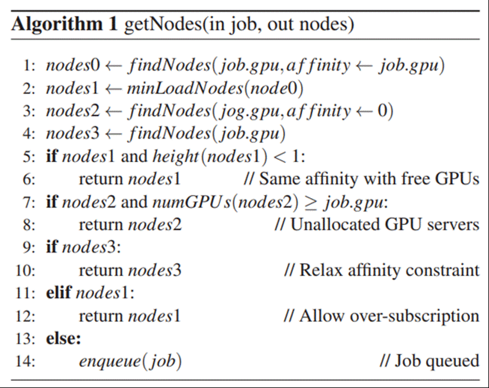  
算法 1：节点分配

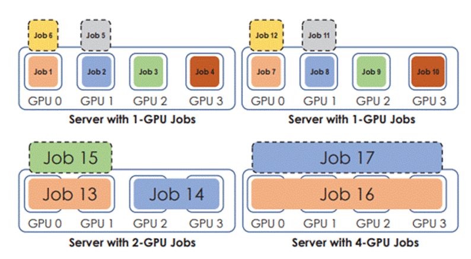  
图7：调度示例（ 16 卡集群）

当新作业提交时，调度器会为该作业分配 GPU。 Gandiva 中使用的节点分配策略如算法 1 所示。 findNodes 是一个函数，用于返回满足作业请求的候选节点，并带有亲和力约束的可选参数。最初，Gandiva 尝试寻找与新作业具有相同亲和力的节点，以及其中负载最小的节点。如果存在这样的节点并且它们的高度小于 1（第 5-6 行），则分配该节点。否则，Gandiva 会尝试查找并分配未关联的节点（第 7-8 行）。如果没有这样的空闲节点，第三种选择是在忽略亲和力的同时寻找具有空闲 GPU 的节点（第 9-10 行）。这可能会导致跨多个节点的碎片分配，但迁移可用于碎片整理。如果以上都不起作用，则意味着集群中没有可用的空闲 GPU。在这种情况下，如果存在具有相同亲和力的节点，则将它们与挂起-恢复一起使用（第 11-12 行）；如果不是，则作业被排队（第 13-14 行）。例如，如图 7 所示，需要 1 卡的作业放在一起，但需要 2 卡或 4 卡的作业放在不同的节点。此外，我们尝试通过选择负载最小的节点来平衡每台服务器上的超额订阅（例如，图中两台服务器各有 6 个 1 卡 GPU 作业）  
在 Gandiva 中，我们检查集群是否可以降低高度； 例如，通过迁移挂起的作业到新腾出的GPU。在常规的调度器中，GPU 分配是作业提交时的一次性事件，而 Gandiva 使用自省模式来不断提高集群利用率， 通过简单的作业分配策略将 GPU 资源快速分配给新作业，从而实现早期反馈。  

#### 4.2.2 自省模式
在自省模式下，Gandiva 持续监控和优化集群中 GPU 的作业分配，以提高整体利用率和 DLT 作业的完成时间。  
在作业量过载时打包作业。打包背后的基本思想是在 GPU 上同时运行多个作业以提高效率。如果打包作业的显存需求总和高于 GPU 显存，此时从 CPU 内存“分页”的开销非常大，打包无效。  
Gandiva 依靠贪婪启发式算法来打包作业。当作业到达时，使用挂起-恢复以独占模式运行它们并收集分析信息（GPU 利用率、显存和作业进度）。根据分析数据，调度器维护一个按 GPU 利用率排序的作业列表。调度器会贪婪地选择 GPU 利用率最低的作业，并尝试将其打包到 GPU 利用率最低的 GPU 上。当打包作业的总吞吐量大于时间片时，就认为打包成功。如果打包不成功，我们将取消打包并尝试下一个利用率最低的 GPU。如果打包成功，我们会找到下一个利用率较低的作业并重复此过程。评估显示，这种简单的贪婪启发式算法可实现 26% 的效率提升。  

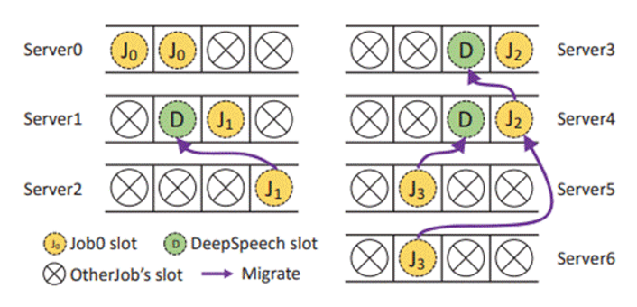  
图 8：在共享集群中迁移作业

在 Gandiva 中，我们使用迁移改善局部性。如图 8，当调度一个包含 4 个作业且每个作业需要 2 张 GPU 的多作业时，它的 GPU 亲和性很差；只有 J0 的两张 GPU 在相同节点，而 J1、J2、J3 位于不同节点。三分钟后，训练作业 DeepSpeech 完成并释放 3 张 GPU，分别位于节点 1、3、4 中，在图 8 中标记为 D。 Gandiva 启动迁移过程，将 J1、J2 和 J3 重新分配到相同节点。对于碎片整理，我们选择了所有非空闲节点中空闲 GPU 最多的服务器。然后我们尝试将该节点上运行的作业转移到其他服务器上。只要性能损失可以忽略不计，该作业就会迁移到另一台可用 GPU 较少的服务器。我们重复此操作，直到每个非空闲节点的空闲 GPU 数量小于阈值，或者没有作业会从迁移中受益。  

当集群未充分利用并且 DLT 作业将自己标识为适合增长-收缩时，会触发增长-收缩。我们会增加作业以使单个服务器中 GPU 用量更大化。此外，我们只会在一段空闲时间后触发增长，以避免抖动，并且在可能需要 GPU 的新作业出现时立即收缩。  

最后，我们支持在每个节点中进行轮询调度，以公平的分时共享 GPU。当作业有多个优先级时，高优先级的作业永远不会被挂起以容纳低优先级的作业。如果一台节点被高优先级作业充分利用，则低优先级作业将迁移到另一台节点（如果可行）。  

## 5 实现
### 5.1 调度器
Gandiva 由一个自定义的调度器和一个客户端组件组成，该组件是每个 DLT 作业 Pod 的一部分。调度器也是 Kubernetes 管理的一个 Pod。 Kubernetes 负责整体集群管理，而 Gandiva 调度器管理 DLT 作业的调度。 Gandiva 调度器使用 Kubernetes API 获取集群节点和 Pod 信息，每当提交新 Pod 时，调度器都会根据调度策略将其分配给集群中的 GPU。  
当一个 Pod 被分配在一个节点上时，最初只有 Gandiva 客户端开始执行。然后它轮询 Gandiva 调度器以确定哪些 GPU 可用于 DLT 作业，并使用挂起/恢复和迁移命令控制 DLT 作业的执行。  

### 5.2 DL 工具包
Gandiva 客户端发出 SIGTSTP 信号以指示 PyTorch 工具包必须挂起进程。它还指示恢复是否应在新的 GPU 上通过内存文件进行。在接收到信号后，工具包设置一个挂起标志，并在 mini-batch 结束时执行挂起。  
在 TensorFlow 中，这是一个“defind-and-run”的工具包，mini-batch 的边界很容易被识别（在 session.run() 的结尾）。而在 PyTorch 中，这是一个“define-by-run”的工具包，我们通过跟踪显存使用循环来识别 mini-batch 的边界，作为 PyTorch 显存管理器（THCCachingAllocator）的一部分，并在释放显存时查找循环的最小值。一旦检测到最小值，工具包就会：  
i）将所有存储的对象从 GPU 复制到 CPU，  
ii）释放 GPU 分配  
iii）挂起进程。  
当 Gandiva 客户端发出 SIGCONT 信号时，工具包会分配 GPU 内存，将存储的对象从 CPU 复制到 GPU，并恢复进程。为了处理恢复时设备地址的更改，我们在工具包中跟踪 GPU 对象并用新地址对其进行修补。切换 GPU 需要调用 cudaDeviceReset 和 CudaInit，可能需要5-10秒钟。我们通过在“暂停”状态下执行这些操作来规避延迟。  

我们使用400多行 Python/C++ 代码对 Tensorflow(TF) 进行更改。再加上 200 多行额外的代码，我们在每个服务器上部署了一个迁移助手，支持按需检查点和迁移。当接收到调度器的迁移命令时，目标助手首先启动 TF 会话并等待检查点。源助手然后要求 TF 保存检查点，在跨服务器迁移的情况下将检查点移动到目标位置，最后恢复训练会话。为了加快迁移速度，我们采用了Ramdisk 将检查点保存在内存中。在跨服务器的情况下，修改后的 TF 直接通过网络文件系统（NFS）协议将检查点保存到远程 Ramdisk 中。  

## 6 评估
实验集群配置：节点是 12 核 Intel Xeon E5-2690@2.60GHz，配备 448 GB RAM 和两个40 Gbps链路（没有 RDMA），运行 Ubuntu 16.04 操作系统。每个服务器都有四个 P100 或四个 P40 GPU。所有服务器都连接到名为 GlusterFS 的网络文件系统，服务器磁盘（SSD）上进行了双向复制。对于使用多个 GPU 的作业，我们只评估数据并行性（因为它比模型并行性更常见），并使用同步更新（尽管我们也支持异步更新）。我们的评估使用了18个模型，其中8个是在PyTorch 0.3中实现的，另外 10 个是在TensorFlow 1.4 中实现的。训练时使用的 mini-batch 大小是它们参考文献中的默认值。在我们的评估中，所有模型每个 mini-batch 的时间都不超过6秒。因此，在这些实验中，我们将时间切片间隔设置为 60 秒。  

### 6.1 微基准测试

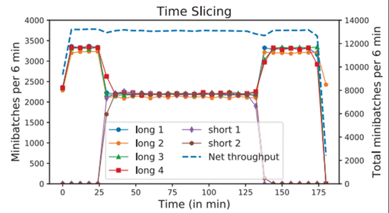   
图 9：时间切片：6 个单卡作业分配在 4 卡上

图 9 展示了每个作业随着时间的推移的进度状态。最初，有四个单 GPU 的长时间作业在运行，当时间 t=25 分钟时，有两个单 GPU 的短时间作业被安排在该服务器上。可以看到，最初的四个单 GPU 作业现在只获得了它们以前份额的 4/6。当两个短作业离开时，长作业恢复到了它们以前的表现。此外，注意到所有作业的聚合吞吐量（右比例尺）在整个跟踪过程中只受到轻微影响（不到 2%），这证明时间切片是一种有效的机制，可以在超额订阅期间提供早期反馈。  

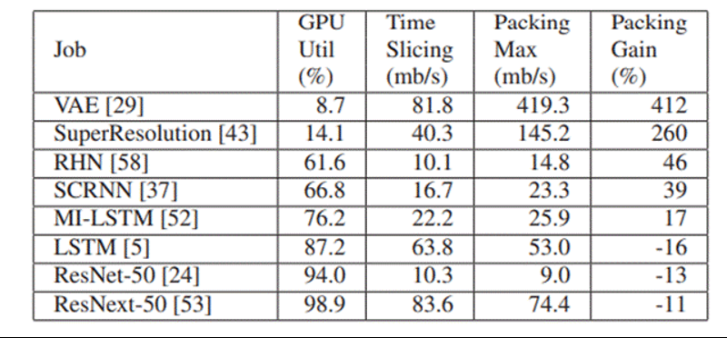  
表 1：在 P40 上打包多作业（mb/s = mini-batches/s）

表 1 展示了使用 PyTorch 工具包进行多个作业在单个 GPU 上打包的性能，适用于各种 DLT 模型。对于 GPU 利用率低的小型 DLT 作业，打包可以提供高达 412% 的显著收益。对于 GPU 利用率中等的 DLT 作业，打包的收益因模型而异，一些模型显示出高达 46% 的收益，但一些模型则显示出 16% 的损失。最后，对于高利用率的图像处理作业，例如在 Cifar10 数据集上的ResNet-50 或 ResNext-50，打包会降低11-13%的性能。  
请注意，这些打包结果是在未启用 NVIDIA 的多进程服务（MPS）的情况下得出的。我们发现，在 P40/P100 GPU 中使用 MPS 会导致显著的开销。然而，V100 GPU 的硬件支持 MPS 表明，在V100 GPU中使用 MPS 可能能够进一步增加打包的收益。  

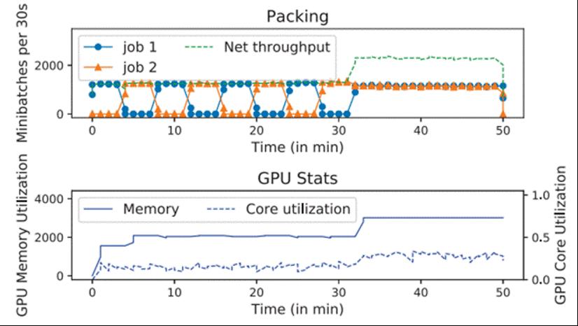   
图 10：在 单 P40 GPU 上打包作业

图 10 展示了两个图像超分辨率作业最初被时间切片在同一个 P40 GPU 上的情况。经过一段时间后，调度器得出结论，它们的显存和 GPU 核心利用率足够小，可以将它们打包在一起，并在GPU 上分配它们。调度器继续分析它们的性能。因为它们的聚合性能提高了，因此保留了打包;否则将撤消打包，作业继续使用时间切片。  

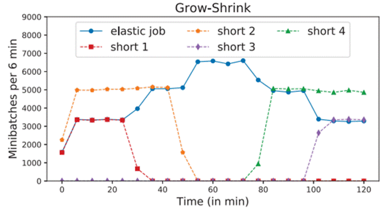  
图 11：作业（elastic-job）增长-收缩示例

在集群利用率低时，增长-收缩非常有用。Gandiva 仅针对那些明确声明可以利用此功能的作业使用增长-收缩，因为用户可能会根据可用的 GPU 数量调整学习率和批处理大小。图 11 展示了该机制的工作原理。最初，一个 4-P100 节点有三个作业，一个 1-GPU 长作业，一个 1-GPU 短作业和一个 2-GPU 短作业，都使用 PyTorch 的 ResNet-50。在时间 t=25 分钟时，短作业离开后，在这个 GPU 上没有新作业分配后，长时间运行的作业扩展到使用 2 个 GPU。在时间t=45 分钟时，第二个短作业离开，长时间运行的作业扩展到使用全部四个 GPU。在时间 t=75 分钟时，一个新的 2-GPU 作业进入，长作业立即缩小到使用两个 GPU，当出现另一个新的 1-GPU 作业时，长作业缩小到仅使用 1 个 GPU。该微基准测试显示了空闲的 GPU 资源可以通过增长-收缩这样的机制有效地利用。  

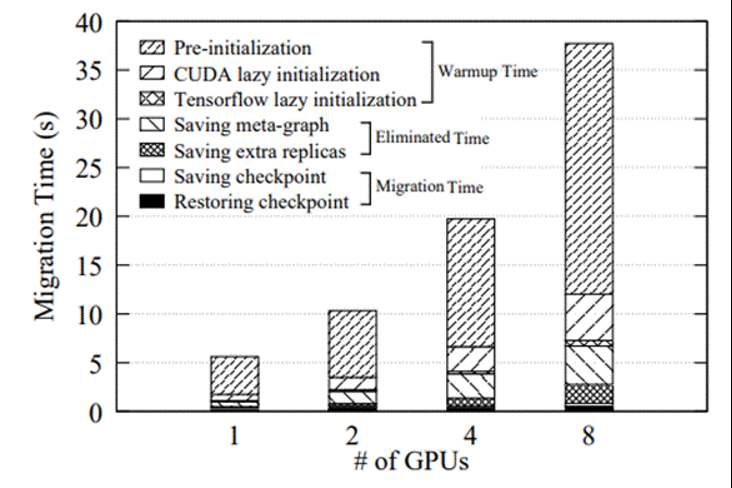  
图 12：TensorFlow 迁移开销

我们使用一台配备 8 卡 P100 GPU 和 Tensorflow 工具包的节点来评估迁移开销。首先，我们将一个 ResNet-50 训练作业从一个节点迁移到另一个节点。图 12 展示了在不同数量的 GPU 下的详细细分情况。使用我们优化后的实现，我们能够消除或隐藏大部分迁移开销。实际的迁移时间，保存和恢复检查点，几乎不受 GPU 数量的影响，因为我们只保存模型的一个副本。每个GPU 中内存检查点的加载并行运行，不会饱和 PCI-e 带宽。热身时间和来自其他 GPU 的元图和检查点的成本随着 GPU 数量的增加而增加。因此，对于 8 个 GPU 作业，我们能够节省 35 秒迁移开销的 98%。  

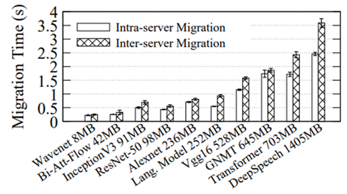  
图 13：工作负载迁移时间

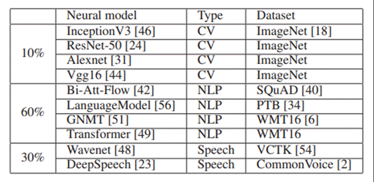  
表 2：神经模型比例

图 13 展示了 10 个不同深度学习模型（明细在表 2 中）的 1-GPU 作业的最大值、最小值和平均服务器内部和服务器间迁移时间，共进行了 3 次运行。其中 6 个模型可以在 1 秒内迁移。即使是最大的模型（DeepSpeech，具有 1.4 GB 的检查点），也可以在约 3.5 秒内迁移，与通常持续数小时或数天的长时间训练时间相比，可以忽略不计。  

6.2 多作业模型探索

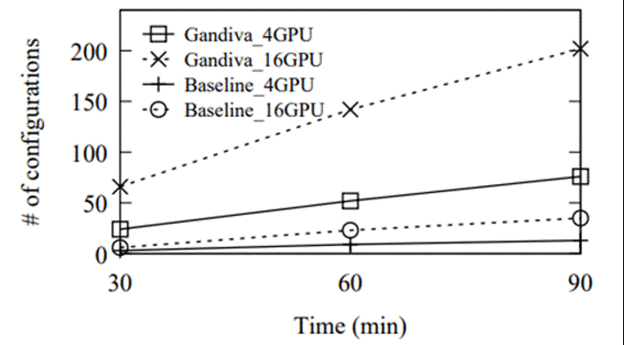   
图 14：模型探索量

图 14 展示了探索的超参数配置数量。在 4-GPU 和 16-GPU 的情况下，Gandiva 可以探索基线方法近 10 倍的数量。这是因为在基线方法中，GPU 可能会被卡在需要完全运行的次优作业集上，但在 Gandiva 中，由于时间切片，新的配置可以与这些作业并行探索。  

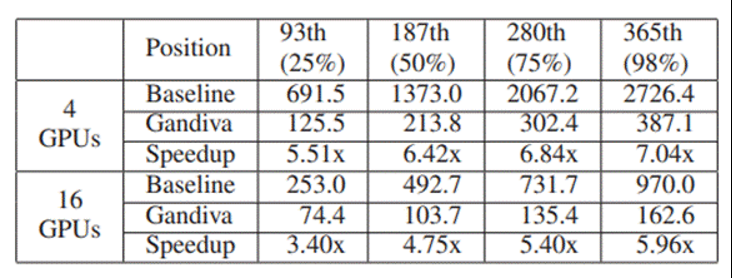 
表 3：找到合适配置的时间（分钟）

进一步的研究表明，使用合格的配置进行调度的第一个作业在 Gandiva 和基线中都排在第 365 位。我们将第一个合格作业从第 365 位移动到第 25 个百分位数、第 50 个百分位数和第 75 个百分位数的调度位置，并重新运行实验。表 3 总结了结果：合格配置显示得越晚，Gandiva 的收益就越大。在典型的 AutoML 实验中，优质模型通常会在后期出现，因为那些提前停止的作业的配置会引导系统找到更好的配置。  

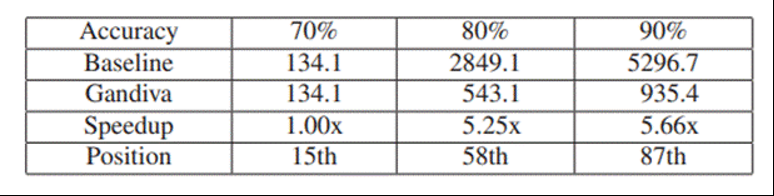  
表 4：类 ResNet 中模型搜索（分钟）

表 4 显示了使用基线和 Gandiva 分别寻找优于目标准确率的模型所花费的时间。对于更高的目标准确率，Gandiva 的性能收益更为显著。当目标准确率为 90％ 时，找到的合格模型实现了92.62％ 的验证准确率。然而，如果目标准确率较低，例如 70％，合格模型将早期出现。在这种情况下，完成单个合格配置运行的时间占据了总的 AutoML 搜索时间。因此，Gandiva 几乎没有提供任何好处。我们可以看到，当使用 AutoML 实现高准确率模型时，Gandiva 相比基线提供了显著的收益。  

### 6.3 集群实验：时间切片和打包

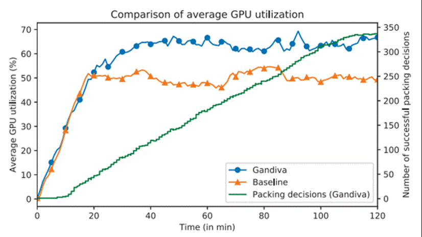
图 15：集群 GPU 使用率

图 15 显示了基线调度器和 Gandiva 的平均 GPU 利用率，以及 Gandiva 的成功打包累计数量（右 y 轴）。结果清楚地表明，相比基线，Gandiva 能够更有效地利用集群。Gandiva 在稳定阶段（从 20 到 200 分钟）内实现的平均利用率为 62.8％，而基线的平均利用率为 50.1％，相对改善了 26％。此外，Gandiva 采用的贪婪打包启发式算法大多数情况下都是成功的，只有少数需要撤销的打包决策（打包曲线大多数情况下呈上升趋势，偶尔有小幅下跌）   

### 6.4 集群实验：时间切片和迁移

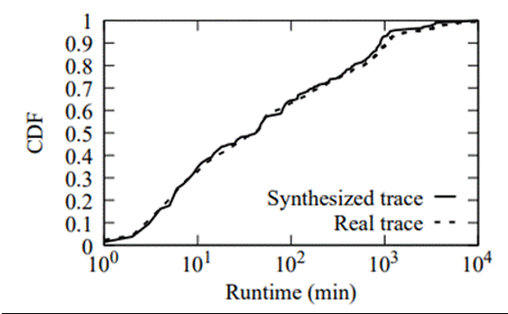  
图 16：合成轨迹

为了合成与生产集群具有相似特征的轨迹，我们将这些模型以与轨迹中相同的比例混合。跟踪中作业的 mini-batch 数量设置为遵循 9 天真实跟踪的作业运行时间分布。我们确保合成跟踪紧密遵循真实跟踪的作业运行时间分布，如图 16 所示。和以前一样，由于集群处于高负载，因此在此实验中没有启用任何作业增长-收缩。  

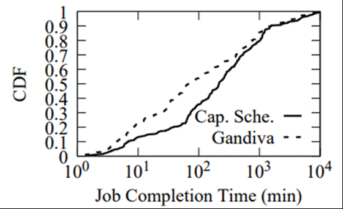
图 17：作业完成时间

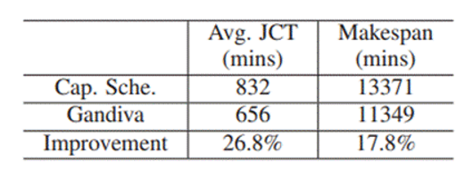  
表 5：全跟踪实验

表 5 显示了在具有 100 个 GPU（50 个 P100，50 个 P40）的集群中回放合成作业跟踪时，两个调度器的平均作业完成时间和 Makespan 时长。我们可以看到，Gandiva 将平均 JCT 提高了 26.8％，Makespan 时长减少了 17.8％。图 17 显示了两种方法的 JCT 的 CDF：它显示 Gandiva 具有更多 JCT 小于约 100 分钟的作业。在整个实验期间，Gandiva 启动了470 次迁移，即每隔约 20 分钟进行一次。  

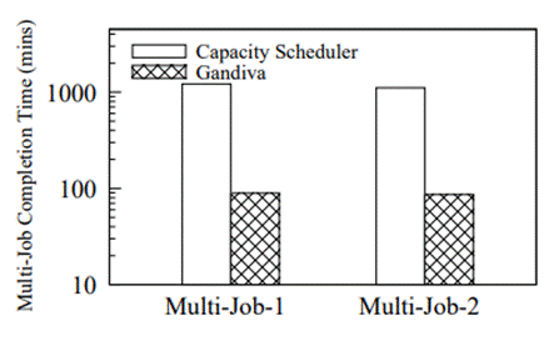
图 18：多作业完成时间

如图 18 所示，使用 Capacity 调度器，分别需要 1215.74 和 1110.62 分钟才能找到两个多作业的合适配置。Gandiva 的机制，如迁移、时间切片和动态优先级，有助于提供更好的局部性，更早地识别有效作业，并提高高优先级作业的训练速度。因此，Gandiva 分别实现了 13.6 和12.9 倍的加速。根据我们进行的微基准测试，我们观察到仅使用时间切片就为这个 AutoML 实验带来了 7 倍的收益。因此，其余的收益可归因于迁移所带来的改进的局部性。  

## 7 相关研究
- DLT 作业调度
- ML 调度策略 
- 大数据集群调度框架
- 时间片、挂起-恢复和进程迁移

## 8 结论
我们提出了 Gandiva，一个用于深度学习的集群调度框架，它提供了一组高效的系统原语，例如时间切片、迁移、作业内弹性和动态优先级。使用这些原语，Gandiva 可以有效地支持在多作业中进行神经模型探索，在真实的共享集群环境中找到准确的神经模型，比使用传统调度器快一个数量级。Gandiva 通过利用 DLT 的作业内可预测性提出机制的高效实现：我们的系统原型证明了作业挂起/恢复和迁移可以在一秒内完成，甚至可以跨服务器迁移流行的深度学习工具包，例如Tensorflow和PyTorch。结合自省式调度策略，Gandiva 将整个集群的利用率提高了26％。

## 附录
### 术语
**超参数（Hyper-parameters）**：是机器学习和深度学习模型中需要手动设置的参数，这些参数不能通过训练数据自动学习得到，而是需要人工调整。超参数的设置对于模型的性能和收敛速度有很大的影响，常见的超参数包括学习率、批量大小、正则化系数等。

**超参数搜索**：是为机器学习或深度学习模型寻找最佳超参数组合的过程，使模型的误差最小化或性能最大化。

**参数梯度（gradient of parameters）**：是指神经网络模型中各个参数对于损失函数的偏导数。在神经网络模型中，损失函数是一个关于模型参数（如权重和偏置项）的函数，其值描述了模型预测结果与实际结果之间的误差。通过计算损失函数对于模型参数的梯度，可以了解到在当前参数值下，损失函数的变化趋势和方向，从而进行模型参数的更新和优化。

**DLT**：即深度学习训练（deep learning training）

**DLT 作业异质性**：指不同训练作业的属性和特征是不同的。这些属性和特征包括训练数据的大小、训练模型的复杂度、训练作业的优先级等。由于作业异质性的存在，不同训练作业的训练过程可能具有不同的性能和资源需求，需要对它们进行不同的调度和资源分配。

**反馈驱动（feedback-driven）**：是指一种基于反馈信息的控制策略，即通过对系统输出的反馈信息进行监测和分析，来指导和调整系统的行为。在反馈驱动的控制策略中，系统会根据反馈信息来调整其输入或行为，以使其输出更接近于期望的目标或状态。

**反向传递**：是通过计算损失函数对神经网络模型参数的梯度来实现的，其计算过程是从网络输出层开始，逐层向前计算每个参数对损失函数的贡献，直到计算出所有参数的梯度。反向传递通常是神经网络模型的反向计算过程，其结果会被用于更新神经网络参数，以最小化损失函数。使得模型能够逐步优化和适应训练数据，提高模型的精度和泛化能力。

**Gandiva**：是一个用于深度学习的集群调度框架，旨在通过提供一组高效的低级系统原语（例如时间切片、迁移、作业内弹性和动态优先级）来支持神经网络模型的探索和训练。

**InfiniBand**：是一种高性能、低延迟、高可靠性的计算机网络架构，旨在连接计算机系统、存储设备和网络设备。它是一种基于RDMA（Remote Direct Memory Access）技术的网络，通过直接访问内存，避免了CPU的参与，从而实现了低延迟和高带宽的数据传输。

**机会作业（Opportunistic Jobs）**：是指在共享 GPU 集群中，由于 GPU 资源的有限性和高昂的成本，某些作业无法在需要时立即获取足够的 GPU 资源。GPU 机会作业是指这些作业，在等待其它高优先级作业完成后，可以利用闲置的 GPU 资源进行计算的作业。GPU 机会作业通常具有较低的优先级和较短的计算时间，因此可以在其它 GPU 资源占用较少的时间段获得 GPU 资源。GPU 机会作业的出现，可以更好地利用 GPU 资源，减少 GPU 资源的浪费和空闲，提高集群的利用率。

**mini-batch（mini-batch interval）**：DLT 一次对几个数据样本进行操作，称为 mini-batch。

**Mini-batch 间隔**：是指在深度学习模型训练过程中，每个 mini-batch 数据之间的时间间隔。与mini-batch size不同，mini-batch 间隔是一个时间参数，用于控制每个小批次数据之间的间隔时间，以便进行模型参数的更新和优化。在训练过程中，mini-batch 间隔往往需要根据具体问题和计算资源进行调整，以最大程度地提高模型的训练效率和性能。

**配置文件（profile-driven）驱动**：是一种集群调度策略，其核心思想是利用预定义的配置文件（profile）来驱动作业的调度和资源分配。配置文件包含了作业的属性和要求，例如作业的优先级、CPU和GPU资源需求、内存需求等。调度器根据配置文件中的信息，对作业进行分类、排序和匹配，以决定哪些作业应该被调度，以及如何分配资源。配置文件驱动的调度策略能够提高集群的利用率和效率，因为它可以更好地根据作业的需求和属性进行调度和资源分配，避免资源浪费和性能瓶颈。

**微基准测试（micro-benchmarking）**：是一种针对计算机系统中小规模的代码片段或函数（通常是几百到几千行代码）的性能测试方法。与传统的基准测试相比，微基准测试更加精细，可以更准确地评估系统的性能和瓶颈，并可以更好地发现和定位代码中的性能问题。微基准测试通常涉及对特定的代码段进行重复执行和计时，以获得其平均执行时间和性能指标。微基准测试通常用于优化和调试计算机系统中的关键代码，例如编译器、操作系统、数据库等，以提高其性能和效率。

**自省式调度（introspective scheduling）**：是一种集群调度策略，其核心思想是将集群中正在运行的任务的信息反馈给调度器，以便调度程序更好地决策下一步要运行的任务。

**正向传递（forward pass）**：是深度学习中神经网络模型的一个关键步骤，它是将输入数据通过神经网络模型，按照一定的计算方式得到输出结果的过程。在正向传递过程中，输入数据会经过一系列的神经网络层，每一层都包括一组权重和激活函数，对输入数据进行线性变换和非线性变换，最终得到输出结果。

**作业内（intra-job）可预测性**：是指在分布式深度学习训练任务中，每个训练作业（job）的训练过程是可以预测的特性。在训练过程中，每个训练作业会根据其输入数据和超参数等设置，按照一定的迭代顺序进行模型参数的更新和优化。作业内可预测性的意义在于，对于同一训练作业的不同迭代，其运行时间和资源需求等特征是相似的或者可预测的。因此，利用作业内可预测性，可以更精确地预测训练作业的运行时间和资源需求，从而更好地进行调度和资源分配，提高集群的利用率和效率。

**作业内部弹性（intra-job elasticity）**：是指在分布式深度学习训练任务中，训练作业在运行过程中根据需要动态调整其资源使用情况的能力。作业内部弹性允许训练作业在运行过程中根据其运行状态和需求，动态调整其使用的 CPU、GPU、内存等资源，以最优化地利用可用资源并提高训练性能。例如，在训练过程中，如果发现某个作业需要更多的 GPU 资源来加速训练，作业内部弹性允许作业动态增加其 GPU 资源的使用量。作业内部弹性通常需要依赖于具有自适应性的调度策略和资源管理器，以实现对训练作业的动态调整和优化。

## 相关文档
- https://www.usenix.org/conference/osdi18/presentation/xiao
- https://www.usenix.org/system/files/osdi18-xiao.pdf
- https://scholar.google.com/citations?user=s7ky8QUAAAAJ
- https://people.eecs.berkeley.edu/~romilb/files/gandiva-poster-osdi18-v2.pdf

