# HiveD：DL GPU 集群共享保障

## 摘要
在多租户 GPU 集群中常遇到共享异常问题，即相比私有集群，租户排队延迟较高。

HiveD 是第一个安全共享 GPU 集群的框架。每个租户通过虚拟私有集群（VC）预留资源。

HiveD 开发了 buddy cell 分配算法，通过有效管理 cell 从 VC 到物理集群的动态绑定来确保共享安全。

评估表明
- 三个流行的深度学习调度器中存在共享异常，额外排队延迟高达 1,000 分钟
- HiveD 可以融合这些调度器并避免所有的共享异常

## 1 介绍
在生产多租户 GPU 集群中，我们观察到异常情况，租户的深度学习训练作业等待 GPU 的时间明显长于在同等租户配额的私有集群中的时间

这是因为当前的资源预留机制是基于配额，即 GPU 的数量。配额无法捕获训练作业的 GPU 亲和性要求：例如，一个节点上的 8 卡 GPU 作业通常比在八个节点上运行得快得多

HiveD 是一个资源预留框架，不使用配额，为每个租户提供一个抽象定义的虚拟私有集群（VC）：cell。

HiveD 专注于资源预留机制，将其他资源分配目标留给 VC 调度器（如集群利用率和作业完成时间）。

Buddy cell 算法支持抢占低优先级作业，清理未使用的 cell 提升整体利用率。

HiveD 实现了私有集群和共享集群的最佳结合效果，保障租户间 cell 独立性同时在其他租户不使用时提升资源利用率。

在 96 卡 GPU 集群评估
- 评估的所有深度学习调度器都存在共享异常
- HiveD 消除了所有共享异常，将过多的排队延迟从 1,000 分钟减少到零
- 无论集群负载如何 HiveD 都保证共享安全，而基于配额的集群在高负载下可能引起租户 7 倍排队延迟

HiveD 已开源，并集成到 OpenPAI（基于 Kubernetes 的深度学习训练平台）。

## 2 背景和动因
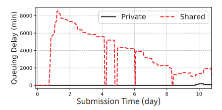  
图 1：共享异常：租户在共享集群中比在其自己的私有集群中需要更长的排队延迟

为了提高集群中的训练速度，用户通常会为深度学习作业指定 GPU 亲和力要求。例如，通常希望 64-GPU 作业以 8×8 亲和力运行，即在 8 个节点上运行作业，每个节点有 8 个 GPU，而不是 64×1，即 64 个节点，每个节点使用 1 个 GPU。

**共享异常**：一个租户被分配了 64 卡 GPU 的配额，但报告它无法运行单个（也是唯一的）8×8 深度学习作业。出现这种异常是因为租户分配的亲和力已经碎片化，不是因为它自己的作业，而是因为其他租户的作业。

我们没有开发一个实现所有可能目标的复杂调度器，而是设计了 HiveD，一个专注于消除共享异常的资源预留框架，并提供了一个接口来融合其他流行 DL 调度器来解决集群利用率 、作业完成时间和公平性等问题。

## 3 HiveD 设计
### 3.1 系统概述
HiveD 提出保证共享安全（即消除第 2 节中描述的共享异常）作为共享 GPU 集群的先决条件。具体来说，如果在私有集群中可以满足一系列具有亲和性要求的 GPU 请求，则应在相应的虚拟私有集群和共享物理集群中满足

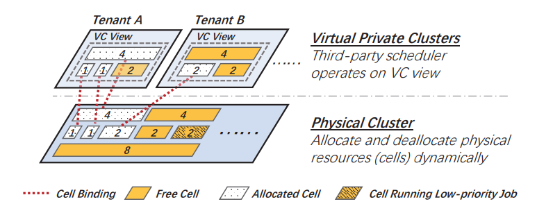  
图 2：系统架构：二层设计

图 2 说明了整体系统架构。 HiveD 对 GPU 资源抽象分为两层，即虚拟私有集群（VC）层和物理集群层。 HiveD 为每个租户提供一个 VC。每个 VC 都预分配了一组 Cell，包括配额和 GPU 的亲和性结构。亲和结构与相应私有集群相同。HiveD 确保任何调度决策都被约束在 VC 视图定义的边界内，从而保障共享安全。

如果没有任何 GPU 在使用，则逻辑 Cell 将与物理集群解除绑定。为了提高利用率，抢占低优先级作业可以机会性地消耗 GPU。这种动态绑定比静态绑定更灵活：动态绑定可以避免硬件出现故障的物理单元；它可以避免低优先级作业使用 cell 减少抢占；它还可以打包 Cell 以最小化 GPU 亲和性碎片。

HiveD 采用 Buddy cell 分配算法来处理动态绑定。

### 3.2 利用 Cells 实现的虚拟私有集群
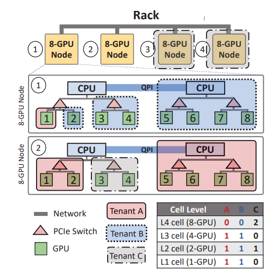  
图 3：机架的多级 cell 分配示例

如图示例，其中有 4 个级别的单元结构：分别在 GPU（级别 1）、PCIe 交换机（级别 2）、CPU 插槽（级别 3）和 Node 级别（级别 4）。该集群有一个机架，由四个 8-GPU 节点组成，由三个租户 A、B 和 C 共享。每个租户的 VC 的 cell 分配汇总在图 3 的表格中。租户 A 和 B 的 VC 都预留了一个 L3 cell（同一个 CPU 插槽下有 4 个 GPU），一个 L2 cell（同一个 PCIe 下有 2 个 GPU），一个 L1 cell （单 GPU）。大租户 C 预留了二个 L4 cell（节点级别）和一个 L2 cell。

### 3.3 Buddy Cell 分配算法
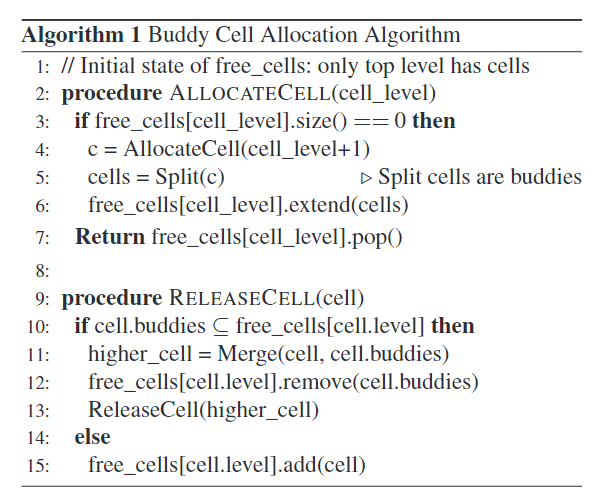  
算法 1：buddy cell 伪代码

为了在 VC 中分配一个 level-k cell，该算法从 level-k 开始，如果需要则向上移动：它首先检查是否有空闲的 level-k cell 可用，如果可用则分配一个。如果没有，该算法将按级向上移动，直到有空闲 level-l cell 可用，其中 l>k。然后将一个空闲的 level-l cell 递归地拆分为多个较低级别的 cell，直到一个 level-k cell 可用。每次分裂都会在下一层产生一组伙伴 cell，这些伙伴cell 将被添加到下一层的空闲列表中。其中一个新的低级单元再次分裂，直到产生空闲级 k cell

cell 释放过程以自下而上的方式进行。当一个 level-k cell c 被释放时，算法将 c 增加到 level-k 空闲列表中，检查 c 的伙伴 cell，如果所有 c 的伙伴 cell 都是空闲的，算法将其合并到 level-（k+1）cell。合并过程递归进行。通过这种方式，buddy cell 分配算法减少了 GPU 碎片，并创造机会调度更高级别 cell 的作业。

在处理分配请求之前，算法确保该请求是合法的，即它在该级别的 VC 分配配额内。

定理1：如果原始 VC 分配可行，在层次均匀可组合的条件下，Buddy cell 分配算法满足任何合法的 cell 分配。

## 4 实现
HiveD 已集成到 OpenPAI 中，这是一个基于 Kubernetes 的开源深度学习训练平台。它已部署到多个 GPU 集群，管理从 NVIDIA Volta 到 AMDMI50  各种类型的 GPU。这包括具有 800 个异构 GPU（200 个 Azure GPU VM）的云集群，其中 HiveD 已经可靠运行了 12 个多月（截至 2020 年 11 月）。 HiveD 服务于大规模的研究和生产工作负载，从大型 NLP 模型（例如 BERTlarge）的长期训练到由数百个短暂的 1-GPU 作业组成的 AutoML 实验。

HiveD 在 7,700 多行 Go 代码中实现。此外，它还有数千行 JavaScript、Shellscripts 和 YAML 规格与训练平台集成。它作为调度程序扩展实现，与 Kubernetes 默认调度程序 (kube-scheduler) 协同工作，即 HiveD 可以复用 kube-scheduler 的基础调度逻辑。

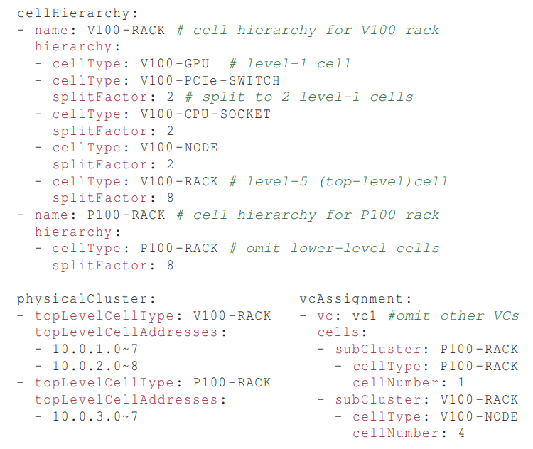  
图 4：cell 规格示例

HiveD 依赖 Cell 规格来理解集群中的 cell 层级分配。图 4 给出一个异构 GPU 集群的示例，其中包含两个机架的 NVIDIA V100 GPU 和一个机架的 NVIDIA P100 GPU。cellHierarchy 描述了两种类型多层级 cell 结构。physicalCluster 描述物理集群 cell 布局：两个 V100 机架和一个 P100 机架。VcAssignment 描述 VC cell 分配。

HiveD 进程本身也是容错的。它被部署为 Kubernetes StatefulSet 以确保单个运行实例。 HiveD 维护几个集中的内存数据结构，以保留用于单元分配的所有运行时信息（例如，空闲 cell 列表和 cell 分配列表）。为了减少开销，这些数据结构不是持久的。 HiveD 将每个 pod 的cell 绑定决策分区存储在“pod 注解”中。

当被抢占的 VM 恢复时，HiveD 会将其重新包含在集群中，就像故障 cell 恢复正常一样。我们观察到集群中高达 75% 的抢占率（200 个虚拟机中的 150 个）。HiveD 很好地处理了抢占。当 VM 被抢占时，运行在其上的深度学习作业将迁移到其他可用的 GPU 或在 GPU 不可用时排队等待。当所需的 VM 从抢占中恢复时，将在一分钟内安排等待作业。

## 5 评估
在 96 卡 GPU 集群评估
- HiveD 避免在所有测试的调度程序中发现的共享异常。作业排队延迟从 1,000 分钟减少到零
- HiveD 保证了各种集群负载下的共享安全。相比之下，基于配额的方案中的高集群负载会导致 7 倍的排队延迟
- HiveD 的 buddy cell 分配算法通过动态绑定将作业抢占减少了 55%，GPU 亲和碎片化减少 20%

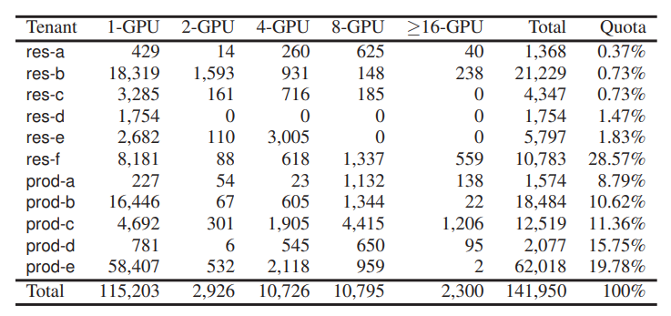  
表 1：不同 GPU 需求的作业数量和租户配额分配

评估环境：279 个 8 卡 GPU 集群，持续 2 个月，包含 141,950 个深度学习训练作业，每个作业指定其提交时间、训练时间、具有亲和力要求的 GPU 数量以及关联的租户。 集群由 11 个租户共享。表 1 显示了每个租户在实际部署中的配额分配和作业的 GPU 数量分布。我们在 Azure 上部署的 96-GPU 集群中运行实验。该集群由 24 个虚拟机组成，每个虚拟机有 4 个 NVIDIA K80 GPU。

HiveD 消除了在测试的所有调度器中发现共享异常。过多的作业排队延迟从 1,000 分钟减少到零。

HiveD 的 buddy cell 分配算法通过动态绑定减少了 55% 的作业抢占，通过 GPU 亲和减少了 20% 资源碎片。

### 5.1 共享安全：集群实验
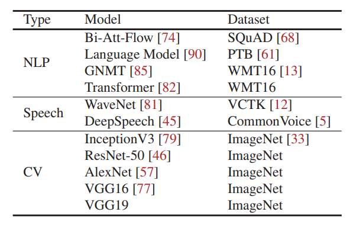  
表 2：实验中使用的深度学习模型

我们从 2 个月的生产评估中收集 10 天的数据。在 96 个 GPU 集群上估计 2,232 个 GPU 集群的负载，我们通过按比例从 10 天跟踪中随机抽样（2,232 个中的 96 个）来减少作业数量。出于安全原因，我们无法访问作业的代码和数据。因此，我们用来自 GitHub 的自然语言处理 (NLP)、语音和计算机视觉 (CV) 领域的 11 个流行的深度学习模型替换了这些工作（总结在表 2 中）。我们按照 NLP:Speech:CV = 6:3:1 的分布混合这些模型。

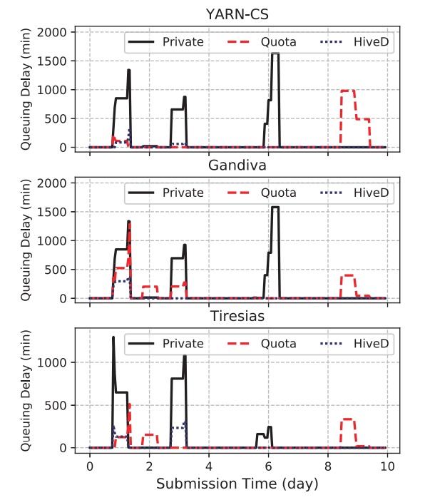  
（a）租户 prod-a 的平均排队延迟

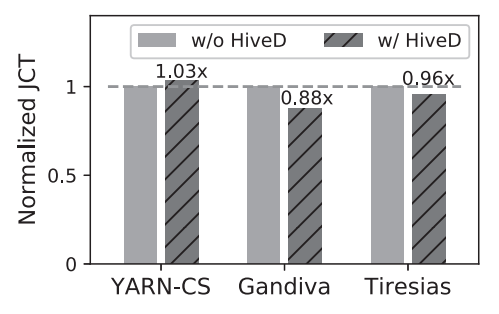  
（b）租户平均作业完成时间  
图 5：96 卡 GPU 集群调度器 HiveD 对照实验

图 5(a) 使用三个调度器评估租户 prod-a 的作业排队延迟。三个调度器在没有 HiveD 的情况下都表现出共享异常。
在共享安全的情况下，HiveD 仍然可以保持调度效率。  
图 5(b) 显示，与没有 HiveD 的那些相比，HiveD 表现出相似的作业完成时间：最多差 3%（对于 YARN-CS）和 优 12%（对于 Gandiva）。

### 5.2 共享安全：全程模拟

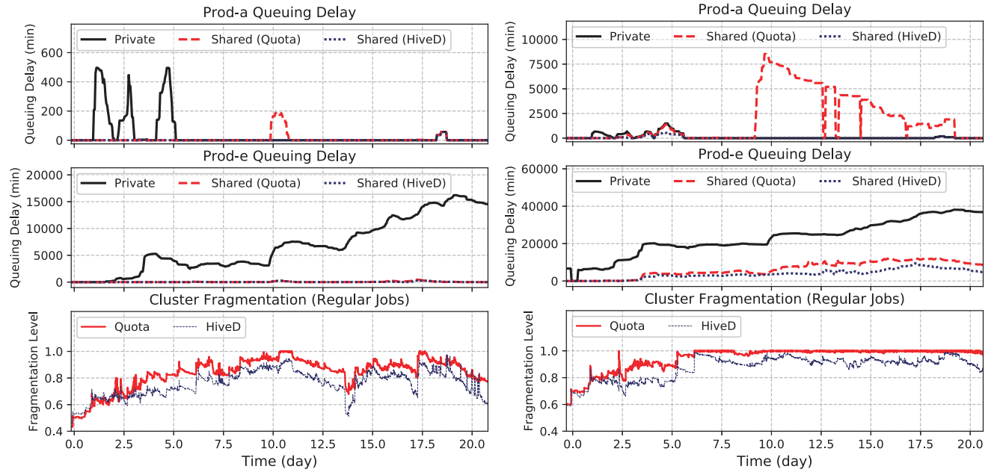  
（a）279 节点                                                    （b）200 节点
图 6：租户 prod-a 和 prod-b 的平均作业排队延迟及 GPU 亲和碎片水平

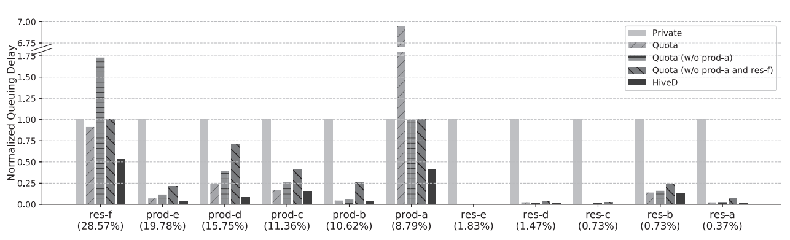  
图 7：租户平均排队延迟，标准化及私有集群（200 节点）

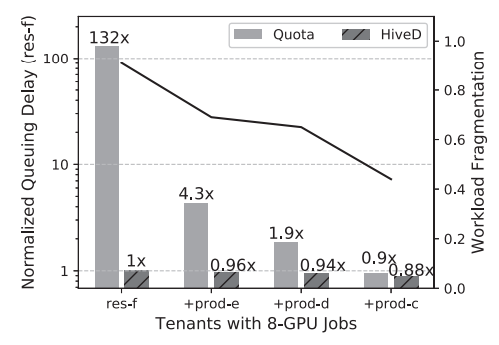  
图 8：私有集群排队延迟与工作负载碎片级别（200 节点）

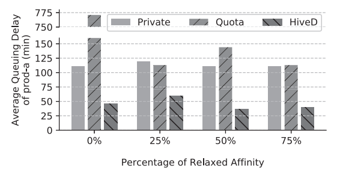  
图 9：弱亲和性需求时的共享异常

### 5.3 Buddy Cell 分配
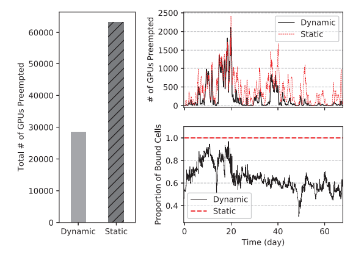  
图 10：动态和静态绑定中的抢占

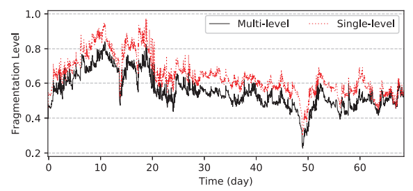  
图 11：多级和单级 cell 碎片化
## 6 讨论
- VC 分配
- 作业迁移
- HiveD 上云
- 将 HiveD 扩展到其他亲和感知资源，如同一 NUMA 节点关联的 CPU。

## 7 相关研究
- 用户 DL 训练的亲和感知调度器
- 共享集群的公平性调度
- 性能隔离：包括存储、设备、网络、GPU 隔离等
- 碎片化研究

## 8 结语
受到生产集群观察启发，并通过广泛的评估验证，HiveD 采用了一种新的方法来应对共享多租户 GPU 集群以进行深度学习的挑战，方法是  
（i） 定义一个简单实用的共享安全性保障，  
（ii）提出一个亲和力感知资源抽象 cell 来模拟虚拟私有集群，  
（iii）开发一个优雅高效的 buddy cell  分配算法 ，它被证明可以保证共享安全且易于扩展至低优先级工作，   
（iv） 设计一个灵活的可融合流行调度器的架构，以实现共享安全和调度效率。  
所有这些结合起来，HiveD 在共享安全和集群利用率等多个目标之间取得了适当的平衡。  

## 附录
### 术语
**虚拟私有集群（VC）**：Virtual Private Cluster，为每个租户提供的抽象定义的虚拟私有集群。

**共享安全（shareing safety）**：确保每个租户只能访问其分配的资源，并防止不同租户之间的干扰和冲突。

**共享异常**：资源碎片化引起的作业排队。

**Buddy cell 分配算法**：管理 cell 从 VC 到物理集群的动态绑定来确保共享安全。

## 相关文档

[1] https://www.usenix.org/conference/osdi20/presentation/zhao-hanyu HiveD: Sharing a GPU Cluster for Deep Learning with Guarantees  
[2] https://dl.acm.org/doi/10.5555/3488766.3488795 eReader  
[3] https://github.com/microsoft/hivedscheduler  