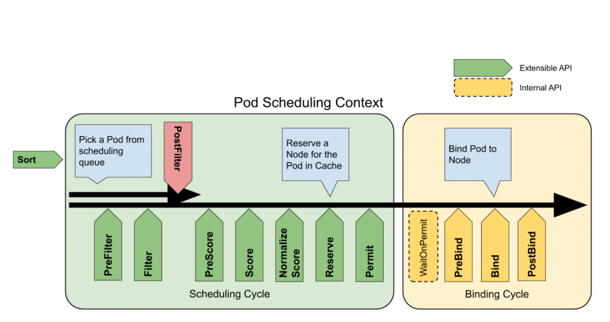

# 《A Deep Dive into Kubernetes Scheduling》笔记

原文链接：https://granulate.io/blog/a-deep-dive-into-kubernetes-scheduling/

`Kubernetes Scheduler` 是 Kubernetes 控制面的核心组件之一。 其默认行为是将 `pod` 分配给节点，同时平衡节点之间的资源利用率。

当 pod 被分配到一个新节点时，运行在该节点上的 `kubelet` 从 Kubernetes API 中检索 pod 规格，然后，`kubelet` 根据规范创建资源和容器。

## 概览

Kubernetes 调度只是将 pod 分配给集群中匹配节点的过程。 调度程序监视新创建的 pod 并为它们的分配找到最佳节点。

`nodeName` 示例:

```yml
apiVersion: v1
kind: Pod
metadata:
  name: nginx
spec:
  containers:
  - name: nginx
    image: nginx
  nodeName: node-0
```

`nodeSelector` 示例，调度器将过滤标签包含 `disktype: ssd`的节点:

```yml
apiVersion: v1
kind: Pod
metadata:
  name: nginx
spec:
  containers:
  - name: nginx
    image: nginx
  nodeSelector:
    disktype: ssd
```

## 节点亲和

- 节点亲和性是一组定义在 pod 上的约束，用于确定哪些节点可以调度。
- 节点亲和过滤节点 `label`
- 例如，可以将 pod 配置为仅运行具有 GPU 的节点，最好使用 NVIDIA_TESLA_V100 来处理您的深度学习工作负载

规则

```bash
# hard rules
requiredDuringSchedulingIgnoredDuringExecution
requiredDuringSchedulingRequiredDuringExecution

# soft rules
preferredDuringSchedulingIgnoredDuringExecution
preferredDuringSchedulingRequiredDuringExecution
```

- 以 required 开头的规则描述了必须满足的硬性要求。
- 以 preferred 开头的规则描述了优先但不保障的软要求。
- 如果规则声明为 IgnoredDuringExecution，则调度程序在第一次分配后，不会再次检查规则有效性。
- 如果使用 RequiredDuringExecution 指定规则，调度程序将始终通过将 pod 移动到合适的节点来确保规则的有效性。

以下示例，pod 有一个节点亲和性规则，表明 Kubernetes Scheduler 应该只将 pod 放置到 us-east 区域中的节点。 第二条规则表明应该首选 us-east-1 或 us-east-2 区域。

```yml
apiVersion: v1
kind: Pod
metadata:
  name: nginx
spec:
  affinity:
    nodeAffinity:
      requiredDuringSchedulingIgnoredDuringExecution:
        nodeSelectorTerms:
        - matchExpressions:
          - key: topology.kubernetes.io/region
            operator: In
            values:
            - us-east

      preferredDuringSchedulingIgnoredDuringExecution:
      - weight: 1
        preference:
          matchExpressions:
          - key: topology.kubernetes.io/zone
            operator: In
            values:
            - us-east-1
            - us-east-2
  containers:
  - name: nginx
    image: nginx
```

## 污点和容忍度

给节点增加污点：  

`kubectl taint nodes node1 test-environment=true:NoSchedule`


Kubernetes 调度器将不会为上午污点节点分配任何 pod，除非 pod 规格中具有匹配的容忍度。如下：

```yml
apiVersion: v1
kind: Pod
metadata:
  name: nginx
spec:
  containers:
  - name: nginx
    image: nginx
  tolerations:
  - key: "test-environment"
    operator: "Exists"
    effect: "NoSchedule"
```

## 调度瓶颈

### "Noisy Neighbors"： `Requests` 和 `Limits`

例如，假设在同一个节点上有两个 pod，A 和 B。 如果 pod B 试图消耗所有 CPU 或内存，那么 pod A 就会有问题。  
幸运的是，为容器设置资源请求和限制可以控制邻居。

### 系统进程资源不足

- Kubernetes 节点主要是连接到 Kubernetes 控制面的虚拟机。 因此，节点也有自己的操作系统和相关进程在其上运行。  
- 如果 Kubernetes 工作负载消耗了所有资源，节点将无法运行并会出现问题。  
- 需要在 kubelet 中使用标志 `–system-reserved` 设置保留资源

### 抢占

- 如果 Kubernetes 调度器无法将 pod 调度到可用节点，它可以抢占（逐出）节点中的一些 pod 以分配资源。
- 如果 pod 没有被调度，需要检查它们的优先级
- 如果 pod 在集群中移动而没有特定原因，请考虑为它们定义优先级。

```yml
apiVersion: scheduling.k8s.io/v1
kind: PriorityClass
metadata:
  name: high-priority-nonpreempting
value: 100000
preemptionPolicy: Never
globalDefault: false
description: "This priority class will not preempt other pods."

---

apiVersion: v1
kind: Pod
metadata:
  name: nginx
spec:
  containers:
  - name: nginx
    image: nginx
priorityClassName: high-priority-nonpreempting
```

## 调度框架

### 工作流和扩展点

调度 Pod 包括两个阶段：调度阶段和绑定阶段。 在调度阶段中，调度器找到一个可行的节点。 然后，在绑定阶段中，将决策应用于集群。



- `QueueSort`：对队列中的 pod 进行排序
- `PreFilter`：检查 pod 调度周期的前置条件
- `Filter`：过滤掉不适合 pod 的节点
- `PostFilter`：如果没有找到适用于 pod 的可行节点，则运行
- `PreScore`：运行预评分任务为评分插件生成可共享状态
- `Score`：通过调用每个评分插件对过滤后的节点进行排名
- `NormalizeScore`：结合分数并计算节点的最终排名
- `Reserve`：在绑定周期之前选择保留的节点
- `Permit`：批准或拒绝调度周期结果
- `PreBind`：执行任何先决条件工作，例如配置网络卷
- `Bind`：将 pod 分配给 Kubernetes API 中的节点
- `PostBind`：通知绑定循环的结果

## 调度器性能调优

当集群中的节点数量非常多时，调度程序的工作量呈指数级增长。 在大型集群中，找到最佳节点可能需要很长时间。  

`percentageOfNodesToScore` 设置了参与评分的节点数量。 默认情况下，Kubernetes 会设置一个线性阈值， 在 100 节点集群 50% 和 5000 节点集群的 10% 之间。 默认值的最小值是 5%。确保您的集群中至少有 5% 的节点被考虑进行调度。
