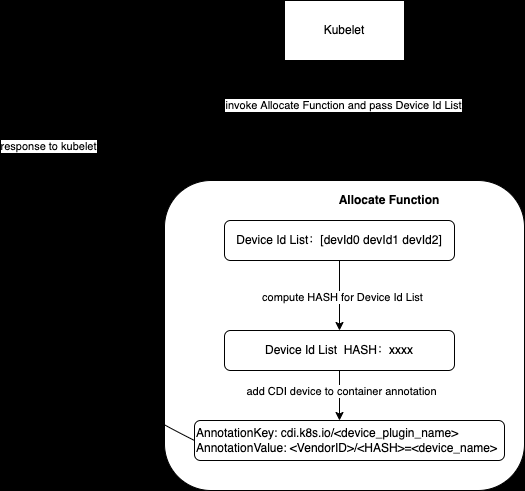
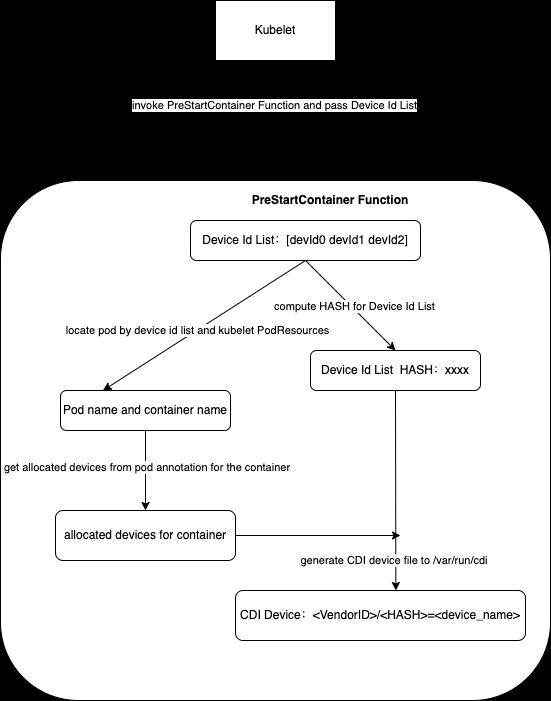
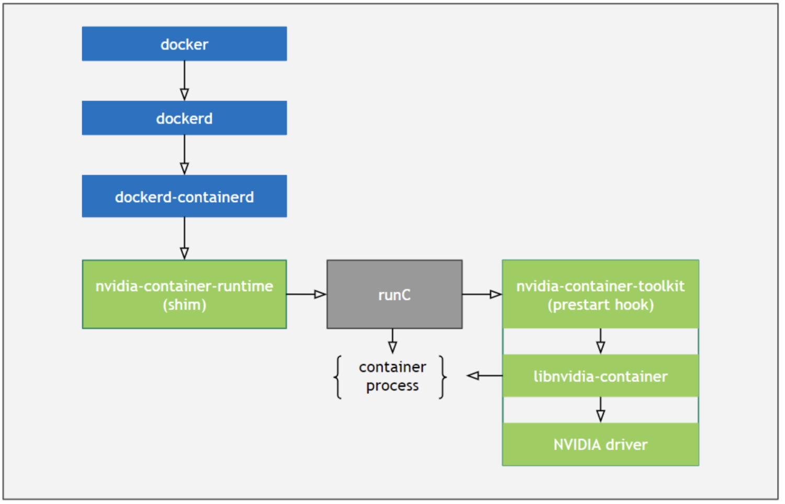
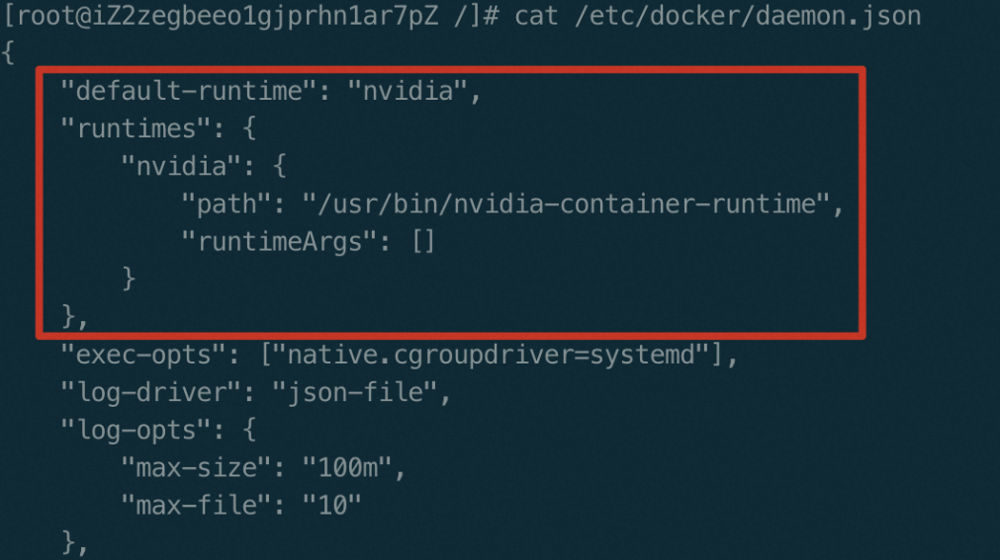

# 容器设备接口 (CDI) 介绍

## 概要
CDI（Container Device Interface）是容器运行时的规范，它将跨容器运行时对 GPU 等复杂设备的访问进行了标准化。容器运行时可以读取并处理该规范，以确保容器中的设备可用。

它引入了设备作为资源的抽象概念。此类设备由完全限定名称唯一指定（示例：vendor.com/device=foo）。

CDI 只关心使容器能够感知设备。资源管理等领域被明确排除在 CDI 之外（并且预计由编排器处理）。由于这一重点，CDI 规范易于实现，并为运行时和编排器提供了极大的灵活性。

注意：CDI 模型基于容器网络接口 (CNI) 模型和规范。

### 背景
在 Linux 上，让容器具有设备感知能力曾经很简单，只需在容器中公开一个设备节点即可。然而，随着设备和软件变得越来越复杂，供应商希望执行更多的操作，例如：
- 将设备暴露给容器可能需要暴露多个设备节点、从运行时命名空间挂载文件或隐藏 procfs 条目。
- 在容器和设备之间执行兼容性检查（例如：此容器可以在此设备上运行吗？）
- 执行特定于运行时的操作（例如：VM 与基于 Linux 容器的运行时）
- 执行特定于设备的操作（例如：清理 GPU 的内存或重新配置 FPGA）

由于缺乏针对第三方设备的标准，供应商往往不得不为不同的运行时编写和维护多个插件，甚至直接在运行时中贡献供应商特定的代码。此外，运行时不会统一公开插件系统（甚至根本不会公开插件系统），这就导致在更高层次的抽象（如 Kubernetes 设备插件）中出现功能重复。

### 示例
定义 CDI 规格（/etc/cdi/vendor.json）
```json
{
    "cdiVersion": "0.6.0",
    "kind": "vendor.com/device", // 设备类型
    "devices": [{
        "name": "foo", // 设备名
        "containerEdits": { // 定义设备行为
            "deviceNodes": [{ // 描述应挂载的设备节点
                    "hostPath": "/vendor/dev/card1",
                    "path": "/dev/card1",
                    "type": "c",
                    "major": 25,
                    "minor": 25,
                    "fileMode": 384,
                    "permissions": "rw",
                    "uid": 1000,
                    "gid": 1000
                }
            ]
        }
    }],
    "containerEdits": {
    }
}
```


在 podman 中使用 CDI：
```bash
podman run --device vendor.com/device=foo ....
```
该命令代表容器使用 vendor.com/device=foo 这个 CDI 设备，其中 vendor.com/device 与 CDI 规格中的 kind 一致，foo 为 CDI 规格定义的设备名称 (name 字段)。


## 规范
容器设备接口（CDI）描述了一种容器运行时的机制，用于创建能够与第三方设备交互的容器。

对于第三方设备来说，与这些设备交互通常需要容器运行时暴露比设备节点更多的信息。例如，第三方设备可能需要加载内核模块、挂载主机库或暴露/屏蔽特定 procfs 路径。

容器设备接口描述了一种允许第三方供应商执行这些操作的机制，这样就不需要更改容器运行时。

使用的机制是一个 JSON 文件（类似于容器网络接口 (CNI)），它允许供应商描述容器运行时应在容器的 OCI 规范上执行的操作。

CDI 支持以下两个流程：  
A、设备安装
- 用户在机器上安装第三方设备驱动程序（和第三方设备）。
- 设备驱动程序安装软件会在一个已知路径（/etc/cdi/vendor.json）上写入一个 JSON 文件。
B、容器运行时
- 用户在运行容器时，参数 --device 后面会跟一个设备名称。
- 容器运行时会读取 JSON 文件。
- 容器运行时会验证 JSON 文件中是否描述了设备。
- 容器运行时会拉取容器映像。
- 容器运行时会生成 OCI 规范。
- 容器运行时会根据 JSON 文件中的指令转换 OCI 规范

CDI 定义（JSON）
```json
{
    "cdiVersion": "0.6.0",
    "kind": "<name>", // 指定了唯一标识设备供应商的标签

    // additional information to a consumer on the spec.
    "annotations": { (optional)
        "key": "value"
    },

    "devices": [ // devices 字段描述了容器运行时用户可以请求的硬件设备集
        {
            "name": "<name>", // 设备名称，可用于在请求设备时引用它

            // additional information to a consumer on the specific device.
            "annotations": { (optional)
              "key": "value"
            },

            "containerEdits": { ... } 
        }
    ],

    // 最外层的containerEdits（与devices字段在同一级别）为所有设备的公共行为
    "containerEdits": [ // 字段描述了要对 OCI 规范进行的编辑
        {
            "env": [ (optional) // 描述了应该设置的环境变量。这些值将附加到容器环境数组中
                "<envName>=<envValue>"
            ]
            "deviceNodes": [ (optional) // 描述应挂载的设备节点
                {
                    "path": "<path>", // 容器内设备的路径
                    "hostPath": "<hostPath>" (optional), // 主机上设备节点的路径
                    "type": "<type>" (optional), // 设备类型：块、字符等
                    "major": <int32> (optional), // 设备主设备号
                    "minor": <int32> (optional), // 设备次要编号
                    "fileMode": <int> (optional), // 设备的文件模式
                    // 设备的 Cgroups 权限
                    // * r - 允许容器从指定设备读取数据
                    // * w - 允许容器写入指定设备
                    // * m - 允许容器创建尚不存在的设备文件
                    "permissions": "<permissions>" (optional),
                    "uid": <int> (optional), // 容器命名空间中设备所有者的 id
                    "gid": <int> (optional) // 容器命名空间中设备组的 ID
                }
            ]
            "mounts": [ (optional) // 描述应挂载的路径
                {
                    "hostPath": "<source>", // 主机上设备的路径
                    "containerPath": "<destination>", // 容器内设备的路径
                    "type": "<OCI Mount Type>", (optional) // 要挂载的文件系统类型
                    "options": "<OCI Mount Options>" (optional) // 要使用的文件系统的挂载选项
                }
            ],
            "hooks": [ (optional) // 描述应运行的钩子
                {
                    "hookName": "<hookName>", // 要调用的钩子名称
                    "path": "<path>", // 必须是绝对路径
                    "args": ["<arg>", "<arg>"], (optional)
                    "env":  [ "<envName>=<envValue>"], (optional)
                    "timeout": <int> (optional) // 终止钩子前的秒数
                }
            ]
        }
    ]
}

```

**Kind**  
kind（字符串，必填）字段指定了唯一标识设备供应商的标签。它可用于消除与设备匹配的供应商的歧义，例如：`docker/podman run --device vendor.com/device=foo ....  `  
种类标签有两部分：前缀和名称，以斜线 (/) 分隔。

**CDI Devices**  
devices 字段描述了容器运行时用户可以请求的硬件设备集。注意：为了使 CDI 文件有效，必须在此数组中至少指定一项。

**OCI 编辑**  
containerEdits 字段描述了要对 OCI 规范进行的编辑。目前，可以对 OCI 规范进行以下几种编辑：环境、设备、挂载和钩子。  
- 在设备级别，只有当容器运行时用户请求匹配设备时才必须进行编辑。
- 在容器级别，如果要求使用设备字段中定义的任何设备，则必须在该级别进行编辑。

## 错误处理
- 请求的种类不存在于任何 CDI 文件中。当请求的种类不存在时，容器运行时应显示错误。
- 请求的设备（非设备节点）不存在。当请求的设备不存在时，容器运行时应显示此错误。
- "资源 "不存在（例如：挂载、挂钩......）。当请求不存在的 "资源 "时（例如：在 "运行 "时），容器运行时应显示此错误。这是因为在编写规范时，资源并不需要存在，但在创建容器时，它需要存在。
- 钩子执行失败。当钩子执行失败时，容器运行时应显示错误。

## 配置
为了使 CDI 发挥作用，需要做到以下几点：
- CDI 规范目录中应包含 JSON 格式的 OCI 规范更新 CDI 文件。默认目录为 /etc/cdi 和 /var/run/cdi
- 应使用 podman 的命令行参数或使用 CRI-O 和 containerd 的容器注解将完全限定的设备名称传递给运行时
- 容器运行时应该能够通过设备名称找到 CDI 文件，并使用 CDI 文件内容更新容器配置

### CRI-O 配置
CRI-O 默认启用 CDI 支持。它使用默认的 /etc/cdi 和 /var/run/cdi CDI 目录位置进行配置。因此，只需将 CDI 配置文件放到这两个目录中的任意一个，就可以开始使用 CDI，静态配置放到 /etc/cdi 中，动态更新配置放到 /var/run/cdi 中。

### containerd 配置
要在 containerd 运行时中启用和配置 CDI 支持，应在 containerd 配置文件（默认为 /etc/containerd/config.toml）的 plugins.io.containerd.grpc.v1.cri 部分中设置 2 个配置选项 enable_cdi 和 cdi_spec_dirs：
```ini
[plugins."io.containerd.grpc.v1.cri"]
  enable_cdi = true
  cdi_spec_dirs = ["/etc/cdi", "/var/run/cdi"]
```

### Podman 配置
podman 不需要任何特定配置来启用 CDI 支持，而是直接处理指定的 --device 标志。如果包含完全限定的设备选择器（例如：vendor.com/device=myDevice），则会检查默认位置（/etc/cdi 和 /var/run/cdi）上的 CDI 规范是否与设备匹配。

## 示例
### CDI 规格
```json
$ mkdir /etc/cdi
$ cat > /etc/cdi/vendor.json <<EOF
{
	"cdiVersion": "0.6.0",
	"kind": "vendor.com/device", // 设备类型
	"devices": [{
		"name": "myDevice", // 设备名
		"containerEdits": { // 定义设备行为
			"deviceNodes": [{ // 描述应挂载的设备节点
					"hostPath": "/vendor/dev/card1",
					"path": "/dev/card1",
					"type": "c",
					"major": 25,
					"minor": 25,
					"fileMode": 384,
					"permissions": "rw",
					"uid": 1000,
					"gid": 1000
				},
				{
					"path": "/dev/card-render1",
					"type": "c",
					"major": 25,
					"minor": 25,
					"fileMode": 384,
					"permissions": "rwm",
					"uid": 1000,
					"gid": 1000
				}
			]
		}
	}],
	"containerEdits": { // 全局共享
		"env": [ // 容器环境变量
			"FOO=VALID_SPEC",
			"BAR=BARVALUE1"
		],
		"deviceNodes": [{ // 描述应挂载的设备节点
			"path": "/dev/vendorctl",
			"type": "b",
			"major": 25,
			"minor": 25,
			"fileMode": 384,
			"permissions": "rw",
			"uid": 1000,
			"gid": 1000
		}],
		"mounts": [{ // 挂载路径
				"hostPath": "/bin/vendorBin",
				"containerPath": "/bin/vendorBin"
			},
			{
				"hostPath": "/usr/lib/libVendor.so.0",
				"containerPath": "/usr/lib/libVendor.so.0"
			},
			{
				"hostPath": "tmpfs",
				"containerPath": "/tmp/data",
				"type": "tmpfs",
				"options": ["nosuid", "strictatime", "mode=755", "size=65536k"]
			}
		],
		"hooks": [{ // 描述应运行的钩子
				"createContainer": {
					"path": "/bin/vendor-hook"
				}
			},
			{
				"startContainer": {
					"path": "/usr/bin/ldconfig"
				}
			}
		]
	}
}
EOF
```

假设该规格已经生成，并存在于 /etc/cdi 或 /var/run/cdi 中，则可通过设备的全限定设备名访问设备。

例如，在 podman 的情况下，访问设备的 CLI 应为
```bash
podman run --device vendor.com/device=myDevice ...
```

### 添加元信息
使用每个设备的注解来添加元信息
```json
$ mkdir /etc/cdi
$ cat > /etc/cdi/vendor-annotations.json <<EOF
{
  "cdiVersion": "0.6.0",
  "kind": "vendor.com/device",
  "devices": [
    {
      "name": "myDevice",
      "annotations": { // 设备注解
        "whatever": "false"
        "whenever": "true"
      }
      "containerEdits": {
        "deviceNodes": [
          {"path": "/dev/vfio/71"}
        ]
      }
    }
  ]
}
EOF
```

## Kubernetes 支持（CDI 注解）
通过 Device Plugin 生成 CDI 设备规格。

对于尚未直接支持 CRI 字段但支持通过注解进行设备请求的容器运行时, 带有 cdi.k8s.io 前缀的注解将被添加到容器中。本节以注解为例介绍。

### Device Plugin 实现方式
Allocate 相关逻辑：
- 假设 kubelet 向 Allocate 函数传递的设备 ID 列表为 [devId0 devId1 devId2]
- 对设备 ID 列表 [devId0 devId1 devId2] 做HASH计算，以算出的 HASH 值构建 CDI 设备类型
- 返回给 kubelet 的容器配置信息中，为容器添加一个 Annotation
  - Annotation 的 key 为 cdi.k8s.io/<device_plugin_name>
  - Annotation 的 value 为 CDI 设备的命名规则，即 <VendorId>/<class>=<unique_name>
- 如果底层 runtime 支持 CDI 机制，发现容器具有这个 annotation 后，会自动寻找这个 CDI设备，并将 CDI 定义的配置加入到容器的配置中。

  
添加 CDI 设备注解

PreStartContainer 阶段配置 CDI 规格
- 根据 kubelet 传递的设备 ID 去定位 pod 和容器
- 从 pod annotation 中，拿到调度器为该 pod 的容器分配的设备信息，生成 CDI 文件，存放在 /var/run/cdi 中

  
CDI 规格配置流程

## Kubernetes 支持（CDI 字段）
 KEP 建议扩展设备插件（Device Plugin） API，在 AllocateResponse 中添加一个字段来指定容器设备接口（CDI）设备 ID。这将补充注解（annotations）等现有字段，并允许设备插件实现使用其完全限定的 CDI 设备名称来唯一指定设备。

### 目标
1、允许设备插件作者将设备请求作为 CRI 字段转发给 CRI 运行时。  
2、允许设备插件作者使用 CDI 来定义容器化环境所需的修改。

### 设计
将在作为设备插件 API 中 AllocateResponse 的 ContainerAllocateResponse 中添加一个重复的 CDIDevice 字段。

该字段中包含的值随后会被用于填充 CRI 中的相应字段，并传递给容器运行时。此外，带有 cdi.k8s.io 前缀的注解将被添加到 CRI 中，以便在尚未直接支持 CRI 字段但支持通过注解进行设备请求的容器运行时中使用。

```go
// CDIDevice 指定 CDI 设备信息
message CDIDevice {
	// 完全限定的 CDI 设备名称
	// 示例: vendor.com/gpu=gpudevice1
	string name = 1;
}

message ContainerAllocateResponse {
	// 要在容器中设置以访问多个设备之一的环境变量列表
	map<string, string> envs = 1;
	// 容器挂载
	repeated Mount mounts = 2;
	// 容器设备
	repeated DeviceSpec devices = 3;
	// 容器注解
	map<string, string> annotations = 4;
	// CDI 设备.
	repeated CDIDevice cdi_devices = 5;
}
```
CRI 注解示例
```yml
AnnotationKey: cdi.k8s.io/nvidia-device-plugin
AnnotationValue: nvidia.com/gpu=0,nvidia.com/gpu=2 （CDI设备名称）
```

### 里程碑
- alpha: v1.28
- beta: v1.29
- stable: v1.30

## 案例：GPU Opearator 对 CDI 的支持
### 无 CDI 时
在没有CDI之前，NVIDIA 对容器中使用 GPU 的场景提供了一套称为 nvidia container runtime 的方案，示意图如下：

  
nvidia container runtime 方案

  
Docker 运行时替换为 nvidia container runtime

创建容器时，nvidia-container-runtime 检查容器的 oci 规格中的环境变量是否有特定环境变量NVIDIA_VISIBLE_DEVICES；如果有，那么在容器 oci 规格中添加一个 prestart hook（告诉runc 在启动容器之前，执行这个 hook：
```json
{
  ...
   "hooks":{
      "prestart":[
         {
            "path":"/usr/bin/nvidia-container-runtime-hook",
            "args":[
               "/usr/bin/nvidia-container-runtime-hook",
               "prestart"
            ]
         }
      ]
   }
  ...
}
```

在容器启动之前，runc 会调用 nvidia-container-runtime-hook（该文件是nvidia-container-toolkit 二进制文件的软连接），这个 hook 将会借助 libnvidia-container 等工具修改容器cgroup，把一些与 GPU 相关的文件挂载到容器中。

这套机制存在一些问题：
- 只针对GPU，如果是其他异构计算设备，那么需要重新开发
- 在高版本的 systemd 环境下使用 nvidia container runtime 可能会存在一些问题。

针对这些问题，nvidia正在逐步使用 CDI 替换原有的这一套机制。

CDI 优势
- CDI 简化了对 GPU 等设备的添加支持，因为该规范适用于所有支持 CDI 的容器运行时。
- CDI 还提高了 Nvidia 容器栈与某些功能（如无根容器）的兼容性。
- CDI 的使用对集群管理员和应用程序开发人员是透明的。

### 实现
CDI 支持由 NVIDIA Container Toolkit 提供，而 Operator 则将该支持扩展到 Kubernetes 集群。  
启用 CDI 后，nvidia-cdi 和 nvidia-legacy 这两个运行时类将可用。这两个运行时类是默认运行时类 nvidia 的补充。  
如果不将 CDI 设置为默认运行时，运行时将解析为 NVIDIA Container Toolkit 在 x86_64 机器或任何安装了 NVML 库的架构上提供的传统运行时模式。

### 生成 CDI 规格
1、生成 CDI 规格文件：`nvidia-ctk cdi generate --output=/etc/cdi/nvidia.yaml`  
2、检查生成的设备名称：`nvidia-ctk cdi list`  
```bash
INFO[0000] Found 9 CDI devices
nvidia.com/gpu=all
nvidia.com/gpu=0
```

### 使用 CDI 运行工作负载
CDI 规范的使用取决于您使用的支持 CDI 的容器引擎或 CLI。以 podman 为例，从 v4.1.0 开始发布的版本支持在 --device 参数中指定 CDI 设备。假设你在上一节中生成了 CDI 规范，那么运行一个可访问所有英伟达™（NVIDIA®）GPU 的容器需要执行以下命令：
```bash
podman run --rm \
--device nvidia.com/gpu=all \
--security-opt=label=disable \
ubuntu nvidia-smi -L
```

以上示例命令应显示与在主机上运行 `nvidia-smi -L` 相同的输出。

CDI 规范还包含对单个 GPU 或 MIG 设备的引用。您可以在启动容器时指定这些设备的名称，例如下面的示例：
```bash
podman run --rm \
    --device nvidia.com/gpu=0 \
    --device nvidia.com/gpu=1:0 \
    --security-opt=label=disable \
    ubuntu nvidia-smi -L
```
上述示例命令请求索引为 0 的完整 GPU 和 GPU 1 上的第一个 MIG 设备。输出应该只显示所请求设备的 UUID。

### 将 CDI 与不支持 CDI 的运行时结合使用
为了支持不原生支持 CDI 的运行时，可以在 cdi 模式下配置 Nvidia Container Runtime。在该模式下，Nvidia Container Runtime 不会将 Nvidia Container Runtime Hook 注入传入的 OCI 运行时规范中。相反，运行时会对请求的 CDI 设备进行注入。

如果通过 CDI 设备名请求设备，Nvidia Container Runtime 会自动使用 cdi 模式。

以未启用 CDI 的运行时 Docker 为例，以下命令使用 CDI 将请求的设备注入容器：
```bash
docker run --rm -ti \
--runtime=nvidia \
-e NVIDIA_VISIBLE_DEVICES=nvidia.com/gpu=all \
ubuntu nvidia-smi -L
NVIDIA_VISIBLE_DEVICES 环境变量表示要将哪些设备注入容器，显式设置为 nvidia.com/gpu=all。
```

## 附录
### 术语
**libnvidia-container** 提供了一个运行时接口，用于在容器中与主机上的 NVIDIA GPU 进行交互。它提供了一些功能，如 GPU 设备的探测、驱动程序的加载和配置、CUDA 库的支持等。通过使用 libnvidia-container，我们可以在容器中轻松地访问和使用 GPU 资源，以提高应用程序的性能和效率。

**nvidia-cdi** 运行时类, 作为对 nvidia 类的补充

**nvidia-ctk**（NVIDIA Container Toolkit CLI）容器工具包, 包含的功能可确保 nvidia runtime 已在 Docker 守护进程中注册

**nvidia-legacy** 运行时类, 作为对 nvidia 类的补充

**完全限定（fully qualified）**意味着一个标识或名称具备了所有必要的信息，能够准确地指代某个对象、位置或实体。举个例子，假设我们要访问一个网站上的特定页面。一个 "fully qualified" 的 URL（统一资源定位符）将包含协议（如 "http" 或 "https"）、域名、路径和其他可能的参数，以确保我们能够准确地定位到这个页面。

### 相关链接
[1] https://github.com/cncf-tags/container-device-interface 容器设备接口  
[2] https://docs.nvidia.com/datacenter/cloud-native/gpu-operator/latest/cdi.html Nvidia GPU Operator 对 CDI 的支持  
[3] https://docs.nvidia.com/datacenter/cloud-native/container-toolkit/latest/cdi-support.html Nvidia CDI 支持  
[4] https://github.com/cncf-tags/container-device-interface/blob/main/SPEC.md 容器设备接口规范  
[5] https://github.com/kubernetes/enhancements/tree/master/keps/sig-node/4009-add-cdi-devices-to-device-plugin-api  KEP-4009：在设备插件 API 中添加 CDI 设备  
[6] https://developer.aliyun.com/article/1180698 CDI 介绍  
[7] https://github.com/NVIDIA/k8s-device-plugin 用于 Kubernetes  的 Nvidia 设备插件  


