# GPU共享调度技术调研报告

## 01、背景
近年来, 随着人工智能和深度学习等前沿技术的迅速发展, GPU 在各行各业部署模型训练和推理计算任务的需求不断增长。GPU 价格高昂, 如何提高 GPU 资源利用率和降低总拥有成本已成为技术领域迫切需要解决的问题。为了充分发挥 GPU 资源潜力, GPU 共享调度技术应运而生。通过集中化管理和动态分配 GPU 计算能力, 实现对 GPU 资源的逻辑隔离与再分割。从而能够支持多个任务或应用同时在 GPU 设备上高效运行, 有效减少因资源争用造成的性能损失, 同时也降低了组织的 GPU 部署投入。这类技术已经成为推动人工智能和深度学习研发与应用的重要基础设施。随着 GPU 算力需求和多租户模式的日益复杂, GPU 共享调度方案本身也在不断提升, 以满足新的挑战。


## 02、业务价值  

GPU 共享调度允许多个任务共享 GPU 计算资源。这意味着多个任务可以同时在 GPU 上执行，从而实现多方面的业务价值 ：

1）**提高 GPU 资源效率**：通过监控不同任务的 GPU 使用情况, 充分利用空闲的计算资源, 最大限度地提升 GPU 的整体利用率。

2）**降低 GPU 使用成本**：相比专属分配 GPU, 共享调度可以显著降低 GPU 的使用成本。

3）**提高灵活性**：共享调度允许动态调整不同任务对 GPU 资源的分配,  根据任务优先级和资源需求进行弹性调度,  提高资源分配的灵活性。

4）**改善用户体验**：在多用户环境中, 通过透明的共享调度可以减少用户等待时间,  提供更流畅的 GPU 加速体验。

5）**简化管理**：相比固定分配, 共享调度可以通过统一的调度系统, 简化 GPU 资源的管理和监控。

6）**加速深度学习**：深度学习训练往往需要大量 GPU 资源, 共享调度可以充分利用存在的 GPU, 大大缩短模型训练时间。

## 03、应用场景
GPU 共享调度在实际生产中有着广阔的应用场景，主要包括：

1）**多用户场景**。在多用户的环境中，多个用户可能需要同时使用 GPU 资源进行计算任务。通过共享调度可以让多个用户的任务在同一张 GPU 上运行，提高 GPU 利用率，降低成本，并保证每个用户都能公平地获取到 GPU 资源。

2）**高性能计算场景**。在服务器上有多块 GPU 时, 如果每个任务独占一块 GPU, 会造成某些 GPU 长期处于空闲状态,降低整体资源利用率。通过 GPU 共享调度可以实现动态任务映射, 提高 GPU 利用率, 并保证任务之间的隔离性，防止一个任务影响到其他任务的运行。

3）**负载平衡场景**。当某些 GPU 负载较高,而另外一些 GPU 负载较低时, 通过 GPU 共享调度可以实现负载在各 GPU 之间的动态平衡, 避免资源闲置。

4）**任务优先级场景**。有些任务由于其自身属性（如延迟敏感任务）需要得到更高优先级的 GPU 资源调度。GPU 共享调度可以根据任务优先级进行资源动态分配。

5）**云计算环境**。在高性能计算（HPC）和分布式计算集群中，多个节点可能共享一个 GPU 集群。共享调度器需要有效地管理和分配 GPU 资源给不同的计算节点和任务，以实现高效的并行计算和数据处理。

6）**游戏流服务场景**。游戏流服务中的 GPU 也可以通过共享调度在不同玩家游戏会话之间切换,以提高 GPU 使用效率。

7）**故障容灾场景**。当集群中 GPU 硬件故障或断电后恢复时,通过 GPU 共享调度可以实现动态判断可用 GPU 数量, 最大限度地利用现有 GPU 资源。


## 04、现状问题与研究

在设计 GPU 共享调度时, 考虑资源利用率的同时, 还要保障隔离安全, 防止或降低资源冲突, 确保任务能高效分配、运行在计算单元上。本文着重调研总结了一些研究成果。概要如下：

1、**算力共享**：多个任务共享 GPU 时, 一个任务可能会影响其他任务的执行, 需要提供性能隔离保障。AntMan、GaiaGPU、NvShare 等开发了协同调度器, 通过时间片轮转方式, 在运行时动态隔离机器学习特定进程的 GPU 计算资源访问, 一个时间片内只有一个任务工作。HiveD 的虚拟集群亲和结构与相应私有集群相同, 确保任何调度决策都被约束在虚拟私有集群视图定义的边界内，从而保障共享安全。

2、**显存共享**：GPU 共享调度需要有效地管理显存。由于多个任务共享同一块显存，可能会出现显存冲突和竞争的问题。需要使用合适的分配和访问策略，以避免此类问题并提高显存利用率。NvShare 和 TGS 使用 Nvidia UVM 显存管理技术, 允许多个进程同时安全地在同一 GPU 上运行，每个进程都可用全部 GPU 显存。AntMan 将特定程序的张量在运行时透明迁移到通用内存地址中，从而使深度学习框架支持动态 GPU 显存上限。

3、**调度算法**：设计一个高效的调度算法是一个挑战。因为 GPU 具有大量的并行计算单元，调度算法需要考虑任务的资源分配和负载均衡等因素，以确保任务能够合理地分配到计算单元上。Gandiva 利用 DLT 领域知识（作业可预测性）, 通过挂起、恢复、迁移任务实现 GPU 集群的自省式调度。TGS 利用自适应速率控制机制，控制每个任务向 GPU 发送 GPU 内核调用的速率。控制环会自动收敛，使机会型任务尽可能多地利用剩余资源，以实现较高的 GPU 利用率，同时又不会对保障型任务的性能造成很大影响。

4、**资源碎片**：由于 GPU 任务执行时间不确定, 经常会导致 GPU 存在大量碎片化的空闲时间, 降低 GPU 利用率。HiveD 通过为每个租户提供一个抽象定义的虚拟私有集群（VC）, 并开发逻辑节点与物理节点动态绑定算法有效减少资源碎片。

5、**优先级管理**：有些任务需要得到更高优先级的 GPU 资源调度。AntMan、HiveD、TGS 等定义了保障型任务和机会型任务, 使用不同的优先级调度策略, 支持抢占低优先级任务。

6、**故障容灾**：GPU 节点故障或维护以及多任务共享 GPU 设备易引起共享异常。HiveD 的动态绑定算法可以及时替换异常物理设备。TGS 中的任务使用独立的 GPU 上下文，一个任务故障不会影响或终止其他容器。

7、**用户体验**：共享调度机制往往会增加用户开发接入成本。GaiaGPU、NvShare、TGS 等在容器下方的操作系统层运行, 透明性允许用户使用任何软件来开发模型并在容器中运行任务。在 Kubernetes 中, KubeShare 将 GPU 视为一级资源，允许用户在规格中动态指定 GPU 的调度请求、约束及卡亲和规则。

## 05、NvShare：在 DL 开发中使用动态内存管理

NvShare 是一种 GPU 共享机制。允许多个容器同时安全地在同一 GPU 上运行，每个进程容器都拥有可用的全部 GPU 显存。

通过使用 UVM 统一内存管理技术，将 CUDA 的显存分配接口转发为 UVM 接口，使得程序可以使用系统内存作为显存的补充，避免超过显存时出现 OOM 的问题。透明地启用 GPU 页面错误（page fault）以使用系统 RAM 作为交换空间（swap）。

采用时间片轮转方式管理 GPU 算力调用，在给定时间量（TQ）内为单个进程提供 GPU 独占权限，从而避免性能抖动，默认 TQ 是 30 秒。

<center>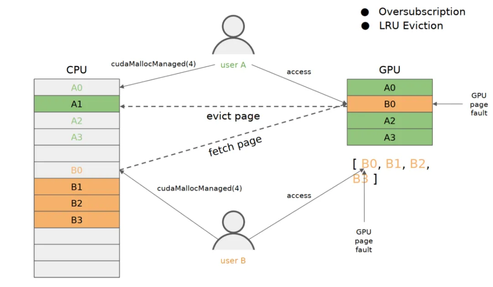</center>

<center>统一内存管理</center>

## 06、HiveD：DL GPU 集群共享保障

HiveD 将 GPU 资源抽象分为两层，即虚拟私有集群（VC）层和物理集群层。为每个租户提供一个 VC。每个 VC 都预分配了一组 Cell 。亲和结构与相应私有集群相同。确保任何调度决策都被约束在 VC 视图定义的边界内，从而保障共享安全。

<center>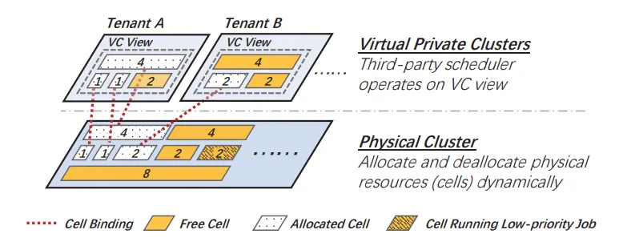</center>

<center>私有虚拟集群系统架构</center>

如果没有任何 GPU 在使用，则逻辑 Cell 将与物理集群解除绑定。为了提高利用率，可抢占低优先级作业机会性地消耗 GPU。这种动态绑定比静态绑定更灵活：动态绑定可以避免硬件出现故障的物理单元；可以避免低优先级作业不可抢占性占用 Cell；还可以通过打包 Cell 减少 GPU 碎片。


**多级 Cell**：

HiveD 为每个租户定义了多级 Cell, 包含 GPU 配额和 GPU 的亲和性结构。

<center>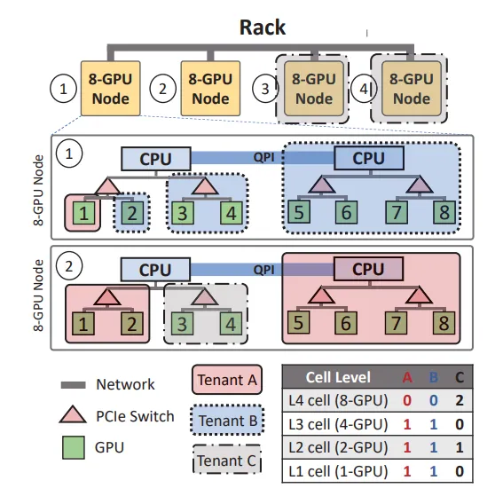</center>

<center>私有虚拟集群系统架构</center>

如图示例，其中有 4 个级别的 Cell 结构：分别在 GPU（级别 1）、PCIe 交换机（级别 2）、CPU 插槽（级别 3）和 Node 级别（级别 4）。该集群有 1 个机架，由 4 个 8 卡 GPU 节点组成，由 3 个租户（ A、B 和 C）共享。每个租户的 VC 的 cell 分配汇总在图中表格。租户 A 和 B 的 VC 都预留了一个 L3 cell（同一个 CPU 插槽下有 4 个 GPU），一个 L2 cell（同一个 PCIe 下有 2 个 GPU），一个 L1 cell （单 GPU）。大租户 C 预留了二个 L4 cell（节点级别）和一个 L2 Cell。


**Cell 动态分配、释放**：

为了在 VC 中分配一个 level-k Cell，算法从 level-k 开始，如果需要则向上移动：它首先检查是否有空闲的 level-k Cell 可用，如果可用则分配一个。如果没有，该算法将按级向上移动，直到有空闲 level-l Cell 可用，其中 l>k。然后将一个空闲的 level-l Cell 递归地拆分为多个较低级别的 cell，直到一个 level-k Cell 可用。每次分裂都会在下一层产生一组空闲 Cell，这些 Cell 将被添加到下一层的空闲列表中。其中一个新的低级 Cell 再次分裂，直到产生空闲 level-k Cell。

Cell 释放过程以自下而上的方式进行。当一个 level-k Cell c 被释放时，算法将 c 增加到 level-k 空闲列表中，检查 c 的同级 Cell，如果 c 所有的同级 Cell 都是空闲的，算法将其合并到 level-（k+1）Cell，合并过程递归进行。通过这种方式，Cell 分配算法减少了 GPU 碎片，并创造机会调度更高级别 Cell 的作业。

在处理分配请求之前，算法确保该请求是合法的，即它在该级别的 VC 分配配额内。

如果原始 VC 分配可行，在层次均匀可组合的条件下，Cell 分配算法满足任何合法的 Cell 分配。

## 07、TGS：DL 容器云中的透明 GPU 共享 

TGS 是一个用于在容器云中进行深度学习训练的 GPU 共享系统，旨在实现以下目标。

- **透明度**。该系统应该对应用程序透明，这样用户就可以使用任何软件在容器中开发和训练 DNN 模型。
- **高 GPU 利用率**。系统应实现计算和内存资源的高 GPU 利用率。
- **性能隔离**。系统应为 DL 作业提供性能隔离。生产作业不应受到机会性作业的重大影响。
- **故障隔离**。应用故障应由容器隔离。一个容器中的应用故障不应导致其他容器中的应用崩溃。

<center>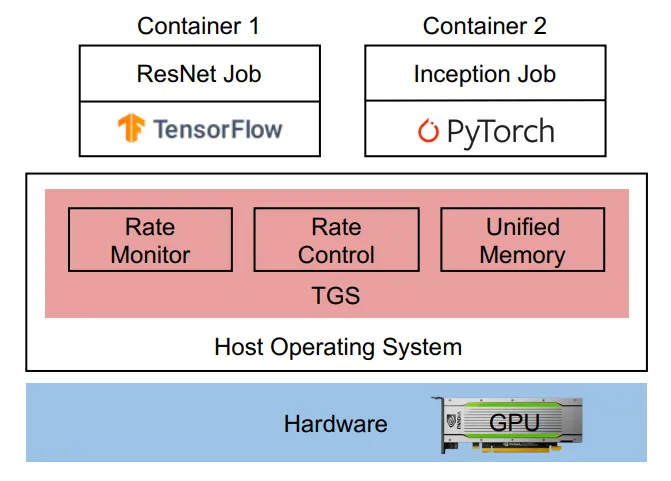</center>

<center>TGS 架构</center>

如图所示，TGS 是一种操作系统层方法：它位于容器和 GPU 之间。容器和应用程序对 TGS 一无所知。用户可以使用任何自定义框架来开发和训练 DNN 模型。GPU 作为普通 GPU 暴露给容器。容器中的进程向 GPU 发布 GPU 内核，即在 GPU 上执行的函数，就像使用专用 GPU 一样。TGS 使用轻量级间接层在多个容器的工作负载之间共享 GPU。间接层拦截来自容器的 GPU 内核调用，并对这些 GPU 内核进行调节，以控制每个容器的资源使用情况。


**主要理念**：

TGS 利用**自适应速率控制**机制和**透明的统一内存**机制，解决了在操作系统层提供透明 GPU 共享的两个难题。第一个挑战是如何在容器之间自适应地共享 GPU 计算资源，而无需应用程序知情。为应对这一挑战，TGS 的速率监控器会监控每个容器的性能，并提供 CUDA 块（GPU 上的基本调度和执行单元）的数量，作为控制环的实时信号。根据该信号，TGS 的速率控制会自适应地控制每个容器向 GPU 发送 GPU 内核的速率。控制环会自动收敛，使机会型作业尽可能多地利用剩余资源，以实现较高的 GPU 利用率，同时又不会对生产作业的性能造成很大影响。

第二个挑战是实现透明的 GPU 内存超量订购。AntMan 修改了 DL 框架，以便在显存被超额订阅时交换显存。操作系统层解决方案 MPS 不支持显存超量订购，而是依靠应用程序来处理内存交换。这些方法都不透明。为了应对这一挑战，TGS 利用了 CUDA 统一内存，它将 GPU 内存和主机内存统一在一个内存空间中。TGS 拦截并重定向来自容器的 GPU 内存分配调用，将其转到 CUDA 统一内存空间。当 GPU 内存被超量占用时，**TGS 可以自动将机会性作业的部分数据驱逐到主机内存**，并将相应的虚拟地址映射到主机内存中的新数据位置。整个过程对应用程序是透明的。为确保性能隔离，**TGS 使用内存放置优先权，优先为生产作业分配 GPU 内存**，而不是机会性作业。

TGS 的设计还有两个优点。首先，该架构是轻量级的。TGS 开销低，符合容器原则。其次，TGS 具有与普通容器相同的故障隔离特性。TGS 中的容器使用独立的 GPU 上下文，而 MPS 则将容器的 CUDA 上下文合并为一个。因此，一个容器中的应用故障不会影响或终止其他容器。

## 08、GaiaGPU：在容器云中共享 GPU

容器的资源不仅影响应用程序的性能，甚至决定应用程序的状态。然而，用户在创建容器时无法准确估计所需的资源。因此，GaiaGPU 提供了两种在运行时更改容器资源的方法。**弹性资源分配**会按需放开容器的计算资源限制，而**动态资源分配**会永久改变容器的资源。

<center>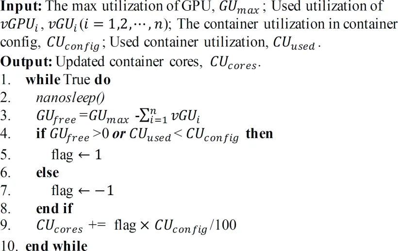</center>

<center>弹性资源分配算法</center>


**弹性资源分配**：

弹性资源分配的目的是充分利用空闲的计算资源，提高资源利用率。如上图所示，nanosleep() 是一个 Linux 内核函数，它挂起调用线程的执行，直到至少经过指定时间或信号传递调用线程（第 2 行）。


我们使用进程的 GPU 利用率来衡量其使用的计算资源量。GU_{free}指物理 GPU 的空闲资源，等于 GPU 的最大利用率减去同一物理 GPU上运行的进程的总利用率（第3行）。由于 vGPU 库会定期监控 GPU 利用率，因此有必要为系统保留一些空闲资源，以防止在下一个时间间隔耗尽GPU资源。GPU 的最大利用率（GU_{max} ）被设置为参数，默认值为 90%。

如果物理 GPU 有空闲资源 (GU_{free}>0) ，即使容器消耗的 GPU 资源超过其需求，vGPU 库仍然为容器分配计算资源（第4-5行）。如果系统没有剩余资源 (GU_{free}<=0) 并且容器消耗的资源超过其需求，vGPU库将收回过度分配的资源（第6-7行）。

采用**非抢占**策略来回收超额分配的资源，这意味着容器会一直占用资源，直到内核完成为止。CU_{cores}类似于令牌，它在容器执行内核函数时消耗，并在内核函数完成时产生。CU_{cores}的初始值等于容器所需的计算资源。当CU_{cores} 为零时，vGPU 库不会为容器分配任何计算资源，直到  CU_{cores}大于0。

<center>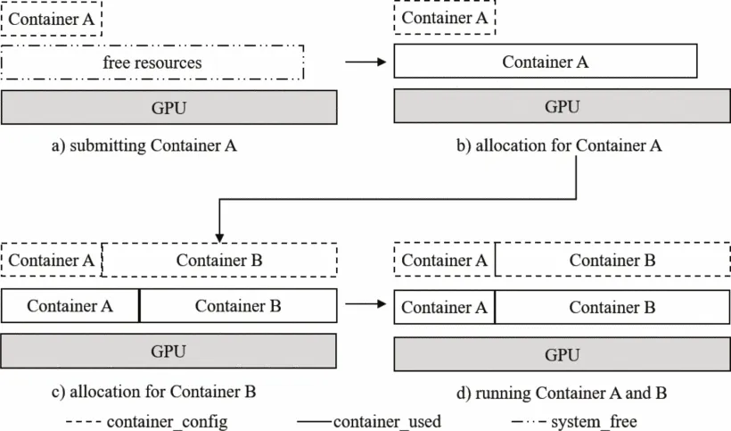</center>

<center>弹性资源分配示例</center>

我们以上图为例来说明弹性资源分配的过程。首先，容器 A 请求 0.3 个 GPU，并被调度到一个空闲的物理 GPU。调度成功后，容器会消耗 GPU 的资源。由于只有容器 A 在 GPU 上运行，因此它会消耗 GPU 资源，直到利用率达到最大值。然后将具有 0.7 个 GPU 的容器 B 调度到同一个物理 GPU。然而，GPU 没有空闲资源。因此，需要收回过多分配给容器 A 的资源，并将这些资源重新分配给容器 B。重复回收和分配资源的过程，直到每个容器的 GPU 使用率不超过约束值。


**动态资源分配**：

动态资源分配在不停止容器的情况下修改容器资源，包括内存和计算资源。动态资源分配旨在解决两个问题。第一个问题是在硬限制下更新容器的显存和算力资源。第二个问题是在弹性限制下向容器添加显存资源。vGPU 库组件通过比较容器的资源配置和容器的实际利用率来限制容器资源。要永久改变容器的资源，我们只需要修改容器的资源配置，并通知 GPU Scheduler 更新相应的物理 GPU 分配即可。

## 09、KubeShare：将 GPU 作为一级资源

KubeShare 提出将 GPU 视为一级资源，允许用户在规格中指定 GPU 的调度请求和约束, 如下：

1）GPU 显存按空间共享，GPU 算力按**时间片共享**。例如，gpu_mem=0.5 意味着容器最多可以分配总设备内存空间的 50%，而 gpu_request=0.5 意味着容器在滑动窗口中应该至少有 50% 的内核执行时间。

2）KubeShare 支持 GPU 上的**弹性资源分配**。这意味着 KubeShare 将保证 gpu_request 指定的容器的最小资源分配，并允许容器利用GPU上的剩余容量，只要其使用量不超过 gpu_limit 的值。 KubeShare 允许以 0 到 1 之间的小数指定所有这些资源需求。

3）KubeShare 支持三种类型的局部性约束：**排它、亲和力和反亲和力**。排除用于排除不同标签的容器之间的 GPU 共享。排除的用例场景是通过仅向其容器提供相同的排除标签来为特定用户或应用程序分配专用资源。专用资源分配策略可以避免其他用户容器的意外性能干扰。亲和力强制具有相同标签的容器被调度在同一个 GPU 上。用户可以使用此约束来减少容器之间的通信开销，或者指定一组特定的容器来共享单个 GPU 设备。最后，反亲和性是亲和性的相反约束，因此它强制具有相同标签的容器被调度到不同的 GPU上。反亲和力约束可用于强制将具有资源争用的作业安排在单独的 GPU 上，以最大限度地减少性能干扰的影响。

所有这些都由注解指定:
```yml
metadata:
  annotations:
    "kubeshare/gpu_request": "0.5" # 算力请求 50%
    "kubeshare/gpu_limit": "0.9" # 算力约束 90%
    "kubeshare/gpu_mem": "0.5" # 显存请求 50%
    "kubeshare/sched_affinity": "green" # 亲和
    "kubeshare/sched_anti-affinity": "red" # 反亲和
    "kubeshare/sched_exclusion": "blue" # 排它
    "kubeshare/gpuid": "abc" # 指定 GPU
```


## 10、AntMan：DL GPU 集群动态伸缩
**显存管理**：

现代操作系统在内存管理中支持以内存页为粒度的分页，当它们用完物理内存时，使用磁盘作为内存。
AntMan 采用类似方法，将特定程序的粒度张量在运行时透明迁移到通用内存地址中，从而使 DL 框架支持动态 GPU 显存上限。

<center>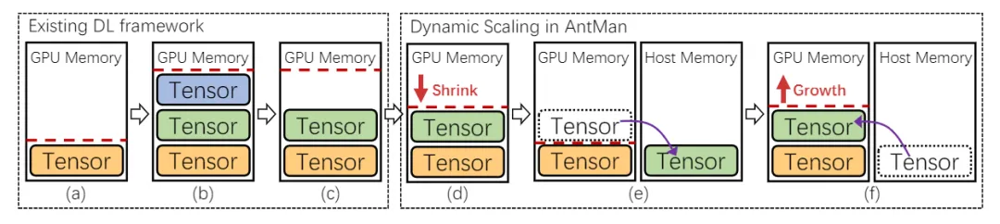</center>

<center>AntMan 通用显存动态伸缩</center>

上图说明了现有 DL 框架中的显存管理以及与 AntMan 的差异。
- 缓存 GPU 显存大小（即红色虚线）的数量随着 DL 框架中创建的张量而增加（a~b）
- 一些张量仅用于 DL 训练的某些阶段（例如，数据预处理、评估），继而不再需要。然而，这部分缓存的 GPU 显存并没有被释放（图 c）。
- AntMan 转向缩放 GPU 显存上限的方法。在处理 mini-batch 时监控应用程序性能和显存需求，以缩小缓存显存。（图 d）
- AntMan 尽量在 GPU 设备上分配张量，如果 GPU 显存仍然不足，可以使用主机内存在 GPU 外部分配张量（图 6e）。此时，工作负载性能降低。
- 当 GPU 显存上限增加时，张量可以自动分配回 GPU（图 f）


**算力管理**：

现代操作系统支持 cgroups，它限制和隔离进程所需的 CPU 资源。AntMan 引入了一种类似的方法，在运行时动态隔离 DL 特定进程的 GPU 计算资源访问。

<center>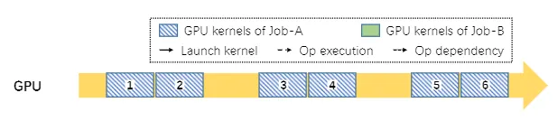</center>

<center>（a）作业 A 在 GPU 中独占执行，有一些空闲周期。</center>

<center>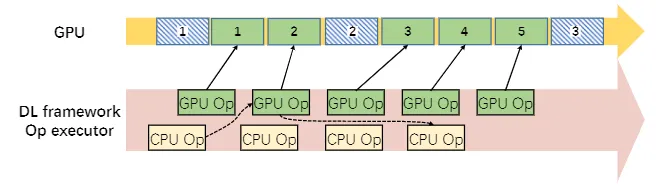</center>

<center>b）作业 A 受到作业 B 干扰</center>

<center>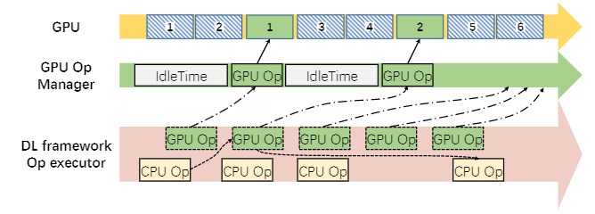</center>

<center>（c）作业 B 的 GpuOpManager 控制干扰</center>

**<center>在共享GPU 中运行两个互不干扰作业的计算管理</center>**


干扰主要来自于缺乏控制 GPU 内核执行频率的能力。为了解决这个问题，我们在 DL 框架中引入了 GPU 运算管理器

上图说明了在同一 GPU 上执行的两个作业的 GPU 计算单元干扰示例。

- 图 a 说明了 作业 A 如何以细粒度的方式在 aGPU 上执行。简而言之，GPU 内核将按顺序排列并由 GPU 一个一个地处理。
- 作业 B 被安排在这个 GPU 上（图 b）。作业 B 的 GPU 操作启动在 GPU 中执行的内核（绿色块），可以将其填满，从而延迟其他 GPU 内核（蓝色块）的执行)，导致 作业 A 的性能不佳。
- 在 AntMan 中，GPU 运算符的执行专门由一个新引入的模块，称为 GpuOpManager。当 GPU 运算符准备好执行时，它会被添加到GpuOpManager 而不是直接启动。 


## 11、Gandiva: DL GPU 集群的自省式调度

通常在 DL 作业的一个 mini-batch 中，显存使用差异超过 10 倍，Gandiva 利用这种循环可预测性来实现高效的程序感知时间分片。

Gandiva 调度程序的主要设计目标是**为作业提供早期反馈**。在传统调度器中，集群过载期间作业在队列中等待。相比之下，Gandiva 通过立即将 GPU 分配给新作业并使用挂起-恢复机制提供早期结果来支持超额订阅。

<center>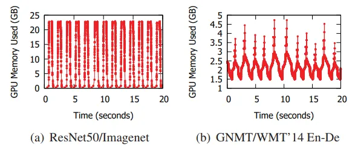</center>

<center>GPU 显存用量</center>

<center>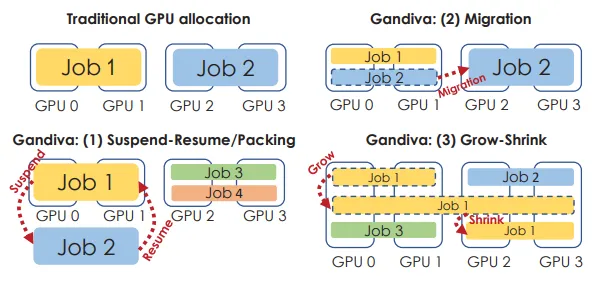</center>

<center>Gandiva 中的 GPU 使用选项</center>

Gandiva 不是等待当前作业完成，而是允许传入作业与现有作业分时使用 GPU。这是使用为 DLT 作业量身定制的挂起-恢复机制以及选择性打包来实现的。

挂起-恢复是 Gandiva 用来消除一组 GPU 对 DLT 作业的独占性的一种机制。现代操作系统支持 CPU 进程时间片的高效挂起-恢复。Gandiva 利用这种机制并添加了对 GPU 时间切片的支持。

DLT 作业对显存的使用具有循环特征，最小和最大显存使用量之间的差异高达 77 倍。 Gandiva 的关键思想是利用这种循环行为，并在显存使用率最低时挂起-恢复 DLT 作业。因此，当发出挂起调用时，DLT 工具包等待显存使用周期的最小值，将存储在 GPU 中的对象复制到 CPU，释放其所有显存分配（包括缓存），然后调用 CPU 挂起机制。稍后，当 恢复作业时，DLT 框架首先分配适当的显存，将存储的对象复制回 GPU，然后恢复作业。

挂起-恢复可以在 100 毫秒内完成，而对于大型语言翻译作业，挂起-恢复最多可能需要 1 秒。给定 1 分钟的时间片间隔，这相当于 2% 或更少的开销。

其次，Gandiva 支持将 DLT 作业从一组 GPU 高效迁移到另一组。迁移允许时间片作业迁移到其他（最近空出的）GPU 或对集群进行碎片整理，以便为传入的作业配具有良好局部性的 GPU。

## 12、总结

技术 | 核心原理 | 优点 | 缺点
--- | --- | --- | --- 
NvShare | 1、共享 GPU 的进程可同时使用全部显存; <br>2、给定时间量为单进程提供 GPU 独占; | 1、显存共享、超分<br>2、对应用程序透明 | 1、协调器存在单点故障 <br>2、GPU 性能防抖动策略单一
HiveD | 1、为每个租户分配虚拟私有集群（VC）; <br>2、为每个租户定义了多级 Cell, 包含 GPU 配额和 GPU 的亲和性结构; <br>3、动态绑定 VC 节点到3物理节点; | 1、算力共享 <br> 2、碎片化低 <br> 3、任务优先级管理 <br> 4、硬件故障隔离 | 1、不适用非多租户集群场景 <br> 2、租户设备限定
TGS | 1、拦截来自容器的 GPU 内核调用，对这些 GPU 内核进行调节; <br> 2、利用放置偏好来确保 GPU 内存优先用于生产作业; | 1、算力共享 <br> 2、显存共享 <br> 3、对应用程序透明 <br> 4、故障隔离 <br> 5、任务优先级管理 | 1、不支持多优先级任务
GaiaGPU | 1、将物理 GPU 划分为多个虚拟 GPU; <br> 2、采用弹性资源分配和动态资源分配; | 1、算力共享 <br> 2、显存共享 <br> 3、对应用程序透明 | 1、协调器存在单点故障
AntMan | 1、显存不足时，使用内存分配张量; <br> 2、通过运算管理器组件管理 GPU 内核执行; <br> 3、保障作业和机会作业使用不同调度策略; | 1、算力共享 <br> 2、显存管理 <br> 3、任务优先级管理 | 1、需要定制 DL 框架 PyTorch 和 TensorFlow <br> 2、在 Fuxi 中完全实现, 未开源
Gandiva | 1、利用 DL 作业可预测性挂起、恢复、迁移作业 <br> 2、持续监控为作业提供早期反馈, 优化 GPU 分配 | 1、负载均衡 <br> 2、迁移作业利于故障隔离 | 1、需要定制 DL 框架 <br> 2、依赖模型运行规律缩放资源

## 附录

### 术语

**AIMD**（Additive Increase Multiplicative Decrease ）是一种计算机网络拥塞控制的方法。意思是增加时加法增加，减小时乘法减小。AIMD 方法的工作原理是，当网络没有出现拥塞时，我们会逐渐增加数据流量的发送速率。这个增加的速率通常是一种加法增加，也就是每次增加一个固定的数量。一旦网络出现拥塞，我们就要采取减少数据流量的措施。在 AIMD 中，我们采用乘法减小的方式来逐渐降低数据流量的发送速率。也就是说，每次发生拥塞时，我们会将发送速率乘以一个小于 1 的因子，从而减少数据流量，以缓解拥塞的情况。

**长尾延迟（Tail Latency）**是指在网络或系统中存在一小部分请求的响应时间比其余请求的响应时间更长的现象。这些请求通常被称为“长尾请求”。

**DLT 作业异质性**：指不同训练作业的属性和特征不同。这些属性和特征包括训练数据的大小、训练模型的复杂度、训练作业的优先级等。由于作业异质性的存在，不同训练作业的训练过程可能具有不同的性能和资源需求，需要对它们进行不同的调度和资源分配.

**反馈驱动**（feedback-driven）：是指一种基于反馈信息的控制策略，即通过对系统输出的反馈信息进行监测和分析，来指导和调整系统的行为。在反馈驱动的控制策略中，系统会根据反馈信息来调整其输入或行为，以使其输出更接近于期望的目标或状态。

**共享安全**（shareing safety）：确保每个租户只能访问其分配的资源，并防止不同租户之间的干扰和冲突。

**机会作业**（Opportunistic Jobs）：是指在共享 GPU 集群中，由于 GPU 资源的有限性和高昂的成本，某些作业无法在需要时立即获取足够的 GPU 资源。GPU 机会作业是指这些作业，在等待其它高优先级作业完成后，可以利用闲置的 GPU 资源进行计算的作业。GPU 机会作业通常具有较低的优先级和较短的计算时间，因此可以在其它 GPU 资源占用较少的时间段获得 GPU 资源。GPU 机会作业的出现，可以更好地利用 GPU 资源，减少 GPU 资源的浪费和空闲，提高集群的利用率。

**UVM**（Unified Memory）统一内存是一种由 NVIDIA 推出的计算机内存技术，它可以将 GPU 内存和 CPU 内存合并为一个通用的内存地址空间。这种技术可以使得 GPU 和 CPU 之间的内存访问变得更加灵活和高效，因为它们可以通过相同的内存地址来访问数据，而不需要进行手动的数据拷贝和传输。这种技术可以极大地简化GPU和CPU之间的数据管理和传输，从而提高计算效率和性能。在使用 Unified Memory 技术时，开发者可以使用CUDA API来管理内存，而不需要关心内存的物理位置和数据传输等问题。此外，Unified Memory 技术还支持动态内存分配和统一虚拟内存等特性，可以更好地支持动态数据集和分布式计算等应用场景。

**虚拟私有集群（VC）**：为每个租户提供的抽象定义的虚拟私有集群。

**资源保障型作业**：提供资源保障，以保证作业运行性能，会消耗相应租户的一定GPU资源配额

**自省式调度（introspective scheduling）**：是一种集群调度策略，其核心思想是将集群中正在运行的任务的信息反馈给调度器，以便调度程序更好地决策下一步要运行的任务。

### 参考链接

1. https://dl.acm.org/doi/10.1145/3369583.3392679 KubeShare: A Framework to Manage GPUs as First-Class and Shared Resources in Container Cloud
2. https://dspace.lib.ntua.gr/xmlui/handle/123456789/54290  NvShare: Dynamic memory management for the efficient utilization of graphics processing units in interactive machine learning development
3. https://cloud.tencent.com/developer/article/2185514
4. https://ieeexplore.ieee.org/abstract/document/8672318 GaiaGPU: Sharing GPUs in Container Clouds
5. https://www.usenix.org/conference/osdi20/presentation/zhao-hanyu HiveD: Sharing a GPU Cluster for Deep Learning with Guarantees
6. https://dl.acm.org/doi/epdf/10.5555/3488766.3488796 AntMan: Dynamic Scaling on GPU Clustersfor Deep Learning
7. https://www.usenix.org/conference/osdi18/presentation/xiao Gandiva: Introspective Cluster Scheduling for Deep Learning
8. https://www.usenix.org/system/files/nsdi23-wu.pdf Transparent GPU Sharing in Container Clouds for Deep Learning Workloads