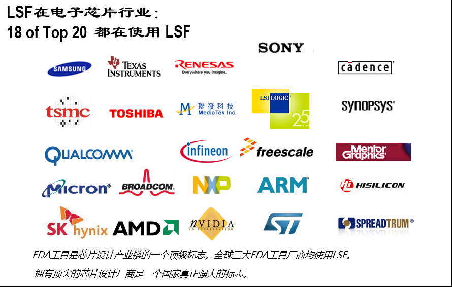
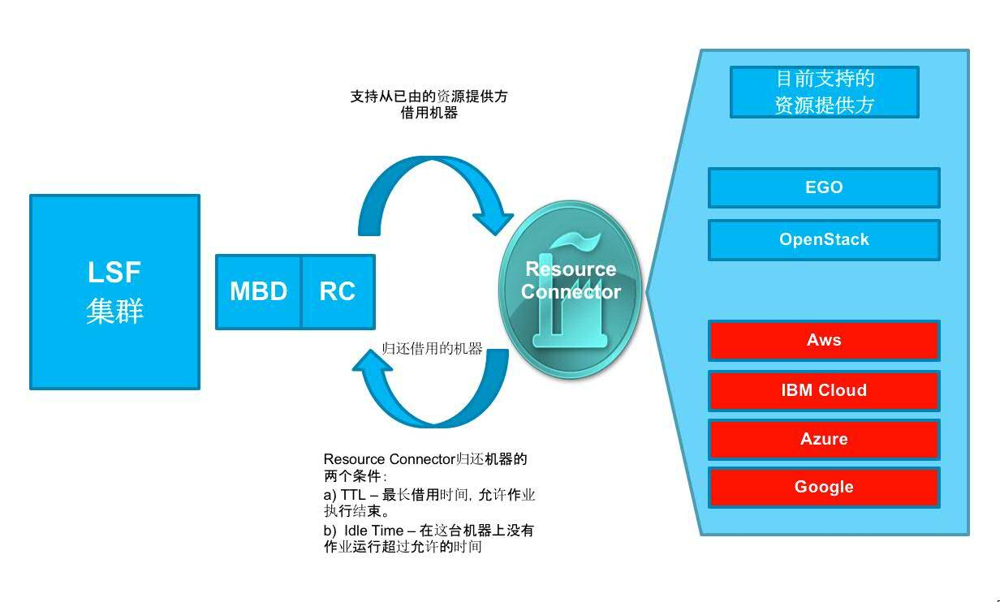

# LSF、SLURM、OPENPBS 等 HPC 调度器对比

HPC 工作负载一直都与模拟有关。科学家和工程师将在大规模并行集群上用软件对复杂系统进行建模，以预测现实世界的结果。金融风险管理、计算化学、地震建模和在软件中模拟车祸都是很好的例子。

随着 HPC 应用程序变得更加多样化，用于调度和管理工作负载的技术也在不断发展。本文从生态、架构、功能点、应用案例出发，横向对比时下流行的调度器。

## LSF

IBM Spectrum LSF（Load Sharing Facility）是 IBM 为分布式高性能计算（HPC）开发的工作负载管理平台、作业调度程序。LSF 提供一种方法来创建由许多较小的系统组成的功能强大的计算系统，以提高生产率并降低运营成本，使有限的资源供应与需求相匹配。

### 生态

1. IBM Spectrum LSF
2. IBM Spectrum LSF 数据管理器
3. IBM Spectrum LSF 应用中心
4. IBM Spectrum LSF 流程管理器
5. IBM Spectrum MPI
6. IBM Spectrum LSF 许可调度程序
7. IBM Spectrum LSF Explorer
8. IBM Spectrum LSF RTM
9. IBM Spectrum LSF 资源连接器

**1、IBM Spectrum LSF**

IBM Spectrum LSF ( LSF ) 是一个功能强大的工作负载管理平台，适用于要求严苛的分布式 HPC 环境。它提供了一套全面的智能、策略驱动的调度功能，可以充分利用您的计算基础设施资源并确保最佳的应用程序性能。

**2、IBM Spectrum LSF 数据管理器**

配置、管理和使用LSF 数据管理器，使您的应用程序能够访问完成计算所需的数据，而不受与应用程序相关的数据位置的阻碍。LSF 数据管理器通过将所需的数据文件尽可能靠近您的应用程序来解决数据局部性问题。您可以将来自外部源存储库的输入数据暂存到集群执行主机，并在作业完成后将输出数据异步暂存到外部目标存储库。

**3、IBM Spectrum LSF 应用中心**

IBM Spectrum LSF Application Center（“ LSF Application Center ”）为集群用户和管理员提供了一个灵活、易于使用的界面。作为IBM Spectrum LSF（“ LSF ”）的附加模块， LSF Application Center使用户能够与直观的、自记录的标准化界面进行交互。

**4、IBM Spectrum LSF 流程管理器**

设计、记录和运行复杂的计算工作流。IBM Spectrum LSF 流程管理器 （“ LSF 流程管理器”）使您能够设计和自动化计算或分析流程，捕获和保护可重复的最佳实践。使用直观的图形界面，轻松记录工作流程步骤和依赖关系，并自动执行容易出现人为错误的冗长重复性任务。

**5、IBM Spectrum MPI**

IBM Spectrum MPI (Message Passing Interface)  广泛用于高性能计算 HPC 行业。它被认为是开发可扩展的并行应用程序的标准之一。

IBM Spectrum MPI 包含高级 CPU 关联特性、网络接口库的动态选择、卓越的工作负载管理器集成和改进的性能。它支持广泛的行业标准平台、互连和开放 API，以帮助确保并行应用程序几乎可以在任何地方运行。

	 

**6、IBM Spectrum LSF 许可调度程序**

IBM Spectrum LSF License Scheduler ( LSF License Scheduler ) 使在同一设计中心或全球范围内的项目团队和部门之间共享许可证变得容易。借助分配和监控许可证的工具，许可证所有者可以共享未使用的许可证，同时仍确保在需要时立即访问许可证。通过更有效的共享，所有用户都会感知到更大的许可证池。

License Scheduler 支持灵活的分层共享策略，以反映业务的需求。在安静时期，当许可证没有争用时，可以将许可证分配给任何需要它们的人，从而保持高利用率和吞吐量。在繁忙时期，许可证的供应可以根据政策分配给最重要的时间或收入关键项目。

**7、IBM Spectrum LSF Explorer**

IBM Spectrum LSF Explorer是用于IBM Spectrum LSF 集群的轻量级数据分析解决方案，允许业务和技术用户快速创建和查看报告和仪表板。

IBM Spectrum LSF Explorer使用 Elasticsearch 快速存储、索引和查询数据。

借助丰富、交互式和可扩展的可视化功能，您可以生成有关计算环境执行情况或项目、线路或业务消耗的资源的报告。

**8、IBM Spectrum LSF RTM**

RTM 是工作负载和资源感知的，提供对LSF集群的完全可见性。它提供了全面的工作负载监控、报告和管理工具。使用RTM，您可以监控和绘制集群中的LSF资源（包括网络、磁盘、应用程序和其他）。RTM以图形或报告格式 显示与资源相关的信息，例如提交的作业数量、单个作业的详细信息（例如负载平均、CPU 使用率、作业所有者）或运行作业的主机。

**9、IBM Spectrum LSF 资源连接器**

IBM Spectrum LSF功能的资源连接器使LSF 集群能够从受支持的资源提供者那里借用资源。

LSF 资源连接器插件支持以下资源提供程序：

- IBM Spectrum Conductor with Spark和 IBM Spectrum Symphony
- OpenStack
- Amazon Web Services (AWS)
- IBM Cloud（以前称为 IBM Bluemix 和 IBM SoftLayer）
- Microsoft Azure
- 谷歌计算云

### 架构

### 功能点

1. 调度策略
2. 队列
3. 作业（Job）

**1、调度策略**

为了解决多样化的问题，LSF 允许在同一个集群中使用多个调度策略。LSF 有几种队列调度策略，例如独占、抢占、公平共享和分层公平共享。

- 先到先服务 (FCFS) 调度：默认情况下，队列中的作业按 FCFS 顺序调度。这意味着作业是根据它们在队列中的顺序分派的。
- 服务水平协议 (SLA) 调度：LSF 中的 SLA 是一种“即时”调度策略，用于调度 LSF 管理员和 LSF 用户之间商定的服务。SLA 调度策略定义了每个 SLA 应运行多少作业才能满足配置的目标。
- 公平共享调度：如果您为队列指定公平共享调度策略或已配置主机分区，LSF 会根据分配的用户份额、资源使用情况或其他因素在用户之间分派作业。
- 抢占：您可以指定所需的行为，以便当两个或多个作业竞争相同的资源时，一个作业抢占另一个作业。抢占不仅可以应用于作业槽，还可以应用于提前预留（为特定作业预留主机）和许可证（使用 IBM Platform License Scheduler）。
- 回填：允许小型作业在为其他作业保留的作业槽上运行，前提是回填作业在保留时间到期且资源使用到期之前完成。
- 独占调度：让作业独占使用它运行的主机。

**2、队列**

LSF 按以下顺序考虑调度作业：

- 对于每个队列，从最高到最低优先级。如果多个队列具有相同的优先级，LSF会以先到先服务 (FCFS) 的顺序调度这些队列中的所有作业。
- 对于队列中的每个作业，根据 FCFS 顺序。
- 如果任何主机有资格运行此作业，则在最符合条件的主机上启动该作业，并将该主机标记为不适合启动任何其他作业，直到 JOB_ACCEPT_INTERVAL参数指定的时间段已过。

**3、作业**

作业启动后，系统、LSF 用户或 LSF 管理员可以将其终止、暂停或恢复。LSF 作业控制操作会导致作业状态发生变化。LSF 支持作业控制的以下默认操作：

- 暂停
- 恢复
- 终止

### 应用案例

- [速石 EDA 云平台](https://fastonetech.com/product/eda-emulation)
- [为LSF 资源连接器配置 Google Cloud Platform](https://www.ibm.com/docs/en/spectrum-lsf/10.1.0?topic=providers-configuring-google-cloud-platform-lsf-resource-connector)
- [为LSF 资源连接器配置 Microsoft Azure CycleCloud](https://www.ibm.com/docs/en/spectrum-lsf/10.1.0?topic=providers-configuring-microsoft-azure-cyclecloud-lsf-resource-connector)
- [为LSF 资源连接器配置 Amazon Web Services](https://www.ibm.com/docs/en/spectrum-lsf/10.1.0?topic=providers-configuring-amazon-web-services-lsf-resource-connector)

### 社区版

IBM Spectrum LSF Suite Community Edition是一款用于高性能计算的免费、完全集成的解决方案，具有集群供应和管理、工作负载调度、以应用程序为中心的门户和 MPI 库（仅限 x86-64）。该软件可以使用本机安装程序或包含的集群管理器进行安装。

LSF Suite Community Edition 的安装和运行仅限于 10 台主机，包括动态添加的主机。每台主机必须是单插槽或双插槽节点，并且总共有多达 64 个内核。不支持其他节点。

LSF Suite Community Edition 支持系统中的 2,500 个活动（已启动和待处理）作业。

LSF Suite Community Edition 中的 LSF 多集群功能具有以下限制：

- 支持将作业转发到远程队列，但 LSF Suite Community Edition 中的提交集群无法接收来自远程集群的作业。提交队列可以配置 SNDJOBS_TO 参数，但忽略 RCVJOBS_FROM 参数。 
- 不支持资源租赁模式。 
- lsb.resources 文件中的 HostExport 参数被忽略。

LSF Application Center 仅限 10 个用户同时登录。移动用户没有限制。

在 LSF Suite Community Edition 中，每个主机的 GPU 数量限制为一个。

GPU 自动检测在 LSF Suite 社区版中默认启用，并且无法更改。这意味着使用传统 ELIM 方法的 GPU 收集被禁用。

LSF Suite Community Edition 中禁用了以下 LSF 组件和功能： 

- Kubernetes 的 LSF 连接器 
- LSF 数据管理器 
- LSF 资源连接器 
- LSF/XL 功能

## Slurm

## 架构

### 功能点

1. 调度
2. 队列
3. 作业

**1、调度**

**通用资源 (GRES) 调度**：Slurm 支持定义和调度任意通用资源 (GRES) 的能力。通过可扩展的插件机制，为特定的 GRES 类型启用了其他内置功能，包括图形处理单元 (GPU) 和 CUDA 多进程服务 (MPS) 设备

**gang 调度**：Slurm 支持时间分片的 gang 调度，其中两个或多个作业被分配给同一分区中的相同资源，并且这些作业交替挂起，以让一个作业在配置的时间段内一次拥有对资源的专用访问权限。

**回填**：Slurm 的回填调度程序会考虑每个正在运行的作业。然后，它会按优先级顺序考虑待处理的作业，确定每个作业将在何时何地开始，同时考虑 作业抢占、 群调度、 通用资源 (GRES) 要求、内存要求等的可能性。

**抢占**：Slurm 支持作业抢占，即“停止”一个或多个“低优先级”作业以让“高优先级”作业运行的行为。

**2、队列**

SLURM有许多不同的队列（又名分区）可供选择，具体取决于资源需求。每个队列都有各种各样的约束，例如作业大小限制、作业时间限制、允许使用它的用户等。

**3、作业**

- 批处理作业
- 串行作业
- OpenMP 作业：让两个或更多处理器解决一个问题。
- MPI 作业：利用多个节点上的多个处理器。仅当您的程序专门为跨节点通信而构建时才请求多个节点。
- 混合 OpenMP-MPI 作业：在混合 OpenMP-MPI 作业中，每个 MPI 进程使用多个线程。
- 交互作业

### 应用案例

- 速石 EDA 云平台
- 阿里云弹性高性能计算 E-HPC
- 在 GCE上部署 Slurm 集群
- Azure 配置自动伸缩 Slurm 集群
- AWS Slurm 指南
- 北京大学国际数学中心微型工作站

## OpenBPS

### 功能点

1. 调度策略
2. 队列
3. 作业（Job）

**1、调度策略**

- FIFO：按照提交作业的顺序运行
- 根据用户或组的优先级，其中作业的优先级由所有者的优先级决定
- 根据资源分配规则，作业在哪里运行，以便它们使用资源，遵循一组关于如何将资源分配给用户或组的规则
- 根据作业的大小，例如通过 CPU 或内存请求来衡量
- 通过为特定用途设置时间段
- 回填：调度程序将尽最大努力在它认为最重要的工作周围回填较小的工作
- 抢占：调度程序将抢占较低优先级的作业以运行较高优先级的作业

**2、队列**

- 路由（Routing）队列：路由队列仅用于将作业移动到其他队列（目标队列）。这些目标队列可以是路由队列或执行队列，并且可以位于不同的 PBS 服务器上。
- 执行（Execution）队列：执行队列用作等待或正在运行的作业的主站。作业必须驻留在执行队列中才能运行。作业在运行期间保留在执行队列中。

执行队列

- Reservation队列：为预订而创建。不要直接对这些进行操作；
- Dedicated time队列：仅在特定时间内运行的作业。
- Primetime队列：仅在黄金时段运行的作业。
- Non-primetime队列：仅在非黄金时段运行的作业。
- Anytime队列：没有专门时间或黄金时段限制的队列。
- Express队列：高优先级队列；优先级设置为表示它是快速队列的级别。
- Anti-express 队列：低优先级队列设计用于仅在没有其他作业需要资源时才运行的工作

 
**3、作业**

作业优先级

- 当前处理器使用情况（按任务理事会）
- 工作优先级
- 队列优先级
- 作业规模（宽作业优先）

**饥饿的工作**被赋予了一个特殊的优先级，称为饥饿。成为饥饿工作所需的默认时间是 24 小时。

### 应用案例

- 速石 EDA 云平台
- 阿里云弹性高性能计算 E-HPC
- 高性能计算（HPC）和云 - Altair
- Altair PBS Works™

## 其他

### 阿里云高性能计算 E-HPC

**支持PBS、Slurm等多种HPC行业常见的调度器**，可通过控制台直接设置调度策略并提交作业到调度器，同时提供基于Web的SSH命令行操作。

### 华为云高性能计算

**CCScheduler是华为全自研的调度器**，提供大规模集群下的高资源利用率、高吞吐量的作业调度能力
多调度器支持，业界首个提供异构调度器统一管理能力的高性能解决方案，**支持HPC统一调度**，华为智能网卡、SSD和GPU加速卡，加速高性能计算应用，提升客户应用性能表现。

[【HPC】鲲鹏HPC解决方案介绍](https://bbs.huaweicloud.com/forum/thread-133391-1-1.html)

### 腾讯云高性能计算解决方案

**无需关注资源和调度平台**，用户更专注于产品研究和创新。

## 参考

- [IBM Spectrum LSF：分布式系统的“瑞士军刀”](http://www.shzcnew.com/html/2021/12/16/61670.html)
- [IBM Spectrum LSF 10 - 轻松处理工作流](https://community.ibm.com/community/user/power/blogs/qingda-wang1/2019/12/11/ibm-spectrum-lsf-10-handle-workflows-with-ease)
- [LSF License Scheduler](http://sunray2.mit.edu/kits/platform-lsf/7.0.6/1/guides/kit_lsf_guide_source/lsf_license_scheduler/index.htm?architecture.html~main)
- [亿万打工人的梦：16万个CPU随你用](https://fastonetech.com/blog/cluster-scheduler-20201105/)
- [速石 EDA](https://fastonetech.com/product/eda-emulation)
- [LSF调度](https://www.ibm.com/docs/en/spectrum-lsf/10.1.0?topic=management-job-scheduling-dispatch)
- [SLURM 文档](https://slurm.schedmd.com/documentation.html)