# Kubeblocks 学习笔记

## 概要

### 什么是KubeBlocks
一句话认识KubeBlocks：一个专为将数据库运行在k8s的operator, 以同一套声明式API实现多种数据库的运维。

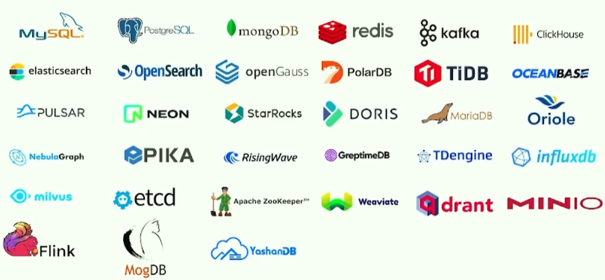  
KubeBlocks 已经支持了30+种数据库

### 为什么用KubeBlocks
<u>痛点1：K8s面对数据库应用的局限性。</u>  
相比无状态应用，有状态应用要复杂得多，尽管 StatefulSet 提供了稳定的持久存储和唯一的网络标识符，但这些能力对于复杂的有状态应用来说还远远不够。  
比如有状态应用内不同节点的服务能力一般是不同的，service selector 需要选择到正确的服务节点，并且和后端 pod 保持动态一致。另外比如水平缩容时，一般都要**指定缩容**哪个节点，而不是缩 StatefulSet 索引最大的节点。这些问题都是在 k8s 上管理有状态工作负载面临的挑战。


<u>痛点二：数据库种类多, 运维操作复杂。</u>  
告别一个引擎一个operator, 使用kubeblocks统一管理。

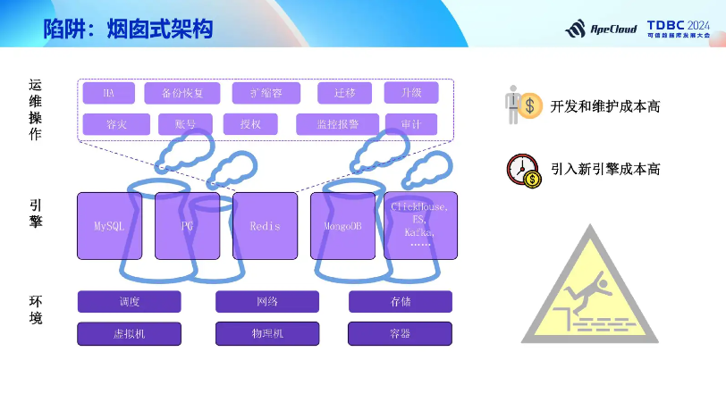  
开发和维护、引入新引擎成本高

### KubeBlocks怎么工作
通过**抽象**和**声明式API**实现对多种数据库的统一管理。

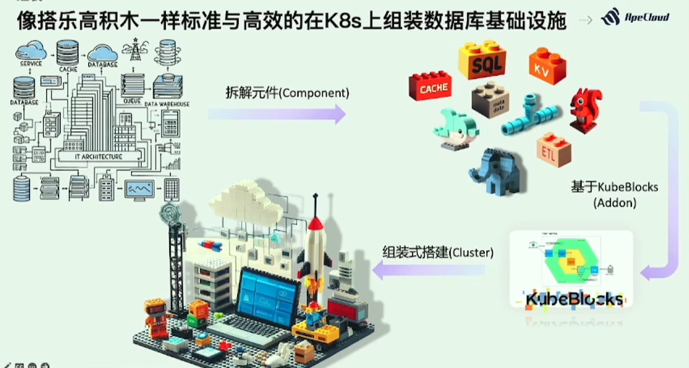  
像搭乐高积木一样标准与高效的在k8s上组装数据库基础设施

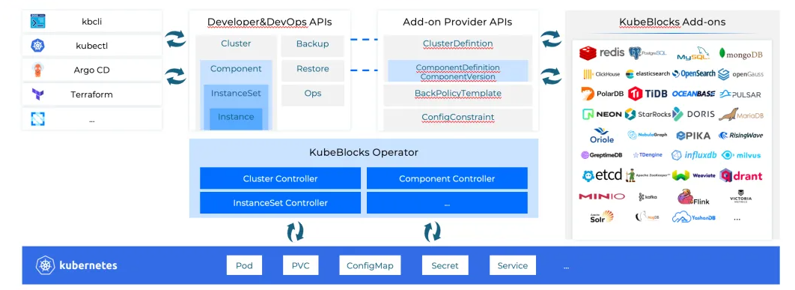  
一个专为将数据库运行在k8s的operator

KubeBlocks的API（或叫CRD）分成两类。  
<u>第一类是Add-on Provider API</u>, 面向数据库提供者，通过这些API可以很容易地将新的数据库接入到 KubeBlocks 系统当中。  
<u>第二类是Developer&DevOps API</u>, 面向数据库的使用者和运维，通过这些 API 可以跟数据库进行交互或者运维。

## 功能
### DB Ops
1. 垂直扩缩容
2. 水平扩缩容
3. 存储扩容
4. 启停重启
5. 备份恢复
6. ..

### 故障转移
KubeBlocks 执行完整的探测、决策、切换、重建和角色校正等任务。KubeBlocks 采用通用的高可用架构，支持各种数据库类型，例如复制集群和分片集群，通过增加副本数量来提高可靠性和可用性，降低数据丢失的概率。

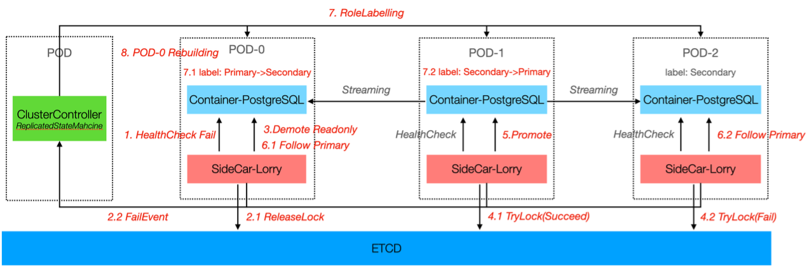  
KubeBlocks 负责执行完整的探测、决策、切换、重建和角色校正等任务


### 备份恢复
KubeBlocks 采用物理备份的方式，将数据库中的物理文件作为备份对象。  
- 按需备份：根据不同的备份选项，按需备份可以进一步分为备份工具备份和快照备份两种。
  - 备份工具备份：可使用数据库产品的备份工具，如 MySQL XtraBackup 和 PostgreSQL pg_basebackup。KubeBlocks 支持为不同的数据产品配置备份工具。
  - 快照备份：如果你的数据存储在支持快照的云盘中，你可以通过快照创建数据备份。快照备份通常比备份工具备份更快，因此推荐使用。
- 定时备份：可指定保留时间、备份方法、时间等参数来自定义备份设置。

KubeBlocks 支持从备份集中恢复数据。

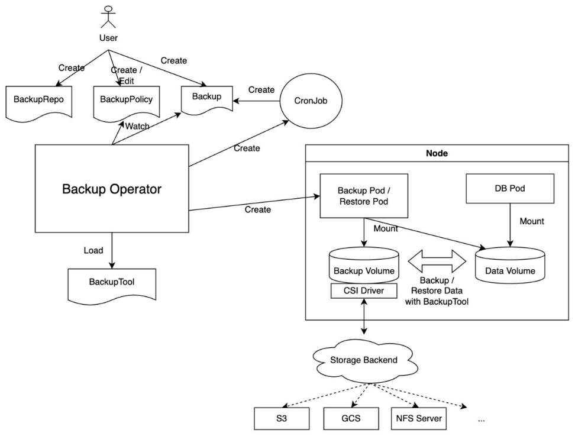  
KubeBlocks 提供了备份恢复策略

### 可观测
KubeBlocks 从丰富的数据源采集监控指标，集成了Prometheus，并提供了Grafana 模板。此外，还提供慢日志等排查工具。

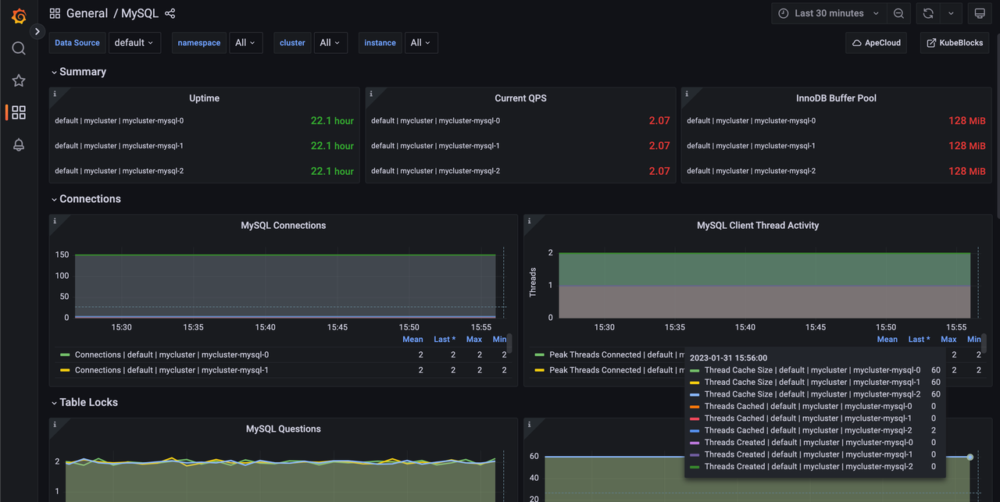  
监控 MySQL 集群的状态

### kbcli
kubeblocks命令行工具。

kbcli命令示例
```bash
# 搜索引擎
kbcli addon search clickhouse
# 安装引擎
kbcli addon install clickhouse --version 0.9.0
# 启用引擎
kbcli addon enable clickhouse
# 设置默认版本
kbcli clusterversion set-default clickhouse-22.9.4

# 查看引擎
kbcli addon  list
# clickhouse                     1.0.0-alpha.0   community   Enabled    true 

# 创建clickhouse集群
kbcli cluster create clickhouse ck --cluster-definition clickhouse 

# 测试集群
curl http://10.177.196.203:8123
# Ok.
```

## 架构

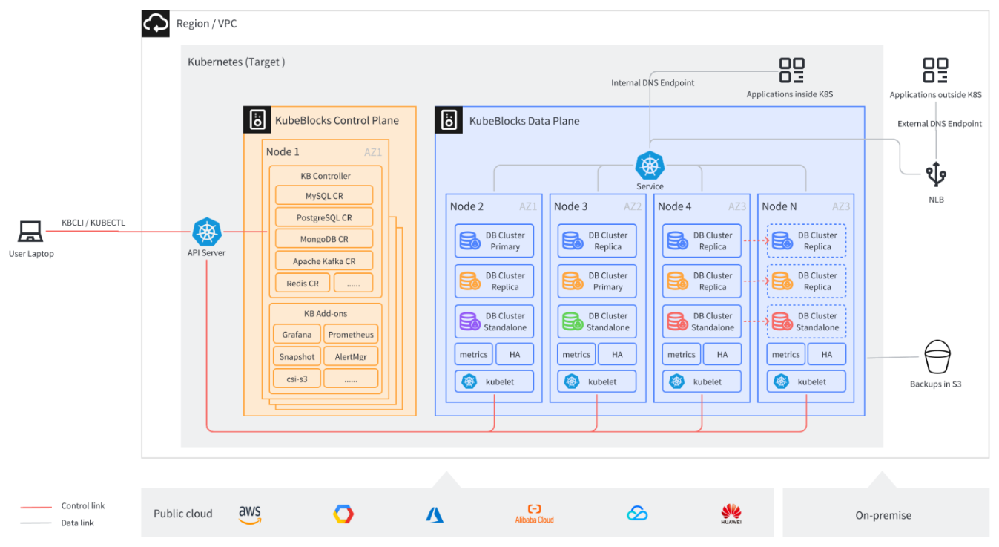  
kubeblocks整体架构

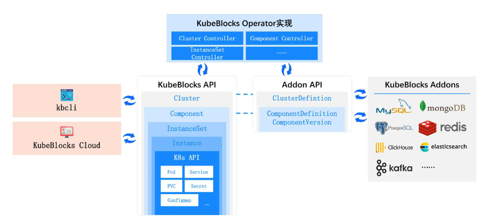  
KubeBlocks通过抽象和分层来管理数据库

用户侧API：
- <u>集群层（Cluster layer）</u>：Cluster 对象表示一个完整的分布式数据库集群。Cluster 是最高级别的抽象，包括数据库的所有组件和服务。
- <u>组件层（Component layer）</u>：Component 表示构成 Cluster 对象的逻辑组件，如元数据管理、数据存储、查询引擎等。每个 Component 对象都有其特定的任务和功能。一个 Cluster 对象包含一个或多个 Component 对象。
- <u>实例集层（InstanceSet layer）</u>：InstanceSet 对象管理 Component 对象内多个副本所需的工作负载，感知这些副本的角色。一个 Component 对象包含一个 InstanceSet 对象。
- <u>实例层（Instance layer）</u>：Instance 对象表示 InstanceSet 对象中的实际运行实例，对应于 Kubernetes 中的 Pod。一个 InstanceSet 对象可以管理零个到多个 Instance 对象。

引擎侧API：
- <u>集群定义（ClusterDefinition ）</u> ：用于定义分布式数据库集群整体结构和拓扑的 API。在 ClusterDefinition 中，可以引用其包含组件的 ComponentDefinition，并定义组件之间的依赖关系和引用关系。
- <u>组件定义（ComponentDefinition）</u> ：用于定义分布式数据库组件的 API，描述了组件的实现细节和行为。通过 ComponentDefinition，可以定义组件的关键信息，如容器镜像、配置模板、启动脚本、存储卷等。它们还可以为组件在不同事件（如节点加入、节点离开、组件增加、组件移除、角色切换等）下设置行为和逻辑。每个组件可以拥有独立的 ComponentDefinition，或共享相同的 ComponentDefinition。

### cluster示例
redis cluster

```yml
apiVersion: v1
items:
- apiVersion: apps.kubeblocks.io/v1alpha1
  kind: Cluster
spec:
    affinity:
      podAntiAffinity: Preferred
      tenancy: SharedNode
      topologyKeys:
      - kubernetes.io/hostname
    clusterDefinitionRef: redis
    componentSpecs:
    - componentDef: redis-7
      enabledLogs:
      - running
      name: redis
      replicas: 2
      resources:
        limits:
          cpu: 500m
          memory: 512Mi
        requests:
          cpu: 500m
          memory: 512Mi
      serviceVersion: 7.2.4
      switchPolicy:
        type: Noop
      volumeClaimTemplates:
      - name: data
        spec:
          accessModes:
          - ReadWriteOnce
          resources:
            requests:
              storage: 20Gi
    - componentDef: redis-sentinel-7
      name: redis-sentinel
      replicas: 3
      resources:
        limits:
          cpu: 200m
          memory: 214748364800m
        requests:
          cpu: 200m
          memory: 214748364800m
      serviceVersion: 7.2.4
      volumeClaimTemplates:
      - name: data
        spec:
          accessModes:
          - ReadWriteOnce
          resources:
            requests:
              storage: 20Gi
    terminationPolicy: Delete
    topology: replication
```

https://github.com/apecloud/kubeblocks/blob/main/examples/redis/cluster.yaml


### component示例
clickhouse components

```bash
kbcli cluster list-components 
NAME         NAMESPACE   CLUSTER      TYPE         IMAGE                                                                                      
clickhouse   default     clickhouse   clickhouse   apecloud-registry.cn-zhangjiakou.cr.aliyuncs.com/apecloud/clickhouse:22.9.4-debian-11-r1   
ch-keeper    default     clickhouse   ch-keeper    apecloud-registry.cn-zhangjiakou.cr.aliyuncs.com/apecloud/clickhouse:22.9.4-debian-11-r1   
zookeeper    default     clickhouse   zookeeper    apecloud-registry.cn-zhangjiakou.cr.aliyuncs.com/apecloud/zookeeper:3.8.0-debian-11-r47

```

redis component aredis-redis

```yml
apiVersion: apps.kubeblocks.io/v1alpha1
kind: Component
spec:
  affinity:
    podAntiAffinity: Preferred
    tenancy: SharedNode
    topologyKeys:
    - kubernetes.io/hostname
  compDef: redis-7
  enabledLogs:
  - running
  replicas: 2
  resources:
    limits:
      cpu: 500m
      memory: 512Mi
    requests:
      cpu: 500m
      memory: 512Mi
  serviceVersion: 7.2.4
  tolerations:
  - effect: NoSchedule
    key: kb-data
    operator: Equal
    value: "true"
  volumeClaimTemplates:
  - name: data
    spec:
      accessModes:
      - ReadWriteOnce
      resources:
        requests:
          storage: 20Gi
```

redis sentinel component
```yml
apiVersion: apps.kubeblocks.io/v1alpha1
kind: Component
spec:
  affinity:
    podAntiAffinity: Preferred
    tenancy: SharedNode
    topologyKeys:
    - kubernetes.io/hostname
  compDef: redis-sentinel-7
  replicas: 3
  resources:
    limits:
      cpu: 200m
      memory: 214748364800m
    requests:
      cpu: 200m
      memory: 214748364800m
  serviceVersion: 7.2.4
  tolerations:
  - effect: NoSchedule
    key: kb-data
    operator: Equal
    value: "true"
  volumeClaimTemplates:
  - name: data
    spec:
      accessModes:
      - ReadWriteOnce
      resources:
        requests:
          storage: 20Gi
```

### instanceset示例
1、redis instancesets.workloads.kubeblocks.io

```yml
apiVersion: workloads.kubeblocks.io/v1alpha1
kind: InstanceSet
spec:
  credential:
    password:
      valueFrom:
        secretKeyRef:
          key: password
          name: aredis-redis-account-default
    username:
      valueFrom:
        secretKeyRef:
          key: username
          name: aredis-redis-account-default
  memberUpdateStrategy: BestEffortParallel
  minReadySeconds: 0
  podManagementPolicy: Parallel
  replicas: 2
  roleProbe:
    builtinHandlerName: redis
    failureThreshold: 2
    initialDelaySeconds: 0
    periodSeconds: 1
    roleUpdateMechanism: DirectAPIServerEventUpdate
    successThreshold: 1
    timeoutSeconds: 1
  roles:
  - accessMode: ReadWrite
    canVote: false
    isLeader: true
    name: primary
  - accessMode: None
    canVote: false
    isLeader: false
    name: secondary
  selector:
    matchLabels:
      app.kubernetes.io/instance: aredis
      app.kubernetes.io/managed-by: kubeblocks
      app.kubernetes.io/name: redis-7
      apps.kubeblocks.io/component-name: redis
  template:
    spec:
      containers:
      - command:
        - /scripts/redis-start.sh
        env:
        envFrom:
        - configMapRef:
            name: aredis-redis-env
            optional: false
        image: apecloud-registry.cn-zhangjiakou.cr.aliyuncs.com/apecloud/redis-stack-server:7.2.0-v10
        imagePullPolicy: IfNotPresent
        lifecycle:
          preStop:
            exec:
              command:
              - /bin/bash
              - -c
              - /scripts/redis-preStop.sh
        name: redis
        ports:
        - containerPort: 6379
          name: redis
          protocol: TCP
        readinessProbe:
          exec:
            command:
            - sh
            - -c
            - /scripts/redis-ping.sh 1
          failureThreshold: 5
          initialDelaySeconds: 10
          periodSeconds: 5
          successThreshold: 1
          timeoutSeconds: 1
        resources:
          limits:
            cpu: 500m
            memory: 512Mi
          requests:
            cpu: 500m
            memory: 512Mi
        volumeMounts:
      - command:
        - /bin/agamotto
        - --config=/opt/conf/metrics-config.yaml
        env:
        envFrom:
        - configMapRef:
            name: aredis-redis-env
            optional: false
        image: apecloud-registry.cn-zhangjiakou.cr.aliyuncs.com/apecloud/agamotto:0.1.2-beta.1
        imagePullPolicy: IfNotPresent
        name: metrics
        ports:
        - containerPort: 9121
          name: http-metrics
          protocol: TCP
        resources:
          limits:
            cpu: "0"
            memory: "0"
        securityContext:
          runAsNonRoot: true
          runAsUser: 1001
        volumeMounts:
        - mountPath: /opt/conf
          name: redis-metrics-config
      - command:
        - /kubeblocks/lorry
        - --port
        - "3501"
        - --grpcport
        - "50001"
        - --config-path
        - /kubeblocks/config/lorry/components/
        env:
        - name: REDIS_DEFAULT_USER
          valueFrom:
            secretKeyRef:
              key: username
              name: aredis-redis-account-default
        envFrom:
        - configMapRef:
            name: aredis-redis-env
            optional: false
        image: apecloud-registry.cn-zhangjiakou.cr.aliyuncs.com/apecloud/redis-stack-server:7.2.0-v10
        imagePullPolicy: IfNotPresent
        name: lorry
        ports:
        - containerPort: 3501
          name: lorry-http-port
          protocol: TCP
        - containerPort: 50001
          name: lorry-grpc-port
          protocol: TCP
        readinessProbe:
          failureThreshold: 3
          httpGet:
            path: /v1.0/checkrole
            port: 3501
          periodSeconds: 1
          timeoutSeconds: 1
        resources:
          limits:
            cpu: "0"
            memory: "0"
        startupProbe:
          tcpSocket:
            port: 3501
        volumeMounts:
        - mountPath: /data
          name: data
        - mountPath: /kubeblocks
          name: kubeblocks
      initContainers:
      - command:
        - cp
        - -r
        - /bin/lorry
        - /config
        - /bin/curl
        - /kubeblocks/
        env:
        - name: KB_POD_FQDN
          value: $(KB_POD_NAME).aredis-redis-headless.$(KB_NAMESPACE).svc
        envFrom:
        - configMapRef:
            name: aredis-redis-env
            optional: false
        image: apecloud-registry.cn-zhangjiakou.cr.aliyuncs.com/apecloud/kubeblocks-tools:0.9.0
        imagePullPolicy: IfNotPresent
        name: init-lorry
        resources:
          limits:
            cpu: "0"
            memory: "0"
        volumeMounts:
        - mountPath: /kubeblocks
          name: kubeblocks
      serviceAccountName: kb-aredis
      tolerations:
      - effect: NoSchedule
        key: kb-data
        operator: Equal
        value: "true"
      topologySpreadConstraints:
      - labelSelector:
          matchLabels:
            app.kubernetes.io/instance: aredis
            apps.kubeblocks.io/component-name: redis
        maxSkew: 1
        topologyKey: kubernetes.io/hostname
        whenUnsatisfiable: ScheduleAnyway
      volumes:
  updateStrategy: {}
  volumeClaimTemplates:
    spec:
      accessModes:
      - ReadWriteOnce
      resources:
        requests:
          storage: 20Gi
    status: {}
```

2、redis sentinel instancesets.workloads.kubeblocks.io
```yml
apiVersion: workloads.kubeblocks.io/v1alpha1
kind: InstanceSet
spec:
  credential:
    password:
      valueFrom:
        secretKeyRef:
          key: password
          name: aredis-redis-sentinel-account-default
    username:
      valueFrom:
        secretKeyRef:
          key: username
          name: aredis-redis-sentinel-account-default
  memberUpdateStrategy: BestEffortParallel
  minReadySeconds: 0
  podManagementPolicy: Parallel
  replicas: 3
  selector:
    matchLabels:
      app.kubernetes.io/instance: aredis
      app.kubernetes.io/managed-by: kubeblocks
      app.kubernetes.io/name: redis-sentinel-7
      apps.kubeblocks.io/component-name: redis-sentinel
  template:
    metadata:
    spec:
      affinity:
        nodeAffinity:
          preferredDuringSchedulingIgnoredDuringExecution:
          - preference:
              matchExpressions:
              - key: kb-data
                operator: In
                values:
                - "true"
            weight: 100
        podAntiAffinity:
          preferredDuringSchedulingIgnoredDuringExecution:
          - podAffinityTerm:
              labelSelector:
                matchLabels:
                  app.kubernetes.io/instance: aredis
                  apps.kubeblocks.io/component-name: redis-sentinel
              topologyKey: kubernetes.io/hostname
            weight: 100
      containers:
      - args:
        - -c
        - |
          set -e
          /scripts/redis-sentinel-start-v2.sh
        command:
        - /bin/bash
        env:
        - name: SENTINEL_USER
          valueFrom:
            secretKeyRef:
              key: username
              name: aredis-redis-sentinel-account-default
        envFrom:
        - configMapRef:
            name: aredis-redis-sentinel-env
            optional: false
        image: apecloud-registry.cn-zhangjiakou.cr.aliyuncs.com/apecloud/redis-stack-server:7.2.0-v10
        imagePullPolicy: IfNotPresent
        lifecycle:
          postStart:
            exec:
              command:
              - /scripts/redis-sentinel-post-start.sh
        livenessProbe:
          exec:
            command:
            - sh
            - -c
            - /scripts/redis-sentinel-ping.sh 5
          failureThreshold: 5
          initialDelaySeconds: 10
          periodSeconds: 5
          successThreshold: 1
          timeoutSeconds: 5
        name: redis-sentinel
        ports:
        - containerPort: 26379
          name: redis-sentinel
          protocol: TCP
        readinessProbe:
          exec:
            command:
            - sh
            - -c
            - /scripts/redis-sentinel-ping.sh 1
          failureThreshold: 5
          initialDelaySeconds: 10
          periodSeconds: 5
          successThreshold: 1
          timeoutSeconds: 1
        resources:
          limits:
            cpu: 200m
            memory: 214748364800m
          requests:
            cpu: 200m
            memory: 214748364800m
        volumeMounts:
        - mountPath: /data
          name: data
        - mountPath: /scripts
          name: scripts
      tolerations:
      - effect: NoSchedule
        key: kb-data
        operator: Equal
        value: "true"
      topologySpreadConstraints:
      - labelSelector:
          matchLabels:
            app.kubernetes.io/instance: aredis
            apps.kubeblocks.io/component-name: redis-sentinel
        maxSkew: 1
        topologyKey: kubernetes.io/hostname
        whenUnsatisfiable: ScheduleAnyway
      volumes:
      - configMap:
          defaultMode: 292
          name: aredis-redis-sentinel-redis-replication-config
        name: redis-config
      - configMap:
          defaultMode: 365
          name: aredis-redis-sentinel-redis-scripts
        name: scripts
      - emptyDir: {}
        name: data
  updateStrategy: {}
  volumeClaimTemplates:
  - metadata:
      labels:
        apps.kubeblocks.io/vct-name: data
      name: data
    spec:
      accessModes:
      - ReadWriteOnce
      resources:
        requests:
          storage: 20Gi
    status: {}
```

### cluster definition示例
redis  
https://github.com/apecloud/kubeblocks-addons/blob/main/addons/redis/templates/clusterdefinition.yaml

### component definition示例
redis sentinel  
https://github.com/apecloud/kubeblocks-addons/blob/main/addons/redis/templates/componentdefinition-redis-sentinel.yaml


## 案例
### Redis
痛点：  
第一个问题是我们<u>怎么样让 Service 能够找到主节点</u>。我们都知道在 Redis 的主从架构当中只有主节点才具备写入的能力。

第二个问题是我们在做扩容的时候，<u>新增加的节点如何找到主节点</u>，以便正确的搭建复制关系。

第三个是在对 Redis 集群做小版本升级的时候，我们<u>怎么样设计我们的升级策略</u>，才能够使整个系统的不可用时长降到最低。除此之外，还有其他的一系列问题需要去考虑。

K8s 原生的 StatefulSet 并不能很好地解决这些问题，所以在 KubeBlocks 里，我们新引入了一个专门为数据库设计的 AP，我们称之为 InstanceSet。


方案：
InstanceSet 在创建每一个 Pod 的时候，会植入一个叫做 <u>kbagent 的 Sidecar，它会周期性地探测主容器</u>，也就是我们的 DB 进程，当前的角色是什么，也就是在复制关系里面的角色是什么。探测到这个角色之后会最终更新到 Pod 的 Label 上面， 这个 Label 我们称之为角色 Label。
在做 Redis 集群水平扩容时，我们可以通过角色 Label 找到 Master 实例，从而正确搭建新增实例与主实例直接的复制关系。

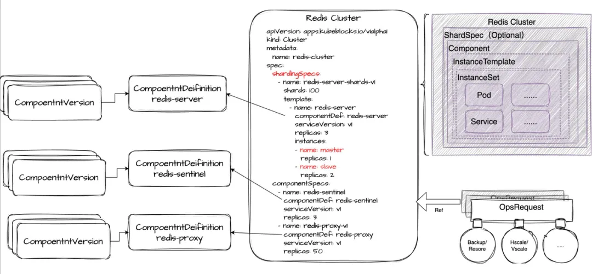  
Redis Server 组件示例

- Cluster - 用于定义整个 Redis 集群。
- ShardSpec - 用于定义 Redis Server 分片的列表。
- Component - 用于定义 Redis Proxy、Sentinel 和单个 Server 分片。
- InstanceTemplate - 用于定义同一组件内的不同配置。
- InstanceSet - 它是最终自动生成的工作负载，提供了我们之前提到的基于角色的管理能力。

## 代码走读

### InstanceSet调谐
将 InstanceSet Controller 的调谐过程设计成了两阶段，即 Prepare 和 Commit 两个阶段。在 Prepare 阶段我们会通过对比 InstanceSet  CR 里面的期望状态，以及系统当前的状态来计算出哪些二级资源需要创建、更新或删除，然后在 Commit 阶段一次性提交给 API Server。这样做的好处是，通常二级资源的更新会触发后续新的调谐，那么集中的提交可以使后续的调谐合并为一次，这样可以减少总的调谐次数。

```go
func (r *InstanceSetReconciler) Reconcile(ctx context.Context, req ctrl.Request) (ctrl.Result, error) {
    logger := log.FromContext(ctx).WithValues("InstanceSet", req.NamespacedName)
    res, err := kubebuilderx.NewController(ctx, r.Client, req, r.Recorder, logger).
       Prepare(instanceset.NewTreeLoader()).
       Do(instanceset.NewFixMetaReconciler()).
       Do(instanceset.NewDeletionReconciler()).
       Do(instanceset.NewStatusReconciler()).
       Do(instanceset.NewRevisionUpdateReconciler()).
       Do(instanceset.NewAssistantObjectReconciler()).
       Do(instanceset.NewReplicasAlignmentReconciler()).
       Do(instanceset.NewUpdateReconciler()).
       Commit()
    // TODO(free6om): handle error based on ErrorCode (after defined)
    return res, err
}

func (c *controller) Prepare(reader TreeLoader) Controller {
    c.oldTree, c.err = reader.Load(c.ctx, c.cli, c.req, c.recorder, c.logger)
    if c.err != nil {
       return c
    }
    if c.oldTree == nil {
       c.err = fmt.Errorf("nil tree loaded")
       return c
    }
    c.tree, c.err = c.oldTree.DeepCopy()
    // init placement
    c.ctx = intoContext(c.ctx, placement(c.oldTree.GetRoot()))
    return c
}

func (c *controller) Commit() (ctrl.Result, error) {
    defer c.emitFailureEvent()
    if c.err != nil {
       return ctrl.Result{}, c.err
    }
    if c.oldTree.GetRoot() == nil {
       return ctrl.Result{}, nil
    }
    builder := NewPlanBuilder(c.ctx, c.cli, c.oldTree, c.tree, c.recorder, c.logger)
    if c.err = builder.Init(); c.err != nil {
       return ctrl.Result{}, c.err
    }
    var plan graph.Plan
    plan, c.err = builder.Build()
    if c.err != nil {
       return ctrl.Result{}, c.err
    }
    if c.err = plan.Execute(); c.err != nil {
       if apierrors.IsConflict(c.err) {
          return ctrl.Result{Requeue: true}, nil
       }
       return ctrl.Result{}, c.err
    }
    if c.res.Next == rtry {
       return ctrl.Result{Requeue: true, RequeueAfter: c.res.RetryAfter}, nil
    }
    return ctrl.Result{}, nil
}
```

### 数据面多集群控制器

```go
multiClusterMgr, err := multicluster.Setup(mgr.GetScheme(), mgr.GetConfig(), mgr.GetClient(),
    multiClusterKubeConfig, multiClusterContexts, multiClusterContextsDisabled)
if err != nil {
    setupLog.Error(err, "unable to setup multi-cluster manager")
    os.Exit(1)
}
client := mgr.GetClient()
if multiClusterMgr != nil {
    client = multiClusterMgr.GetClient()
}

if viper.GetBool(workloadsFlagKey.viperName()) {
    if err = (&workloadscontrollers.InstanceSetReconciler{
       Client:   client,
       Scheme:   mgr.GetScheme(),
       Recorder: mgr.GetEventRecorderFor("instance-set-controller"),
    }).SetupWithManager(mgr, multiClusterMgr); err != nil {
       setupLog.Error(err, "unable to create controller", "controller", "InstanceSet")
       os.Exit(1)
    }
}
```

## 同类产品
### kubedb
KubeDB 提供了许多熟悉的数据库引擎，包括 PostgreSQL、MySQL、MongoDB、Elasticsearch、Redis、Memcached 和 Percona XtraDB。与云提供商和数据库供应商的竞争解决方案相比，KubeDB 与 Kubernetes 的原生集成使其成为独特的解决方案。

它的特别功能是 dormantdatabases.kubedb.com 资源。 它可以防止意外/错误操作：**所有被删除的数据库都会存档并复制到该资源中**，因此您可以在必要时恢复它们。 下图显示了 KubeDB 中数据库的生命周期：

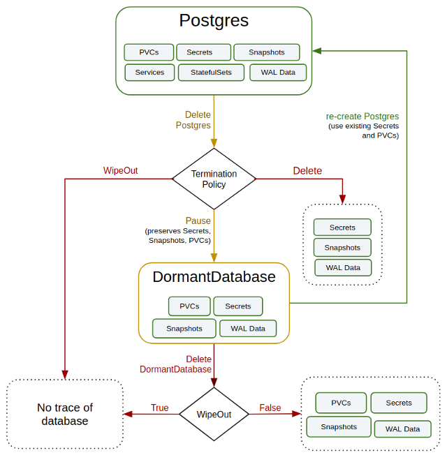  

1. https://kubedb.com/
2. https://kubedb.com/docs/v2024.8.21/guides/mysql/concepts/opsrequest/

### CloudNativePG
CloudNativePG 是一个综合性平台，旨在无缝管理 Kubernetes 环境中的 PostgreSQL 数据库，涵盖从初始部署到持续维护的整个运营生命周期。  

云原生 CloudNativePG 基于不可变基础架构、声明式配置和微服务架构等成熟的 DevOps 概念，完全依赖 Kubernetes API 服务器来维护 PostgreSQL 集群的状态。 此外，CloudNativePG 还提供云原生功能，如自我修复、高可用性、滚动更新、只读副本的扩缩、亲和/反亲和/调度韧度、资源管理等。  

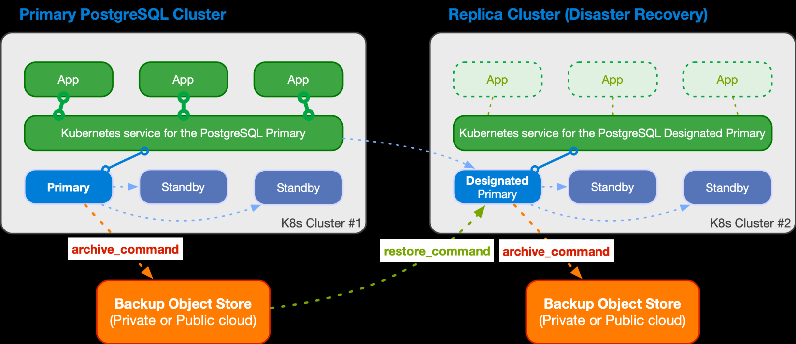

1. https://cloudnative-pg.io/
1. https://github.com/cloudnative-pg/cloudnative-pg
1. https://cloudnative-pg.io/documentation/1.24/architecture/

### postgres-operator
适用于Kubernetes，从高可用性 Postgres 集群到全面的database-as-a-service。  

Postgres Operator，作为 Kubernetes 部署运行，由单个容器组成。此 PGO 容器包含一组 Kubernetes 控制器，用于管理原生 Kubernetes 资源（作业、Pod）以及自定义资源 （PostgresCluster）。用户可以向 Kubernetes 提供期望的 Postgres 集群规格，PGO 使用自定义资源定义 （CRD） 来处理这些规格。PGO 的控制器可以使您的规格成为现实。主要的自定义资源定义是 postgresclusters.postgres-operator.crunchydata.com 。此 CRD 允许您控制有关 Postgres 集群的所有信息，包括：  
- 资源配置
- 高可用性
- 备份管理
- 集群的部署位置和方式（关联性、容忍度、拓扑分布约束）
- 灾难恢复 / 备用集群
- 监测
- ..

1. https://github.com/CrunchyData/postgres-operator
2. https://access.crunchydata.com/documentation/postgres-operator/latest/overview/architecture

## 部署
### elasticsearch部署示例

```bash
kbcli addon install elasticsearch --version 0.9.0
kbcli cluster create elasticsearch elasticsearch
# kbcli cluster create mycluster --cluster-definition elasticsearch --cluster-version 0.9.0
kbcli cv list --cluster-definition=elasticsearch
# NAME                  CLUSTER-DEFINITION   STATUS      IS-DEFAULT   CREATED-TIME                 
# elasticsearch-8.8.2   elasticsearch        Available   false        Sep 11,2024 21:00 UTC+0800
curl http://10.177.36.180:9200
# {
#   "name" : "elasticsearch-mdit-0",
#   "cluster_name" : "elasticsearch",
#   "cluster_uuid" : "_na_",
#   "version" : {
#     "number" : "8.8.2",
#     "build_flavor" : "default",
#     "build_type" : "docker",
#     "build_hash" : "98e1271edf932a480e4262a471281f1ee295ce6b",
#     "build_date" : "2023-06-26T05:16:16.196344851Z",
#     "build_snapshot" : false,
#     "lucene_version" : "9.6.0",
#     "minimum_wire_compatibility_version" : "7.17.0",
#     "minimum_index_compatibility_version" : "7.0.0"
#   },
#   "tagline" : "You Know, for Search"
# }

```

### Redis部署示例

```bash
# 创建 Redis 单机版
kbcli cluster create redis --mode standalone bredis

# 创建 Redis 主备版
kbcli cluster create redis --mode replication aredis

k get pod
# NAME                                        READY   STATUS    RESTARTS   AGE
# kb-post-provision-job-myredis-redis-rbf7w   1/1     Running   0          7s
# myredis-redis-0                             3/3     Running   0          24s
# myredis-redis-1                             3/3     Running   0          24s
# myredis-redis-sentinel-0                    1/1     Running   0          83s
# myredis-redis-sentinel-1                    1/1     Running   0          83s
# myredis-redis-sentinel-2                    1/1     Running   0          83s

kbcli cluster list
# NAME      NAMESPACE   CLUSTER-DEFINITION   VERSION   TERMINATION-POLICY   STATUS    CREATED-TIME                 
# myredis   default     redis                          Delete               Running   Sep 10,2024 17:38 UTC+0800 

#垂直扩容
kbcli cluster vscale myredis \
--components="redis" \
--memory="1Gi" --cpu="1"

#垂直缩容
kbcli cluster vscale myredis \
--components="redis" \
--memory="0.5Gi" --cpu="0.5"

#水平扩容
kbcli cluster hscale bredis \
--components="redis" --replicas=3

#水平缩容
kbcli cluster hscale mredis \
--components="redis" --replicas=1
#磁盘扩容
kbcli cluster volume-expand mredis --components="redis" \
--volume-claim-templates="data" --storage="22Gi"
#启停、重启
kbcli cluster restart aredis --components="redis" \
--ttlSecondsAfterSucceed=30
# 集群被停止时，其计算资源将被释放
kbcli cluster stop aredis
# NAME     NAMESPACE   CLUSTER-DEFINITION   VERSION   TERMINATION-POLICY   STATUS     CREATED-TIME                 
# aredis   default     redis                          Delete               Stopping   Sep 10,2024 20:30 UTC+0800 

```

## issues
### cluster状态异常
no matches for kind \"PodDisruptionBudget\" in version \"policy/v1\"

```bash
2024-09-12T02:54:03.375Z	ERROR	Reconciler error	{"controller": "cluster", "controllerGroup": "apps.kubeblocks.io", "controllerKind": "Cluster", "Cluster": {"name":"elasticsearch","namespace":"default"}, "namespace": "default", "name": "elasticsearch", "reconcileID": "0cf1a7a5-cb93-4c91-8a09-9b04c72a6be7", "error": "no matches for kind \"PodDisruptionBudget\" in version \"policy/v1\""}
sigs.k8s.io/controller-runtime/pkg/internal/controller.(*Controller).reconcileHandler
	/go/pkg/mod/sigs.k8s.io/controller-runtime@v0.17.2/pkg/internal/controller/controller.go:329
sigs.k8s.io/controller-runtime/pkg/internal/controller.(*Controller).processNextWorkItem
	/go/pkg/mod/sigs.k8s.io/controller-runtime@v0.17.2/pkg/internal/controller/controller.go:266
sigs.k8s.io/controller-runtime/pkg/internal/controller.(*Controller).Start.func2.2
	/go/pkg/mod/sigs.k8s.io/controller-runtime@v0.17.2/pkg/internal/controller/controller.go:227
```

状态扭转异常
1. cluster状态卡在deleting
2. 状态卡在stopping
3. 状态卡在updating

### 部分引擎无法启用
```bash
kbcli addon list
# elasticsearch                  1.0.0-alpha.0   community   Enabling   true           
```

现象：
- 卡在Enabling
- clusterDefinition或clusterVersion缺失


### 相关文档
1. https://cn.kubeblocks.io/ KubeBlocks简介
1. https://mp.weixin.qq.com/s/UGqzq1L2Hu1PjF3Y08XT5Q KubeCon China 回顾｜快手的 100% 资源利用率提升：从裸机迁移大规模 Redis 到 Kubernetes
1. https://www.cnblogs.com/ryanyangcs/p/17648249.html 使用 KubeBlocks 为 K8s 提供稳如老狗的数据库服务
1. https://github.com/apecloud/kubeblocks-addons KubeBlocks Add-ons
1. https://aws.amazon.com/cn/blogs/china/using-kubeblocks-to-easily-launch-vector-database-qdrant-based-on-amazon-eks/ 基于 Amazon EKS 采用 KubeBlocks 轻松拉起向量数据库 Qdrant
1. https://open.oceanbase.com/blog/7747938080 使用KubeBlocks管理你的OceanBase集群
1. https://blog.palark.com/comparing-kubernetes-operators-for-postgresql/
