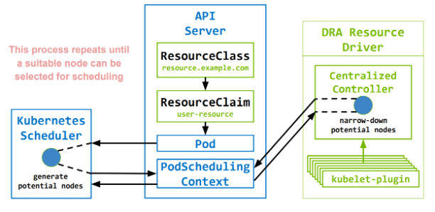

## Kubernetes DRA 特性调研

## 概要
用户越来越多地将 Kubernetes 部署为新工作负载（批处理）和新环境（边缘计算）的管理解决方案。此类工作负载不再只需要 RAM 和 CPU，还需要访问专用硬件。随着数据中心互连增强，加速器可以安装在特定节点之外，并根据需要动态连接到节点。

KEP 引入了一个新的 API，用于描述 Pod 需要哪些新资源。该 API 支持：   
- **网络附加资源**。现有的设备插件 API 仅限于节点上的硬件。 
- **在多个容器或 Pod 之间共享资源分配**。设备管理器 API 目前无法共享资源。它可以扩展为在单个 Pod 中的容器之间共享资源，但支持 Pod 之间的共享需要一个类似于此 KEP 中的全新 API。 
- **描述资源需求和初始化的自定义参数**。参数不限于可计数的单个线性量。使用当前的 Pod API，必须使用注释来捕获此类参数，然后需要通过 CSI 驱动程序或设备插件来访问它们。 

对新硬件的支持将由硬件供应商附加组件提供。不再需要修改 Kubernetes 本身。 

此 KEP 不会取代请求传统资源（RAM/CPU、卷、扩展资源）的其他方式。调度程序将充当拥有资源（CSI 驱动程序、资源驱动程序）的附加组件与调度程序拥有和分配的资源（RAM/CPU、扩展资源）之间的协调器。

### 定义
动态资源分配（Dynamic Resource Allocation）是一个用于在 Pod 和 Pod 内的容器之间请求和共享资源的 API。它是通用资源持久卷 API 的泛化。第三方资源驱动程序负责跟踪和分配资源。

DRA 是 Kubernetes 1.26 中引入的 API。在此之前，Kubernetes 只能处理整数可数资源，例如 RAM 和 CPU。 DRA 使用户能够利用 Kubernetes 中更复杂的以及需要额外设置参数的设备。

DRA 使 GPU 设备能够在不同容器和 Pod 之间共享，以便您可以灵活选择它们的使用方式。

DRA 使用容器设备接口 (CDI) 作为通用规范，定义了设备资源从节点一直到运行时的样式。

  
DRA API 可以轻松在 Kubernetes 中启用硬件设备并跨容器和 Pod 分配它们

### 路线图
- Kubernetes 1.25 - KEP accepted
- Kubernetes 1.26 - Alpha1 Release
- Kubernetes 1.27 - Alpha2 Release
- Kubernetes 1.29 - Beta Release

## 特性
- 在不同的 pod 和容器中访问相同的资源实例
- 将任意约束附加到资源请求以获取资源
- 通过用户提供的参数初始化资源

### 新增 API 类型

`resource.k8s.io/v1alpha2` API 组提供四种类型

**ResourceClass 资源类**
- 将命名资源与其相应的资源驱动程序关联
- 由系统管理员创建，用于定义可分配资源集
- 可以包含带有自定义 API 的可选类参数集

ResourceClass：
```yml
apiVersion: resource.k8s.io/v1alpha2 
kind: ResourceClass 
metadata: 
  name: t4.nvidia.com 
driverName: gpu.resource.nvidia.com 
parametersRef: 
  apiGroup: gpu.resource.nvidia.com 
  kind: GpuClassParameters 
  name: only-t4-gpus
```

GpuClassParameters：
```yml
apiVersion: gpu.resource.nvidia.com/v1alpha1 
kind: GpuClassParameters 
metadata: 
  name: only-t4-gpus 
spec: 
  selector: 
  - productName: "*t4*"
```

**ResourceClaim** 及 **ResourceClaimTemplate** 资源声明及声明模板
- 表示资源驱动程序进行的实际资源分配
- 由用户创建
- 可以包含带有自定义 API 的可选声明参数集

ResourceClaimTemplates 每次被引用时都会创建一个新的 ResourceClaim（例如，每个引用都有一个唯一的 GPU）

ResourceClaimTemplate：
```yml
apiVersion: resource.k8s.io/v1alpha2
kind: ResourceClaimTemplate
metadata:
 name: unique-gpu
spec:
 spec:
   resourceClassName: gpu.nvidia.com

```

ResourceClaims 每次被引用时都引用完全相同的对象（例如，每个引用使用相同的 GPU）

ResourceClaim：
```yml
apiVersion: resource.k8s.io/v1alpha2 
kind: ResourceClaim 
metadata: 
  name: shared-gpu 
spec: 
  resourceClassName: gpu.nvidia.com

```

参数声明：
```yml
apiVersion: resource.k8s.io/v1alpha2
kind: ResourceClaim
metadata:
 name: shared-gpu
spec:
 resourceClassName: gpu.nvidia.com
 parametersRef:
 apiGroup: gpu.resource.nvidia.com
 kind: GpuClaimParameters
 name: t4-or-16gb-v100-mps-shared

```

参数定义：
```yml
apiVersion: gpu.resource.nvidia.com/v1alpha1
kind: GpuClaimParameters
metadata:
 name: t4-or-16gb-v100-mps-shared
spec:
 count: 1
 selector:
   orExpression:
   - productName: "*t4*"
   - andExpression:
   - productName: "*v100*"
   - memorySize:
     value: 16Gi
     operator: LessThanOrEqualTo
   sharing:
     strategy: MPS

```


**PodSchedulingContext**
- 当需要为 Pod 分配 ResourceClaims 时，由控制平面和资源驱动程序在内部使用来协调 Pod 调度。
- 在 DRA 机制中，调度器与 Resource Controller 不直接通信，而是通过 PodSchedulingContext 资源对象交换信息。

```go
// PodSchedulingContextSpec 描述 Pod 需要哪些资源。
type PodSchedulingContextSpec struct {
	// SelectedNode 是分配 ResourceClaims 的节点 
    // 由 Pod 引用并使用 “WaitForFirstConsumer” 尝试分配。
	SelectedNode string `json:"selectedNode,omitempty" protobuf:"bytes,1,opt,name=selectedNode"`
	// PotentialNodes 列出 Pod 可能能够运行的节点.
	PotentialNodes []string `json:"potentialNodes,omitempty" protobuf:"bytes,2,opt,name=potentialNodes"`
}

// PodSchedulingContextStatus 描述可以为 Pod 分配资源的位置
type PodSchedulingContextStatus struct {
	// ResourceClaims 描述每个资源的可用性
	ResourceClaims []ResourceClaimSchedulingStatus `json:"resourceClaims,omitempty" protobuf:"bytes,1,opt,name=resourceClaims"`
}

type ResourceClaimSchedulingStatus struct {
	// Name 与 pod.spec.resourceClaims[*].Name 字段匹配
	Name string `json:"name,omitempty" protobuf:"bytes,1,opt,name=name"`
	// UnsuitableNodes 列出了无法为其分配 ResourceClaim 的节点
	UnsuitableNodes []string `json:"unsuitableNodes,omitempty" protobuf:"bytes,2,opt,name=unsuitableNodes"`
}
```

### 规格示例
Pod 申请资源时, 支持填写任意参数, 目前 Device Plugin 机制中申请资源只能通过在 resource.limits 填写资源请求量, 其他参数不支持

申请单卡：  


申请多卡：  


## 原理
### DRA 资源驱动程序剖析
DRA 关联组件：  


驱动程序包含两个独立协调组件
- 高可用性运行的集中控制器
- 节点 kubelet 插件（daemonset）

集中控制器
- 与 K8s 调度器协调，决定传入的 ResourceClaim 可以在哪些节点上提供服务
- 一旦调度器选择要分配的节点，就执行实际的 ResourceClaim 分配
- 一旦删除，就执行 ResourceClaim 的释放

kubelet 插件
- 上报集中控制器做出分配决策所需的任何节点本地状态
- 执行节点上 prepare 和 unprepare ResourceClaim 所需的任何节点本地操作
- 将与准备好的 ResourceClaim 关联的设备集传递到 kubelet，以便它可以将它们转发到底层容器运行时

kubelet 和 驱动插件之间的通信：  


### DRA 分配资源
立即分配
- 创建 ResourceClaim 后立即分配资源
- 引用该声明的 Pod 将仅限于已分配这些资源的节点

延迟分配（默认）
- 延迟分配 ResourceClaim，直到第一个引用它的 pod 被调度（避免因缺少 cpu、mem 等资源引起的调度失败）
- 资源可用性将被视为 Pod 调度决策的一部分

延迟分配：  




立即分配：


### 自定义 DRA 资源驱动
自定义 DRA 资源驱动流程：
- 确定驱动程序的名称 
- 确定通信策略（单一用途 CRD 与拆分用途通信） 
- 定义类型来表示可分配资源、已分配资源和准备资源
- 定义类型来表示您想要的任何 ClassParameters资源
- 定义类型来表示您想要的资源的任何 ClaimParameters
- 准备至少一个默认的 ResourceClass 以便与您的资源驱动程序一起分发
- 编写样板代码以向调度程序注册您的控制器
- 编写样板代码以向其注册您的 kubelet-plugin kubelet
- 为您的控制器编写业务逻辑
- 为您的 kubelet-plugin 编写业务逻辑

控制器代码片段
```go
type Driver interface {
  // 用于获取Resource Class提供的参数，这些参数在具体分配资源时需要用到
  GetClassParameters(context, class) (interface{}, error)
  // 用于获取Resource Claim提供的参数，这些参数在具体分配资源时需要用到。
  GetClaimParameters(context, claim, class, classParameters) (interface{}, error)
  // 调度器给了一些候选节点（PotentialNodes Nodes），从这些节点中确认哪些节点不适合运行当前调度的pod，便于下次调度该Pod时，提示调度器这些节点不能运行该pod。
  UnsuitableNodes(context, pod, []claimAllocation, []potentialNodes) error
  // 执行分配资源的操作。
  Allocate(context, claim, claimParameters, class, classParameters, selectedNode string) (allocationResult, error)
  // 解除分配，比如某个Resource Claim所需的资源由某个Node提供，现在不需要这个Node提供，换其他Node提供，那么先得执行解除分配操作。
  Deallocate(context, claim) error
}

// 循环访问潜在节点以搜索可用资源
// 返回缩小的不可用节点列表
type ClaimAllocation struct {
  PodClaimName string
  Claim *resourcev1alpha2.ResourceClaim
  Class *resourcev1alpha2.ResourceClass
  ClaimParameters interface{}
  ClassParameters interface{}
  UnsuitableNodes []string
}

// 附加到声明的数据将传递给 kubelet 插件进行解释
type AllocationResult struct {
  ResourceHandles []ResourceHandle
  AvailableOnNodes *v1.NodeSelector
  Shareable bool
}
```

Kubelet 插件代码片段
```go
type NodeServer interface {
  // Pod被调度到节点以后，kubelet在创建该Pod前，会通过GRPC调用Kubelet Plugin的这个函数，Plugin会在节点上准备相关资源，同时也提供Device Plugin类似的能力，将需要挂载到容器的设备路径，设置环境变量等信息返回给Kublelet
  NodePrepareResource(context.Context, *NodePrepareResourceRequest) (*NodePrepareResourceResponse, error)
  // Pod被删除时，该函数被触发，用于执行某些与pod相关的资源清理。
  NodeUnprepareResource(context.Context, *NodeUnprepareResourceRequest) (*NodeUnprepareResourceResponse, error)
}

type NodePrepareResourceRequest struct {
  Namespace string
  ClaimUid string
  ClaimName string
  ResourceHandle string
}

type NodePrepareResourceResponse struct {
  CdiDevices []string
}
```

### 调度

当某个 Pod 申请使用 Resource Claim，调度器在调度该Pod时，使用 dynamicresources 插件进行节点调度。

dynamicresources 插件扩展点：
- PreFilter 检测 Pod“立即分配”声明是否绑定
- Filter 根据申明评估 Pod 请求资源是否合适
- PostFilter 检查是否存在可以取消分配的声明
- PreScore 传递适合该 pod 的所有节点的列表
- Reserve 为 Pod 预留声明
- UnReserve 清除所有声明的预留
- PostBind Pod 成功绑定到节点后调用, 删除 PodSchedulingContext 对象

  
调度器筛选节点, 创建 PodSchedulingContext 对象


  
驱动控制器筛选节点


## 对比 Device Plugin
DRA 优势
- Pod 申请资源时, 支持填写任意参数, 目前 Device Plugin 机制中申请资源只能通过在 resource.limits 填写资源请求量, 其他参数不支持
- 自定义资源的设置和清理操作
- 用于描述资源请求的友好的 API
- 运行管理资源的组件自主开发和部署, 无需编译 Kubernetes 核心组件
- 丰富的语义, 使得当前所有的设备插件都可以基于 DRA 来实现
- 支持网络附加资源
- 在多个容器或 Pod 之间共享资源分配

## 示例
### 资源规格示例
```yml
# 假设已经安装 `resource-driver.example.com` 的资源驱动
apiVersion: resource.k8s.io/v1alpha1
kind: ResourceClass
name: resource.example.com
driverName: resource-driver.example.com
---
# 终端用户可以按如下方式分配两个类型为 `resource.example.com` 的特定资源
---
apiVersion: cats.resource.example.com/v1
kind: ClaimParameters
name: large-black-cats
spec:
 color: black
 size: large
---
apiVersion: resource.k8s.io/v1alpha1
kind: ResourceClaimTemplate
metadata:
 name: large-black-cats
spec:
 spec:
   resourceClassName: resource.example.com
   parametersRef:
     apiGroup: cats.resource.example.com
     kind: ClaimParameters
     name: large-black-cats
–--
apiVersion: v1
kind: Pod
metadata:
 name: pod-with-cats
spec:
 containers: # 两个示例容器；每个容器申领一个 cat 资源
 - name: first-example
   image: ubuntu:22.04
   command: ["sleep", "9999"]
   resources:
     claims:
     - name: cat-0
 - name: second-example
   image: ubuntu:22.04
   command: ["sleep", "9999"]
   resources:
     claims:
     - name: cat-1
 resourceClaims:
 - name: cat-0
   source:
     resourceClaimTemplateName: large-black-cats
 - name: cat-1
   source:
     resourceClaimTemplateName: large-black-cats
```

### DRA 驱动示例

驱动控制器过滤节点：
```go
func (d driver) unsuitableNode(ctx context.Context, pod *corev1.Pod, allcas []*controller.ClaimAllocation, potentialNode string) error {
	d.lock.Get(potentialNode).Lock()
	defer d.lock.Get(potentialNode).Unlock()

	crdconfig := &nascrd.NodeAllocationStateConfig{
		Name:      potentialNode,
		Namespace: d.namespace,
	}
	crd := nascrd.NewNodeAllocationState(crdconfig)

	client := nasclient.New(crd, d.clientset.NasV1alpha1())
	err := client.Get()
	if err != nil {
		for _, ca := range allcas {
			ca.UnsuitableNodes = append(ca.UnsuitableNodes, potentialNode)
		}
		return nil
	}

	if crd.Status != nascrd.NodeAllocationStateStatusReady {
		for _, ca := range allcas {
			ca.UnsuitableNodes = append(ca.UnsuitableNodes, potentialNode)
		}
		return nil
	}

	if crd.Spec.AllocatedClaims == nil {
		crd.Spec.AllocatedClaims = make(map[string]nascrd.AllocatedDevices)
	}

	perKindCas := make(map[string][]*controller.ClaimAllocation)
	for _, ca := range allcas {
		var kind string
		switch ca.ClaimParameters.(type) {
		case *gpucrd.GpuClaimParametersSpec:
			kind = gpucrd.GpuClaimParametersKind
		case *gpucrd.MigDeviceClaimParametersSpec:
			kind = gpucrd.MigDeviceClaimParametersKind
		}
		perKindCas[kind] = append(perKindCas[kind], ca)
	}
	for _, kind := range []string{gpucrd.GpuClaimParametersKind, gpucrd.MigDeviceClaimParametersKind} {
		var err error
		switch kind {
		case gpucrd.GpuClaimParametersKind:
			err = d.gpu.UnsuitableNode(crd, pod, perKindCas[kind], allcas, potentialNode)
		case gpucrd.MigDeviceClaimParametersKind:
			err = d.mig.UnsuitableNode(crd, pod, perKindCas[kind], allcas, potentialNode)
		}
		if err != nil {
			return fmt.Errorf("error processing '%v': %v", kind, err)
		}
	}

	return nil
}
```

资源分配：
```go
func (d driver) Allocate(ctx context.Context, claim *resourcev1.ResourceClaim, claimParameters interface{}, class *resourcev1.ResourceClass, classParameters interface{}, selectedNode string) (*resourcev1.AllocationResult, error) {
	if selectedNode == "" {
		return nil, fmt.Errorf("TODO: immediate allocations not yet supported")
	}

	d.lock.Get(selectedNode).Lock()
	defer d.lock.Get(selectedNode).Unlock()

	crdconfig := &nascrd.NodeAllocationStateConfig{
		Name:      selectedNode,
		Namespace: d.namespace,
	}
	crd := nascrd.NewNodeAllocationState(crdconfig)

	client := nasclient.New(crd, d.clientset.NasV1alpha1())
	err := client.Get()
	if err != nil {
		return nil, fmt.Errorf("error retrieving node specific Gpu CRD: %v", err)
	}

	if crd.Spec.AllocatedClaims == nil {
		crd.Spec.AllocatedClaims = make(map[string]nascrd.AllocatedDevices)
	}

	if _, exists := crd.Spec.AllocatedClaims[string(claim.UID)]; exists {
		return buildAllocationResult(selectedNode, true), nil
	}

	if crd.Status != nascrd.NodeAllocationStateStatusReady {
		return nil, fmt.Errorf("NodeAllocationStateStatus: %v", crd.Status)
	}

	var onSuccess OnSuccessCallback
	classParams := classParameters.(*gpucrd.DeviceClassParametersSpec)
	switch claimParams := claimParameters.(type) {
	case *gpucrd.GpuClaimParametersSpec:
		onSuccess, err = d.gpu.Allocate(crd, claim, claimParams, class, classParams, selectedNode)
	case *gpucrd.MigDeviceClaimParametersSpec:
		onSuccess, err = d.mig.Allocate(crd, claim, claimParams, class, classParams, selectedNode)
	default:
		err = fmt.Errorf("unknown ResourceClaim.ParametersRef.Kind: %v", claim.Spec.ParametersRef.Kind)
	}
	if err != nil {
		return nil, fmt.Errorf("unable to allocate devices on node '%v': %v", selectedNode, err)
	}

	allocated := crd.Spec.AllocatedClaims[string(claim.UID)]
	allocated.ClaimInfo = &nascrd.ClaimInfo{
		Namespace: claim.Namespace,
		Name:      claim.Name,
		UID:       string(claim.UID),
	}
	crd.Spec.AllocatedClaims[string(claim.UID)] = allocated

	err = client.Update(&crd.Spec)
	if err != nil {
		return nil, fmt.Errorf("error updating NodeAllocationState CRD: %v", err)
	}

	onSuccess()

	return buildAllocationResult(selectedNode, *classParams.Shareable), nil
}
```

### 节点资源状态

```yml
Name: node0
API Version: gpu.resource.example.com/v1alpha1
Kind: NodeAllocationState
Spec:
 Allocatable Devices:
 Gpu:
   Model: LATEST-GPU-MODEL
   Uuid: GPU-4cf8db2d-06c0-7d70-1a51-e59b25b2c16c
 Gpu:
   Model: LATEST-GPU-MODEL
   Uuid: GPU-4404041a-04cf-1ccf-9e70-f139a9b1e23c
 Allocated Claims:
   c06f3b95-7c8e-463f-bab1-c6fefc5b563b:
     Gpu:
       Devices:
       Uuid: GPU-4cf8db2d-06c0-7d70-1a51-e59b25b2c16c
 Prepared Claims:
   c06f3b95-7c8e-463f-bab1-c6fefc5b563b:
     Gpu:
       Devices:
       Uuid: GPU-4cf8db2d-06c0-7d70-1a51-e59b25b2c16c
```

## 附录

### 术语
**CDI**（容器设备接口）是容器运行时的规范，用于支持第三方设备。它引入了设备作为资源的抽象概念。此类设备由完全限定名称唯一指定，该名称由供应商 ID、设备类别和每个供应商 ID-设备类别对唯一的名称构成。

**KEP**（Kubernetes Enhancement Proposals）：Kubernetes 增强提案是一种提议、沟通和协调 Kubernetes 项目新工作的方式。此过程仍处于测试状态，并且对于从 1.14 版开始的所有增强功能都是强制性的。

**WaitForFirstConsumer**：集群管理员可以通过指定 WaitForFirstConsumer 模式, 该模式将延迟 PersistentVolume 的绑定和配置，直到创建使用 PersistentVolumeClaim 的 Pod。将根据 Pod 调度约束指定的拓扑来选择或配置 PersistentVolume。这些包括但不限于资源要求、节点选择器、pod 亲和性和反亲和性以及污点和容忍度。

### 相关链接

- https://kubernetes.io/docs/concepts/scheduling-eviction/dynamic-resource-allocation/
- https://github.com/kubernetes/enhancements/blob/master/keps/sig-node/3063-dynamic-resource-allocation/README.md
- https://github.com/kubernetes/dynamic-resource-allocation
- https://www.intel.com/content/www/us/en/developer/articles/technical/new-frameworks-for-kubernetes-resource-management.html Kubernetes 资源管理的新框架
- https://kccnceu2023.sched.com/event/1HyWy/device-plugins-20-how-to-build-a-driver-for-dynamic-resource-allocation-kevin-klues-nvidia-alexey-fomenko-intel 设备插件 2.0
- https://www.youtube.com/watch?v=_fi9asserLE
- https://drive.google.com/file/d/1sU1ZhY4zNKBtXAeVx3sozHT0PuDz4-Qf/view 示例
- https://kubernetes.io/zh-cn/blog/2022/12/15/dynamic-resource-allocation/
- https://cloud.tencent.com/developer/article/2215920 Kubernetes 1.26: 动态资源分配 Alpha API
- https://github.com/kubernetes-sigs/dra-example-driver example driver
- https://github.com/intel/intel-resource-drivers-for-kubernetes intel
- https://github.com/NVIDIA/k8s-dra-driver nvidia
- https://pkg.go.dev/k8s.io/dynamic-resource-allocation/controller
- https://pkg.go.dev/k8s.io/kubelet/pkg/apis/dra/v1alpha2 Kubelet Plugin API and Helper Library
- https://pkg.go.dev/k8s.io/dynamic-resource-allocation/kubeletplugin
- https://github.com/cncf-tags/container-device-interface CDI
- https://kubernetes.io/zh-cn/docs/reference/kubernetes-api/workload-resources/pod-scheduling-context-v1alpha2/
- https://developer.aliyun.com/article/1272914 K8S下一代设备管理机制：DRA
- https://github.com/kubernetes/kubernetes/blob/v1.28.1/pkg/scheduler/framework/plugins/dynamicresources/dynamicresources.go DynamicResources 调度插件