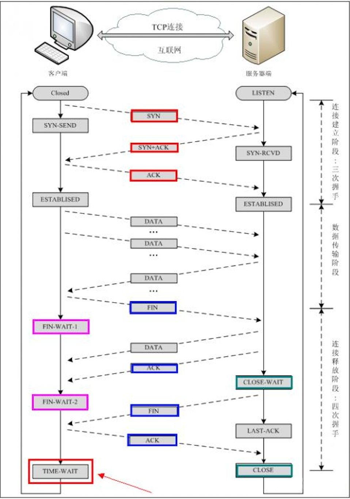
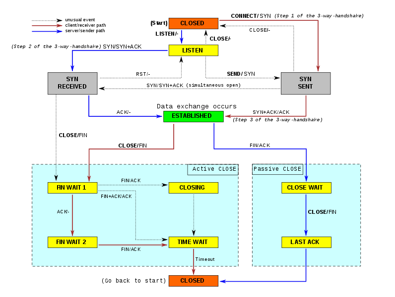
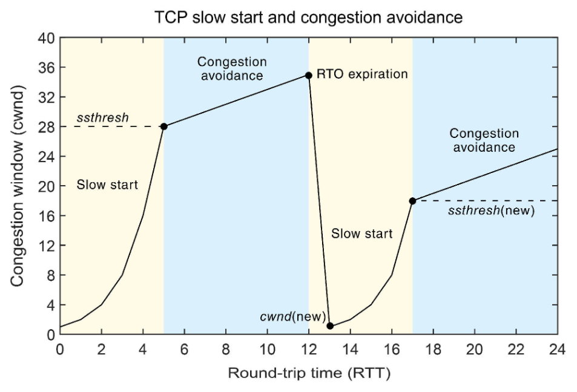
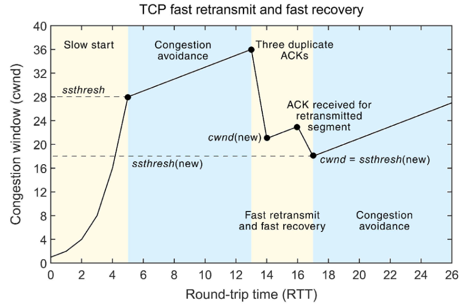

## TCP 示例

### 关键词

- ACK 确认 Acknowledgment
- SYN 同步序列编号 Synchronize Sequence Numbers
- RST 重置 Reset
- LISTEN 侦听来自远方的TCP端口的连接请求 LISTENING
- ESTABLISHED 表示两台机器正在传输数据
- CLOSE WAIT 等待主动关闭端发来的连接中断请求的确认
- TIME WAIT 等待足够的时间以确保被动关闭端接收到连接中断请求的确认
- MSL 报文段最大生存时间 Maximum Segment Lifetime
- 客户端：主动连接端、主动关闭端
- 服务端：被动连接端、被动关闭端

### TCP 连接

### TCP 状态图

### 握手为什么需要三次

- 第一次握手（SYN），主动连接端 C 发送网络包，被动连接端 S 收到，证明 C 的发送能力， S 的接收能力正常
- 第二次握手（SYN+ACK），S 端发包，C 端收到，证明 S 端发送能力，C 端接收能力正常，此时 S 端不清楚 C 端接收能力正常
- 第三次握手（ACK），C 端发包，S 端收到，证明 C 端接收能力正常

### 挥手为什么需要四次

- 关闭连接时，当被动关闭端收到 FIN 报文时，很可能并不会立即关闭 SOCKET
- 所以只能先回复一个 ACK 报文，告诉主动关闭端，"你发的 FIN 报文我收到了"
- 等到被动关闭端所有的报文都发送完了，发送 FIN 报文
- 等待主动关闭端发来的连接中断请求的确认 ACK ，关闭连接

### SYN 泛洪攻击

- 被动连接端的资源分配是在二次握手时分配，主动连接端的资源是在完成三次握手时分配
- 主动连接端在短时间伪造大量不存在的 IP，向被动连接端不断发送 SYN 包
- 被动连接端回复确认包，等待主动连接端确认
- 由于 IP 不存在，因此被动连接端不断重发确认包，直到超时
- 这时，伪造的 SYN 包长时间占用未连接队列
- 正常的 SYN 请求因为队列满被丢弃，导致网络拥塞
- SYN 攻击是典型的 DDoS 攻击

### TCP 对比 UDP

- TCP 面向连接（如打电话要先拨号建立连接）;
- UDP 是无连接的，即发送数据之前不需要建立连接
- TCP 提供可靠的服务。也就是说，通过TCP连接传送的数据，无差错，不丢失，不重复，且按序到达;
- UDP 尽最大努力交付，即不保证可靠交付
- TCP 保证数据顺序，UDP不保证。
- TCP 面向字节流，实际上是 TCP 把数据看成一连串无结构的字节流; UDP 是面向报文的
- UDP 没有拥塞控制，因此网络出现拥塞不会使源主机的发送速率降低
  - 对实时应用很有用，如IP电话，实时视频会议等
- TCP 连接只能是点到点的;
- UDP 支持一对一、一对多、多对一、多对多的交互通信
- TCP 首部开销20字节，UDP的首部开销小，只有8个字节
- TCP 的逻辑通信信道是全双工的可靠信道，UDP则是不可靠信道

### 拥塞控制

拥塞控制采用了四种算法：慢启动、拥塞避免、快重传和快恢复。

慢启动(Slow Start)

- 不要一开始就发送大量的数据，先探测一下网络的拥塞程度
  - 也就是说由小到大逐渐增加拥塞窗口的大小
  - 拥塞窗口 cwnd（Congestion Window），以字节为单位
- 算法：当发送方每收到一个 ACK，拥塞窗口 cwnd 的大小就会加 1
  - 指数增长
- 慢启动的目的是逐渐增加发送速度进行试探，直到进入拥塞避免阶段
  - 慢启动门限 ssthresh（slow start threshold），一般是 65535 字节
    - 当 cwnd 超过该值后，慢启动结束，进入拥塞避免阶段

拥塞避免（Congestion Voidance）

- 拥塞避免算法就是将原本慢启动算法的指数增长变成了线性增长
  - 还是增长阶段，但是增长速度缓慢了一些
- 算法：每当收到一个 ACK 时，cwnd 增加 1/cwnd
- 随着 cwnd 持续增长，网络慢慢进入拥塞状况，出现丢包现象
  - 这时，需要对丢失的数据包重传
    - 重传机制：超时重传、快重传
- 当触发了重传机制，也就进入了拥塞发生算法

快重传（Fast Retransmit）

- 当接收方发现丢了一个中间包的时候，发送 3 次前一个包的 ACK
- 发送方只要一连收到三个重复确认（ACK）就应当立即重传对方尚未收到的报文段
  - 而不必继续等待设置的重传计时器时间到期
- 进入快速恢复算法

快恢复（Fast Recovery）

- 快恢复是快速重传的后续处理
  - 考虑到如果网络出现拥塞的话就不会收到好几个重复的确认
    - 所以发送方现在认为网络可能没有出现拥塞
- 算法：将 cwnd 设置为当前值的一半
  - cwnd = cwnd/2
  - ssthresh = cwnd
- 然后执行拥塞避免算法

## 参考

- [TCP连接的状态详解以及故障排查 - cloud.tencent.com](https://cloud.tencent.com/developer/article/1347046)
- [三次握手和四次挥手 - juejin.cn](https://juejin.cn/post/6844903958624878606)
- [TCP 状态图 - wikipedia.org](https://en.wikipedia.org/wiki/File:Tcp_state_diagram.png)
- [5G 网络中 TCP 拥塞控制的全面概述 - mdpi ](https://www.mdpi.com/1424-8220/21/13/4510)